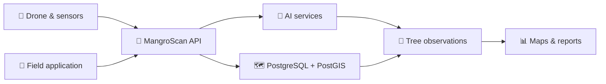
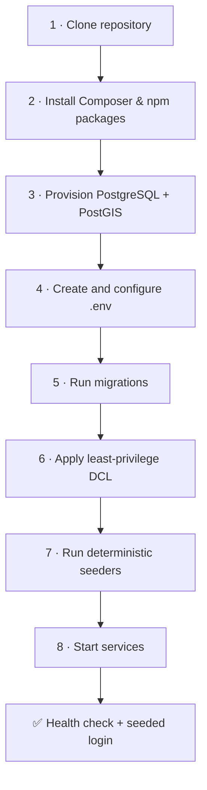
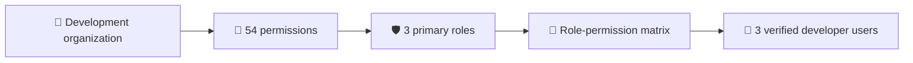
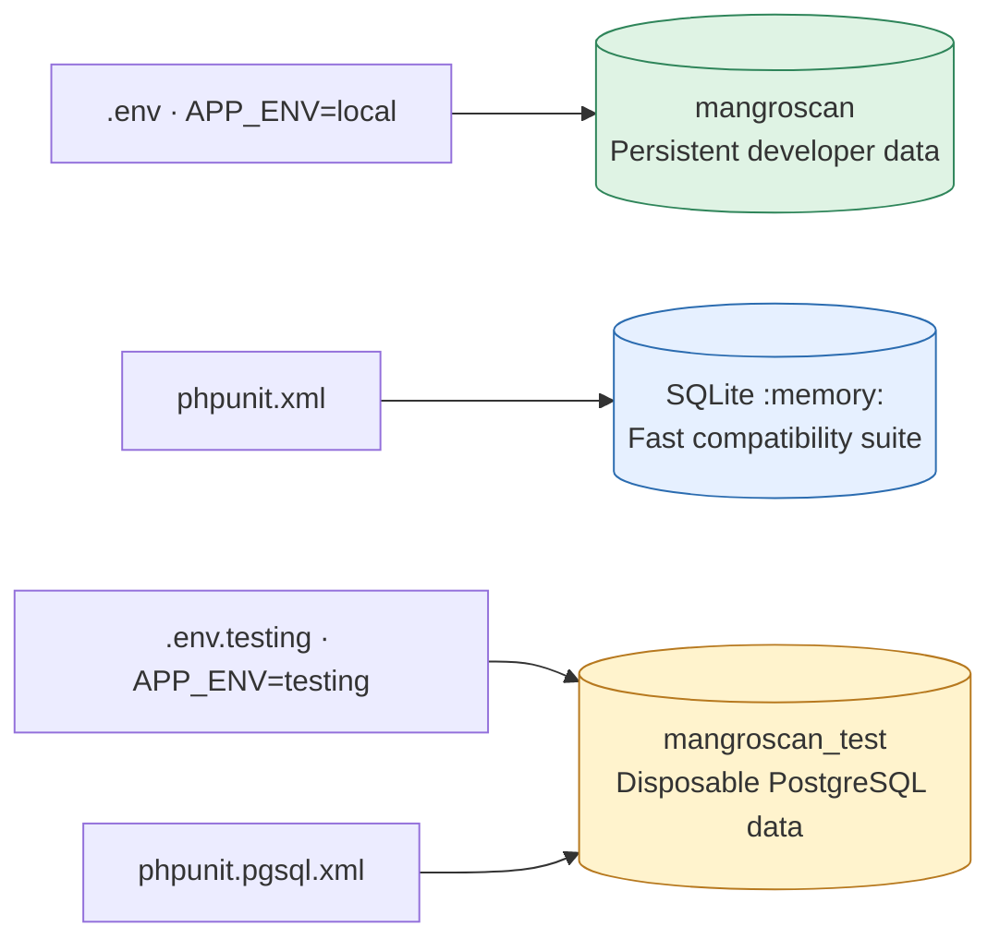

# MangroScan API

> **Geospatial Mangrove Forest Monitoring & Analysis Platform**

A production-grade RESTful API for managing drone-based surveys, AI-powered tree analysis, and environmental monitoring of mangrove forests. Built with Laravel 12, PostgreSQL, PostGIS, and modern backend practices.

[](#api-documentation)
[](https://www.php.net/)
[](https://laravel.com)
[](https://www.postgresql.org/)
[](https://postgis.net/)
[](LICENSE)



---

## Table of Contents

- [Overview](#overview)
- [Features](#features)
- [Tech Stack](#tech-stack)
- [System Requirements](#system-requirements)
- [Development Environment Setup](#development-environment-setup)
- [Project Structure](#project-structure)
- [Database & Migrations](#database--migrations)
- [API Documentation](#api-documentation)
- [Configuration](#configuration)
- [Development](#development)
- [Testing](#testing)
- [Team API Development Workflow](#team-api-development-workflow)
- [Deployment](#deployment)
- [Troubleshooting](#troubleshooting)
- [Contributing](#contributing)
- [License](#license)

---

## Overview

MangroScan API is a comprehensive backend solution for organizations conducting drone-based environmental surveys of mangrove forests. It provides:

- **Multi-tenant Architecture**: Support for multiple organizations with complete data isolation
- **Survey Management**: Track missions, drone flights, and field teams
- **Media Handling**: Upload, store, and organize aerial imagery and sensor data
- **AI Integration**: Connect to external ML services for tree detection, species classification, and biometric estimation
- **Result Tracking**: Store and query tree observations with estimated age, height, and species
- **Audit Compliance**: Immutable logs of all system actions for accountability
- **Mobile Support**: Offline-capable mobile app synchronization
- **Role-Based Security**: Fine-grained permission system for different user types

---

## Features

✅ **Complete Authentication & Authorization**
- Token-based authentication (Laravel Sanctum)
- Role-Based Access Control (RBAC) with dynamic permissions
- Multi-organization tenant isolation
- Session management and password reset workflow

✅ **Survey Operations**
- Create and manage survey sites with geospatial boundaries
- Plan missions with team member assignments
- Track individual drone flight sessions
- Record pre-flight and post-flight checklists

✅ **Hardware Management**
- Drone registry with specifications
- Sensor attachment and tracking
- Sensor calibration history

✅ **Media & Data Upload**
- Resumable media uploads with session tracking
- Sensor dataset management (LiDAR, depth maps, photogrammetry)
- Configurable storage backends (local, S3)
- File size and type validation

✅ **AI Service Integration**
- AI model registration and versioning
- Service health monitoring
- Model synchronization
- Processing job queue management

✅ **Tree Analysis & Results**
- Tree observation storage with GPS coordinates
- Species classification results
- Canopy height estimation
- Tree age estimation
- Results aggregation and reporting

✅ **Audit & Compliance**
- Immutable audit logs for all mutations
- User action tracking with before/after state
- Sensitive data protection

✅ **Performance & Scale**
- Pagination with configurable limits
- Database indexing optimizations
- Rate limiting and throttling
- Geospatial query support via PostGIS

---

## Tech Stack

### Backend
- **Framework**: [Laravel 12](https://laravel.com/docs) - Modern PHP web framework
- **Language**: PHP 8.2+ - Type-safe, feature-rich programming
- **Database**: PostgreSQL 18 - Powerful relational database
- **Geospatial**: PostGIS - Advanced spatial data support
- **Authentication**: Laravel Sanctum - API token management
- **ORM**: Eloquent - Elegant database abstraction

### Frontend Tooling
- **Build Tool**: Vite 6 - Next-generation frontend build tool
- **CSS Framework**: Tailwind CSS 4 - Utility-first styling
- **HTTP Client**: Axios - Promise-based API requests
- **Package Manager**: npm - Node.js dependency management

### Development & Testing
- **Testing**: PHPUnit 11 - Unit and feature test framework
- **Code Quality**: Laravel Pint - PHP code style fixer
- **Debugging**: Laravel Tinker - Interactive REPL
- **Containers**: Laravel Sail - Docker development environment

### Key Dependencies
```json
{
  "php": "^8.2",
  "laravel/framework": "^12.0",
  "laravel/sanctum": "^4.3",
  "laravel/tinker": "^2.10.1"
}
```

---

## System Requirements

### Minimum Requirements

| Component | Version | Notes |
|-----------|---------|-------|
| PHP | 8.2+ | With extensions: mbstring, PDO, bcmath, ctype, json, tokenizer |
| PostgreSQL | 14+ | PostGIS 3.2+ recommended for geospatial features |
| Node.js | 18+ | For frontend asset compilation |
| Composer | 2.2+ | PHP dependency manager |
| npm | 9+ | Node.js package manager |

### Recommended (Production)

| Component | Specification |
|-----------|---------------|
| CPU | 4+ cores |
| RAM | 8GB+ |
| Storage | 100GB+ (depends on media volume) |
| PostgreSQL | Dedicated instance with replication |
| Redis | For caching and job queue |
| Object Storage | S3 or compatible for media files |

### Local Development (Quick Setup)

- **OS**: Windows 10+, macOS 10.15+, Ubuntu 20.04+ (WSL2 supported)
- **Docker**: Desktop Edition 20.10+ (optional, for Sail)
- **Disk Space**: 2GB+ free
- **RAM**: 4GB minimum (8GB recommended)

---

## Development Environment Setup

The supported development path uses PostgreSQL with PostGIS. SQLite is intentionally reserved for the fast default test suite; it does not exercise PostgreSQL constraints, functions, triggers, DCL, or geospatial behavior.



### 1. Verify prerequisites

```bash
php --version
composer --version
node --version
npm --version
psql --version
```

Required locally: PHP 8.2+, Composer 2.2+, Node.js 18+, PostgreSQL, and PostGIS. Make sure PHP has `pdo_pgsql`, `mbstring`, `bcmath`, `ctype`, and `fileinfo` enabled.

### 2. Clone and install dependencies

```bash
git clone https://github.com/earljohnestandarte/MangroScan-API.git
cd mangroscan-api
composer install
npm install
```

Create the local environment file:

```powershell
# Windows PowerShell
Copy-Item .env.example .env
```

```bash
# macOS, Linux, or WSL
cp .env.example .env
```

### 3. Provision the development database

Create a dedicated database and a local-only LOGIN role. Run these commands from the repository root using a PostgreSQL administrator account:

```bash
createdb -U postgres mangroscan
createuser -U postgres --login --pwprompt mangroscan_dev
psql -U postgres -d mangroscan -c "CREATE EXTENSION IF NOT EXISTS pgcrypto; CREATE EXTENSION IF NOT EXISTS postgis;"
psql -U postgres -d mangroscan -f database/sql/dcl/001_roles_and_schema.sql
psql -U postgres -d mangroscan -c "GRANT mangroscan_migrator, mangroscan_api_rw TO mangroscan_dev;"
```

If `mangroscan` or `mangroscan_dev` already exists, do not recreate it. Open `psql -U postgres -d postgres` and run `\password mangroscan_dev` when you only need to rotate the local credential without exposing it in shell history.

The combined `mangroscan_dev` membership is a convenience for local development: it can run migrations and exercise the API. Staging and production should use separate migrator and runtime LOGIN roles.

### 4. Configure `.env`

Set these values in the uncommitted `.env` file:

```env
APP_NAME="MangroScan API"
APP_ENV=local
APP_DEBUG=true
APP_URL=http://localhost:8000
MANGROSCAN_WEB_URL=http://localhost:5173

DB_CONNECTION=pgsql
DB_HOST=127.0.0.1
DB_PORT=5432
DB_DATABASE=mangroscan
DB_USERNAME=mangroscan_dev
DB_PASSWORD="replace-with-the-same-local-database-password"
DB_SEARCH_PATH="app,public"

# Used only to create the three local developer accounts.
MANGROSCAN_SEED_USER_PASSWORD="choose-a-local-login-password"

CACHE_STORE=database
QUEUE_CONNECTION=database
FILESYSTEM_DISK=local
MEDIA_UPLOAD_DISK=local
```

Never commit `.env`, database credentials, or the developer-account password. Generate the Laravel application key and clear any stale cached configuration:

```bash
php artisan key:generate
php artisan optimize:clear
```

Confirm that Laravel resolves the intended database before changing its schema:

```bash
php artisan tinker --execute="dump(config('app.env'), config('database.default'), config('database.connections.pgsql.database'), config('database.connections.pgsql.username'));"
```

Expected values include `local`, `pgsql`, `mangroscan`, and `mangroscan_dev`.

### 5. Run migrations

```bash
php artisan migrate
php artisan migrate:status
```

The migrations create the application tables, PostgreSQL functions/views/triggers, and PostGIS-backed columns in the `app` schema. PostgreSQL extensions were created by the administrator in step 3 because ordinary application roles should not receive extension-management privileges.

### 6. Apply database grants

After migrations, apply the remaining version-controlled DCL scripts in filename order.

```powershell
# Windows PowerShell
Get-ChildItem database/sql/dcl/*.sql |
    Where-Object Name -ne '001_roles_and_schema.sql' |
    Sort-Object Name |
    ForEach-Object { & psql -v ON_ERROR_STOP=1 -U postgres -d mangroscan -f $_.FullName }
```

```bash
# macOS, Linux, or WSL
for file in database/sql/dcl/*.sql; do
  if [ "$(basename "$file")" != "001_roles_and_schema.sql" ]; then
    psql -v ON_ERROR_STOP=1 -U postgres -d mangroscan -f "$file" || exit 1
  fi
done
```

### 7. Run deterministic seeders



Run the complete dependency-safe seed chain:

```bash
php artisan db:seed
```

The command is idempotent and may be run repeatedly. It creates or updates:

| Developer account | Seeded role | Password |
| --- | --- | --- |
| `admin@mangroscan.test` | System Administrator | Value of `MANGROSCAN_SEED_USER_PASSWORD` |
| `researcher@mangroscan.test` | Researcher | Value of `MANGROSCAN_SEED_USER_PASSWORD` |
| `specialist@mangroscan.test` | Environmental Specialist | Value of `MANGROSCAN_SEED_USER_PASSWORD` |

All seeded passwords are hashed. The developer-user seeder refuses a blank password and skips account creation in production. See the [RBAC Seeder Matrix](docs/MangroScan_RBAC_Seeder_Matrix.md) for the exact permission assignments.

### 8. Start and verify the application

Run everything together:

```bash
composer run dev
```

Or use separate terminals:

```bash
php artisan serve
php artisan queue:listen --tries=1
php artisan pail --timeout=0
npm run dev
```

Verify the service:

```bash
curl http://localhost:8000/api/v1/health
curl http://localhost:8000/api/v1/meta/capabilities
```

Then authenticate with one of the seeded email addresses and the local value of `MANGROSCAN_SEED_USER_PASSWORD`:

```bash
curl -X POST http://localhost:8000/api/v1/auth/login \
  -H "Content-Type: application/json" \
  -d '{"email":"researcher@mangroscan.test","password":"your-local-seed-password","device_name":"Local development"}'
```

---

## Project Structure

```
mangroscan-api/
├── app/
│   ├── Contracts/          # Interfaces for services
│   ├── Exceptions/         # Custom exception classes
│   ├── Http/
│   │   ├── Controllers/    # API endpoint handlers
│   │   │   └── Api/V1/    # V1 API controllers organized by domain
│   │   ├── Middleware/     # HTTP middleware (auth, CORS, etc.)
│   │   ├── Requests/       # Form request validation classes
│   │   └── Resources/      # API response transformers
│   ├── Models/             # 34 Eloquent models (User, Mission, etc.)
│   ├── Providers/          # Service providers (AppServiceProvider)
│   ├── Rules/              # Custom validation rules
│   └── Services/           # Business logic organized by domain
│       ├── Ai/             # AI model management
│       ├── Auth/           # Authentication
│       ├── Drone/          # Drone operations
│       ├── Flight/         # Flight management
│       ├── Media/          # Media uploads
│       ├── Mission/        # Mission orchestration
│       ├── Organization/   # Org administration
│       ├── Processing/     # Job processing
│       ├── Rbac/           # Role & permission logic
│       ├── Site/           # Site management
│       ├── Tenancy/        # Multi-tenant isolation
│       └── User/           # User management
├── bootstrap/
│   ├── app.php             # Application bootstrap
│   └── providers.php       # Service provider registration
├── config/
│   ├── app.php             # App configuration
│   ├── auth.php            # Authentication config
│   ├── database.php        # Database config
│   ├── mangroscan.php      # MangroScan-specific settings
│   ├── filesystems.php     # Storage config
│   ├── logging.php         # Logging configuration
│   └── queue.php           # Job queue config
├── database/
│   ├── migrations/         # Database schema migrations
│   ├── factories/          # Model factories for testing
│   ├── seeders/            # Database seeding classes
│   └── sql/                # Custom SQL files
├── docs/
│   ├── CODEBASE_ANALYSIS.md         # Detailed codebase analysis
│   ├── MangroScan_DB_Schema.md      # Database schema documentation
│   ├── MangroScan_API_Endpoint_Tracker.csv  # Endpoint tracking
│   └── PostgreSQL_Testing.md        # PostgreSQL setup guide
├── public/
│   ├── index.php           # Application entry point
│   └── build/              # Compiled frontend assets
├── resources/
│   ├── css/                # Tailwind CSS
│   ├── js/                 # Frontend JavaScript
│   └── views/              # Blade templates
├── routes/
│   ├── api.php             # API route definitions
│   ├── web.php             # Web route definitions
│   └── console.php         # Console/Artisan commands
├── storage/
│   ├── app/                # Application files
│   ├── framework/          # Framework cache
│   └── logs/               # Application logs
├── tests/
│   ├── TestCase.php        # Base test class
│   ├── Feature/            # HTTP integration tests
│   └── Unit/               # Unit tests
├── vendor/                 # Composer dependencies
├── .env.example            # Example environment file
├── artisan                 # Laravel command-line tool
├── composer.json           # PHP dependencies
├── package.json            # Node.js dependencies
├── phpunit.xml             # PHPUnit configuration (SQLite)
├── phpunit.pgsql.xml       # PHPUnit configuration (PostgreSQL)
├── vite.config.js          # Vite configuration
└── CODEBASE_ANALYSIS.md    # Comprehensive codebase analysis
```

---

## Database & Migrations

### Understanding Migrations

Migrations are version-controlled database schema changes. They allow you to:
- Track schema changes in Git
- Collaborate safely on database updates
- Rollback changes if needed
- Test with different database engines

### Migration Files

Migrations live in `database/migrations/` and execute in timestamp order. The current chain is organized by dependency rather than alphabetically:

```
database/migrations/
├── 0001_*                 Laravel cache and queue infrastructure
├── 2026_08_12_0615*      PostgreSQL extensions
├── 2026_08_12_0616–0623  Organizations, users, RBAC, tokens, and audit
├── 2026_08_12_0630–0639  Sites, missions, drones, flights, and mobile sync
├── 2026_08_12_0640–0659  Media, AI, results, maps, and upload workflows
├── 2026_08_12_0660*      Validation data foundation
└── 2026_08_12_0700–0702  Effective-access view/function and update triggers
```

### Running Migrations

```bash
# Run pending migrations
php artisan migrate

# Rollback last migration batch
php artisan migrate:rollback

# Check migration status
php artisan migrate:status
```

> [!CAUTION]
> `migrate:fresh`, `migrate:refresh`, `migrate:reset`, and `db:wipe` are destructive. Never run them against a shared development, staging, or production database. Use them only after verifying a disposable test database.

### Creating New Migrations

```bash
# Create a new migration
php artisan make:migration create_table_name_table

# Create migration with model
php artisan make:model ModelName -m

# Create migration with model and controller
php artisan make:model ModelName -mc

# Edit generated migration and run
php artisan migrate
```

### Seeding the Database

`DatabaseSeeder` runs a dependency-safe, idempotent chain:

1. `OrganizationSeeder`
2. `PermissionSeeder`
3. `RoleSeeder`
4. `RolePermissionSeeder`
5. `DeveloperUserSeeder`

```bash
# Requires a non-empty MANGROSCAN_SEED_USER_PASSWORD outside production.
php artisan db:seed

# Inspect the result without displaying passwords.
php artisan tinker --execute="dump(DB::table('organizations')->count(), DB::table('permissions')->count(), DB::table('roles')->count(), DB::table('users')->count());"
```

Expected counts in an otherwise empty development database are 1 organization, 54 permissions, 3 primary roles, and 3 developer users. Existing unrelated application data is preserved. Role-permission and user-role pivots are synchronized without duplication.

### Key Tables Overview

| Table | Purpose | Key Fields |
|-------|---------|-----------|
| `organizations` | Tenant records | `organization_id`, `organization_name`, `status` |
| `users` | Authenticated identities | `user_id`, `organization_id`, `email`, `status` |
| `roles` | Global/tenant RBAC roles | `role_id`, `organization_id`, `role_code` |
| `permissions` | Global permission catalog | `permission_id`, `permission_code` |
| `survey_sites` | Monitoring areas | `site_id`, `organization_id`, `center_point` |
| `site_boundaries` | Geospatial polygons | `boundary_id`, `site_id`, `boundary_geom` |
| `survey_missions` | Survey campaigns | `mission_id`, `site_id`, `mission_status` |
| `flight_sessions` | Drone sorties | `flight_session_id`, `mission_id`, `flight_status` |
| `media_assets` | Captured media metadata | `media_asset_id`, `flight_session_id`, `storage_key` |
| `processing_jobs` | AI inference jobs | `processing_job_id`, `job_status` |
| `tree_observations` | Detected trees | `tree_observation_id`, `mission_id`, `tree_location` |
| `audit_logs` | Immutable activity evidence | `audit_log_id`, `user_id`, `action`, `old_values`, `new_values` |

### PostGIS Geospatial Queries

The database uses PostGIS for spatial data:

```sql
-- Find trees within 100 meters of a point
SELECT * FROM tree_observations 
WHERE ST_DWithin(location, ST_Point(-73.123, 40.456)::geography, 100);

-- Find flights that crossed a boundary
SELECT * FROM flight_sessions 
WHERE ST_Intersects(flight_path, (SELECT boundary_geom FROM site_boundaries WHERE id = ?));

-- Calculate area of a site boundary
SELECT ST_Area(boundary_geom) AS area_square_meters 
FROM site_boundaries WHERE id = ?;
```

---

## API Documentation

### Base URL

- **Development**: `http://localhost:8000/api/v1`
- **Production**: `https://api.mangroscan.com/api/v1` (example)

### Authentication

All endpoints (except `/health` and `/meta/capabilities`) require an API token:

```bash
# Get token
curl -X POST http://localhost:8000/api/v1/auth/login \
  -H "Content-Type: application/json" \
  -d '{"email":"user@example.com","password":"password"}'

# Response
{
  "data": {
    "user": { ... },
    "access_token": "uuid-token-here",
    "expires_at": "2025-08-13T11:30:00Z",
    "roles": [...],
    "permissions": [...]
  }
}

# Use token in requests
curl http://localhost:8000/api/v1/sites \
  -H "Authorization: Bearer uuid-token-here"
```

### Core Endpoints

#### Platform & Health
```
GET    /health                    # Health check
GET    /meta/capabilities         # Feature flags
```

#### Authentication
```
POST   /auth/login                # Login
GET    /auth/me                   # Current user profile
POST   /auth/logout               # Logout
PUT    /auth/password             # Change password
GET    /auth/permissions          # User permissions
POST   /auth/password/forgot      # Request password reset
POST   /auth/password/reset       # Complete password reset
```

#### Organizations & Users
```
GET    /organizations             # List organizations (admin)
POST   /organizations             # Create organization
GET    /organizations/{id}        # Organization detail
PATCH  /organizations/{id}        # Update organization

GET    /users                     # List users
POST   /users                     # Create user
GET    /users/{id}                # User detail
PATCH  /users/{id}                # Update user
POST   /users/{id}/activation     # Activate/deactivate user

GET    /roles                     # List roles
GET    /permissions               # List permissions
PUT    /users/{id}/roles          # Assign user roles
PUT    /roles/{id}/permissions    # Assign role permissions
```

#### Survey Sites
```
GET    /sites                     # List sites
POST   /sites                     # Create site
GET    /sites/{id}                # Site detail
PATCH  /sites/{id}                # Update site

GET    /sites/{id}/boundaries     # List boundaries
POST   /sites/{id}/boundaries     # Create boundary
PATCH  /boundaries/{id}           # Update boundary

GET    /sites/{id}/plots          # List plots
POST   /sites/{id}/plots          # Create plot
```

#### Drones & Hardware
```
GET    /drones                    # List drones
POST   /drones                    # Create drone
GET    /drones/{id}               # Drone detail

POST   /drones/{id}/sensors       # Attach sensor
```

#### Missions & Flights
```
GET    /missions                  # List missions
POST   /missions                  # Create mission
GET    /missions/{id}             # Mission detail
PATCH  /missions/{id}             # Update mission
POST   /missions/{id}/approve     # Approve mission
POST   /missions/{id}/start       # Start mission
POST   /missions/{id}/complete    # Complete mission
PUT    /missions/{id}/team        # Assign team

GET    /missions/{id}/flights     # List flights
POST   /missions/{id}/flights     # Create flight
GET    /flights/{id}              # Flight detail
PATCH  /flights/{id}              # Update flight
```

#### Media & Processing
```
GET    /flights/{id}/media        # List flight media
POST   /media/upload/initiate     # Start media upload
POST   /media/upload/complete     # Finalize upload

GET    /processing-jobs           # List processing jobs
POST   /processing-jobs           # Create job
GET    /processing-jobs/{id}      # Job detail
POST   /processing-jobs/{id}/retry # Retry job
```

#### AI Services
```
GET    /ai-services               # List AI services
POST   /ai-services               # Register service
GET    /ai-services/overview      # Service status
POST   /ai-services/health-test   # Test service
POST   /ai-services/synchronize   # Sync models

GET    /ai-models                 # List models
GET    /ai-models/{id}            # Model detail
```

#### Notifications
```
GET    /notifications             # List notifications
POST   /notifications/{id}/read   # Mark as read
GET    /notifications/unread-count # Unread count
```

### Response Format

**Success (200/201)**:
```json
{
  "data": {
    "id": "uuid",
    "name": "Example",
    "created_at": "2025-08-13T10:00:00Z"
  }
}
```

**Paginated (200)**:
```json
{
  "data": [{ ... }, { ... }],
  "meta": {
    "current_page": 1,
    "per_page": 15,
    "total": 100,
    "last_page": 7
  }
}
```

**Error (4xx/5xx)**:
```json
{
  "message": "Validation failed",
  "errors": {
    "email": ["Email is already taken"],
    "password": ["Password must be at least 8 characters"]
  }
}
```

### Status Codes

| Code | Meaning |
|------|---------|
| 200 | OK - Successful GET/PATCH |
| 201 | Created - Successful POST |
| 202 | Accepted - Async operation started |
| 204 | No Content - Successful DELETE/logout |
| 400 | Bad Request - Invalid data |
| 401 | Unauthorized - Missing/invalid token |
| 403 | Forbidden - Insufficient permissions |
| 404 | Not Found - Resource doesn't exist |
| 409 | Conflict - Duplicate/state violation |
| 422 | Unprocessable Entity - Validation error |
| 429 | Too Many Requests - Rate limited |
| 500 | Server Error |

For full API documentation, see [API Endpoint Tracker](docs/MangroScan_API_Endpoint_Tracker%20-%20API%20Endpoint%20Tracker.csv).

---

## Configuration

### Environment Variables (.env)

Create `.env` from `.env.example` and configure:

```env
# Application
APP_NAME="MangroScan API"
APP_ENV=local              # local, testing, staging, production
APP_DEBUG=true             # false in production
APP_URL=http://localhost:8000
MANGROSCAN_WEB_URL=http://localhost:5173

# Database
DB_CONNECTION=pgsql
DB_HOST=127.0.0.1
DB_PORT=5432
DB_DATABASE=mangroscan
DB_USERNAME=mangroscan_dev
DB_PASSWORD="local-database-password"
DB_SEARCH_PATH="app,public"

# Cache & Queue
CACHE_STORE=database       # database, redis, file
QUEUE_CONNECTION=database  # database, redis, sync

# Mail
MAIL_MAILER=log            # log, smtp, mailgun
MAIL_FROM_ADDRESS=noreply@mangroscan.local

# MangroScan Config
MANGROSCAN_SEED_USER_PASSWORD="local-developer-account-password"
AUTH_ACCESS_TOKEN_TTL_MINUTES=60
AUTH_LOGIN_ATTEMPTS_PER_MINUTE=5
AUTHENTICATED_REQUESTS_PER_MINUTE=60
MEDIA_UPLOAD_DISK=local    # local, s3
MEDIA_UPLOAD_URL_TTL_MINUTES=30
MEDIA_MAX_UPLOAD_BYTES=5368709120  # 5GB

# AI Services
AI_SERVICE_CONNECT_TIMEOUT_SECONDS=3
AI_SERVICE_TIMEOUT_SECONDS=10
```

### Key Configuration Files

**config/mangroscan.php**
```php
return [
    'api_version' => 'v1',
    'seed_user_password' => env('MANGROSCAN_SEED_USER_PASSWORD', ''),
    'features' => [
        'health_checks' => true,
        'request_ids' => true,
        'token_authentication' => true,
    ],
    'auth' => [
        'access_token_ttl_minutes' => 60,
        'login_attempts_per_minute' => 5,
    ],
    'media' => [
        'upload_url_ttl_minutes' => 30,
        'max_upload_bytes' => 5_368_709_120,
    ],
];
```

**config/database.php**
- PostgreSQL with PostGIS support
- SQLite fallback for testing
- Connection pooling settings

---

## Development

### Running the Application

#### Option 1: Combined Services (Recommended)

```bash
composer run dev
```

Runs concurrently:
- Laravel API server on localhost:8000
- Queue worker for background jobs
- Real-time log viewer (Pail)
- Vite frontend dev server

#### Option 2: Individual Services

```bash
# Terminal 1: API Server
php artisan serve

# Terminal 2: Queue Worker
php artisan queue:listen --tries=1

# Terminal 3: Log Viewer
php artisan pail --timeout=0

# Terminal 4: Frontend Build
npm run dev
```

### Artisan Commands

```bash
# Model & Code Generation
php artisan make:model ModelName -a              # Model with all files
php artisan make:controller ControllerName --api
php artisan make:request RequestClassName
php artisan make:resource ResourceClassName

# Database
php artisan migrate
php artisan migrate:status
php artisan db:seed

# Cache & Config
php artisan cache:clear
php artisan config:cache
php artisan route:cache
php artisan view:cache

# Tinker (Interactive REPL)
php artisan tinker
```

### Debugging

#### Using Tinker

```bash
php artisan tinker

# Interactive debugging
>>> $user = App\Models\User::first();
>>> $user->roles;
>>> Auth::loginUsingId($user->id);
```

#### Logging

```php
// Add debug logging
Log::debug('Debug message', ['data' => $variable]);
Log::info('Info message');
Log::warning('Warning message');
Log::error('Error message', ['exception' => $e]);

// View logs
php artisan pail
php artisan pail --filter=User    # Filter by keyword
php artisan pail --type=error     # Only errors
```

#### Code Standards

```bash
# Fix code style
./vendor/bin/pint

# Check without fixing
./vendor/bin/pint --test

# Format specific file
./vendor/bin/pint app/Models/User.php
```

---

## Testing

Development and test data must remain separate:



### Fast SQLite suite

The default PHPUnit profile forces an in-memory SQLite database. It does not read or destroy the development PostgreSQL database.

```bash
php artisan test
php artisan test tests/Feature/Auth/LoginTest.php
php artisan test --filter=LoginTest
php artisan test --stop-on-failure
```

### Dedicated PostgreSQL/PostGIS suite

Provision the disposable database once as a PostgreSQL administrator:

```bash
psql -U postgres -d postgres -f database/sql/testing/001_create_test_database.sql
psql -U postgres -d postgres
\password mangroscan_test
\q
```

Copy and configure the isolated environment file:

```powershell
# Windows PowerShell
Copy-Item .env.testing.example .env.testing
```

```bash
# macOS, Linux, or WSL
cp .env.testing.example .env.testing
```

Set `DB_USERNAME=mangroscan_test`, its local test password, and `MANGROSCAN_SEED_USER_PASSWORD=password` in `.env.testing`. Never copy development or production credentials into this file.

Verify the resolved target before any destructive command:

```bash
php artisan tinker --env=testing --execute="dump(config('app.env'), config('database.connections.pgsql.database'), config('database.connections.pgsql.username'));"
```

The result must identify `testing`, `mangroscan_test`, and `mangroscan_test`. Then the disposable database can be safely reset and seeded:

```bash
php artisan migrate:fresh --seed --env=testing
```

Run PostgreSQL/PostGIS coverage with the dedicated profile:

```bash
php vendor/bin/phpunit -c phpunit.pgsql.xml

# Focused RBAC/seeder verification
php vendor/bin/phpunit -c phpunit.pgsql.xml tests/Feature/Rbac/RbacSeederTest.php
```

> [!WARNING]
> PostgreSQL feature tests use `RefreshDatabase` and repeatedly rebuild `mangroscan_test`. If the resolved database name is anything else, stop immediately.

### Test Coverage Report

```bash
# Generate coverage report
php artisan test --coverage --coverage-html=coverage

# Open coverage/index.html in browser
```

---

## Team API Development Workflow

Remaining endpoint ownership, dependency-aware work packages, branch names, code-placement conventions, tracker status rules, testing gates, and merge-conflict controls are documented in the [MangroScan API Team Development Guide](docs/CONTRIBUTING_API.md).

The authoritative assignment tracker is [docs/MangroScan_API_Endpoint_Tracker - API Endpoint Tracker.csv](docs/MangroScan_API_Endpoint_Tracker%20-%20API%20Endpoint%20Tracker.csv). Developers should update only their owned planning fields and must preserve every endpoint contract column.

---

## Deployment

### Production Checklist

```bash
# Before deployment
php artisan config:cache
php artisan route:cache
php artisan view:cache

# Install dependencies (production only)
composer install --optimize-autoloader --no-dev
npm install --production
npm run build

# Database migrations
php artisan migrate --force

# Create necessary directories
mkdir -p storage/app storage/framework/{cache,sessions,views} storage/logs
chmod -R 775 storage bootstrap/cache
```

### Environment Configuration

```env
APP_ENV=production
APP_DEBUG=false

# Database
DB_HOST=prod-db.example.com
DB_USERNAME=<runtime-login-role>
DB_PASSWORD=<secure>
DB_SEARCH_PATH="app,public"

# Cache
CACHE_STORE=redis
REDIS_HOST=prod-redis.example.com

# Queue
QUEUE_CONNECTION=redis

# Storage
MEDIA_UPLOAD_DISK=s3
MANGROSCAN_SEED_USER_PASSWORD=
AWS_ACCESS_KEY_ID=<secure>
AWS_SECRET_ACCESS_KEY=<secure>
AWS_DEFAULT_REGION=us-east-1
AWS_BUCKET=mangroscan-media
```

### Server Setup

#### Using Laravel Sail (Docker)
```bash
./vendor/bin/sail up -d
./vendor/bin/sail artisan migrate
```

Do not seed developer accounts during production deployment. `DeveloperUserSeeder` is production-guarded, and the production seed password should remain blank.

#### Using Traditional VPS
1. Install PHP 8.2+, PostgreSQL 18+, Composer, Node.js
2. Clone repository
3. Configure `.env` with production values
4. Run setup commands above
5. Configure Nginx/Apache virtual host
6. Set up process supervisor (Supervisor) for queue worker
7. Enable HTTPS with Let's Encrypt

#### Nginx Configuration Example
```nginx
server {
    listen 80;
    server_name api.mangroscan.com;
    root /var/www/mangroscan-api/public;

    add_header X-Frame-Options "SAMEORIGIN" always;
    add_header X-Content-Type-Options "nosniff" always;
    add_header X-XSS-Protection "1; mode=block" always;

    location / {
        try_files $uri $uri/ /index.php?$query_string;
    }

    location ~ \.php$ {
        fastcgi_pass unix:/var/run/php-fpm.sock;
        fastcgi_param SCRIPT_FILENAME $realpath_root$fastcgi_script_name;
        include fastcgi_params;
    }

    location ~ /\.(?!well-known).* {
        deny all;
    }
}
```

### Monitoring & Maintenance

```bash
# Monitor logs
tail -f storage/logs/laravel.log

# Queue monitoring
php artisan queue:monitor

# Clear old logs
php artisan log:clear

# Prune old data
php artisan model:prune
```

---

## Troubleshooting

### Common Issues

#### 1. "SQLSTATE[HY000]: General error: 1 no such table"

**Problem**: Database not set up  
**Solution**:
```bash
php artisan migrate
```

If the database does not exist, provision it with PostgreSQL tooling as described in [Development Environment Setup](#development-environment-setup); this project does not define an Artisan `db:create` command.

#### 2. "Class not found" errors

**Problem**: Autoloader not refreshed  
**Solution**:
```bash
composer dump-autoload -o
php artisan cache:clear
```

#### 3. PostgreSQL PostGIS not enabled

**Problem**: Spatial functions not available  
**Solution**:
```bash
# In PostgreSQL
psql -U postgres -d mangroscan
CREATE EXTENSION IF NOT EXISTS postgis;
\q

# Verify
psql -U postgres -d mangroscan -c "SELECT PostGIS_Version();"
```

#### 4. `MANGROSCAN_SEED_USER_PASSWORD` is not configured

**Problem**: The developer-user seeder refuses to create accounts with a blank password.

**Solution**:

```bash
# Set MANGROSCAN_SEED_USER_PASSWORD in the uncommitted .env, then:
php artisan optimize:clear
php artisan db:seed
```

#### 5. `permission denied for schema app`

**Problem**: The local LOGIN role is missing its development group-role memberships, or the schema bootstrap was not applied.

**Solution**:

```bash
psql -U postgres -d mangroscan -f database/sql/dcl/001_roles_and_schema.sql
psql -U postgres -d mangroscan -c "GRANT mangroscan_migrator, mangroscan_api_rw TO mangroscan_dev;"
```

Reconnect after changing role membership so PostgreSQL starts a fresh session.

#### 6. Port already in use (8000)

**Problem**: Laravel server port busy  
**Solution**:
```bash
# Specify different port
php artisan serve --port=8001

# Or find and kill process
lsof -i :8000
kill -9 <PID>
```

#### 7. Permission denied on storage directory

**Problem**: Cannot write to storage  
**Solution**:
```bash
chmod -R 775 storage bootstrap/cache
chown -R www-data:www-data storage bootstrap/cache
```

#### 8. "The only supported ciphers are AES-128-CBC and AES-256-CBC"

**Problem**: APP_KEY not set  
**Solution**:
```bash
php artisan key:generate
```

### Getting Help

1. Check [Laravel Documentation](https://laravel.com/docs)
2. Review [CODEBASE_ANALYSIS.md](CODEBASE_ANALYSIS.md)
3. Check [API Endpoint Tracker](docs/MangroScan_API_Endpoint_Tracker%20-%20API%20Endpoint%20Tracker.csv)
4. Check `storage/logs/laravel.log` for error details
5. Use `php artisan tinker` to debug interactively

---

## Contributing

### Development Guidelines

1. **Branch Naming**: `feature/description`, `bugfix/description`, `docs/description`
2. **Commit Messages**: Clear, descriptive, imperative mood
3. **Code Style**: Run `./vendor/bin/pint` before committing
4. **Testing**: All new code must have tests with good coverage
5. **Documentation**: Update README/docs for new features

### Pull Request Process

1. Create feature branch from main
2. Write code with tests
3. Ensure tests pass: `php artisan test`
4. Ensure style passes: `./vendor/bin/pint`
5. Document changes in PR description
6. Request code review
7. Merge after approval

### Adding New Endpoints

1. Create migration if needed: `php artisan make:migration ...`
2. Create Model: `php artisan make:model ModelName -a`
3. Create Request validation in `app/Http/Requests/`
4. Create Controller in `app/Http/Controllers/Api/V1/`
5. Create Resource in `app/Http/Resources/`
6. Add route in `routes/api.php`
7. Write tests in `tests/Feature/`
8. Update endpoint tracker CSV
9. Run full test suite

---

## License

This project is open-sourced software licensed under the [MIT license](LICENSE).

---

## Project Documentation

- **Full Analysis**: See [CODEBASE_ANALYSIS.md](CODEBASE_ANALYSIS.md)
- **Database Schema**: See [MangroScan_DB_Schema.md](docs/MangroScan_DB_Schema.md)
- **API Endpoints**: See [API Endpoint Tracker](docs/MangroScan_API_Endpoint_Tracker%20-%20API%20Endpoint%20Tracker.csv)
- **Testing Guide**: See [PostgreSQL_Testing.md](docs/PostgreSQL_Testing.md)
- **Changelog**: See [CHANGELOG.md](CHANGELOG.md)

---

**Version**: 1.0.0  
**Last Updated**: August 13, 2025  
**Built with**: Laravel 12 | PostgreSQL 18 + PostGIS | PHP 8.2+
