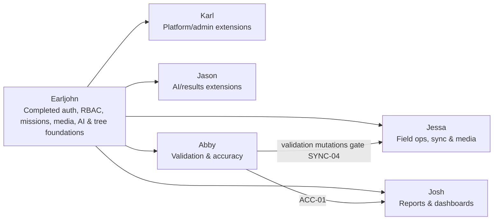

# MangroScan API Team Development Guide

This guide coordinates the remaining API work across the six-person team. The authoritative planning artifact is [MangroScan_API_Endpoint_Tracker - API Endpoint Tracker.csv](MangroScan_API_Endpoint_Tracker%20-%20API%20Endpoint%20Tracker.csv). Always read the tracker row and the matching contract in [MangroScan_API_Database_Migration_Kanban.md](MangroScan_API_Database_Migration_Kanban.md) before writing code.

## Team and ownership model

| Member | Responsibility |
| --- | --- |
| Earljohn Estandarte | Project owner; owns the 85 endpoints already marked `Done` and the shared implementation foundation |
| Karl | Authentication, site/access, saved-view, settings, notification, and audit extensions |
| Jessa | Hardware, field lifecycle, mobile synchronization, and remaining media lifecycle |
| Jason | AI lifecycle, geospatial layer building, confidence review, and training/annotation extensions |
| Abby | Validation, ground truth, decisions, completion, and accuracy calculation |
| Josh | Reports, exports, and dashboards |

Assignments optimize conflict avoidance and dependency continuity before raw endpoint-count equality. The P0 validation and reporting chains intentionally remain together because splitting their services, migrations, and tests would create substantial merge risk.

## Assignment summary

| Developer | Endpoint count | P0 | P1 | P2 | Main domain | Estimated workload |
| --- | ---: | ---: | ---: | ---: | --- | ---: |
| Karl | 13 | 0 | 1 | 12 | Platform admin and tenant CRUD extensions | ~23 points |
| Jessa | 12 | 1 | 2 | 9 | Hardware, field operations, sync, and media | ~27 points |
| Jason | 13 | 0 | 3 | 10 | AI/results and training extensions | ~31 points |
| Abby | 8 | 7 | 1 | 0 | Validation and accuracy | ~32 points |
| Josh | 10 | 3 | 7 | 0 | Reports, exports, and dashboards | ~35 points |
| **Total remaining** | **56** | **11** | **14** | **31** |  |  |

The estimate starts with P0 = 3, P1 = 2, and P2 = 1, then accounts for geospatial work, async/storage workflows, validation calculations, transactions, and cross-domain coordination. It is a planning estimate, not a tracker contract.

### Karl

**Modules:** authentication refresh; site/archive, plot, and permit extensions; saved views; notification/settings/audit extensions.

**Endpoint IDs:**

- P1: `AUTH-04`
- P2: `SITE-05`, `PLOT-03`, `PERMIT-01`, `PERMIT-02`, `VIEW-01`, `VIEW-02`, `VIEW-03`, `VIEW-04`, `NOTIF-04`, `SET-01`, `SET-02`, `AUD-02`

**Recommended branches:**

- `feature/karl/auth-refresh`
- `feature/karl/sites-permits`
- `feature/karl/dashboard-admin-extensions`

**Likely paths:** `app/Http/Controllers/Api/V1/Auth`, `Site`, `Notification`, and `Audit`; matching folders under `app/Http/Requests`, `app/Services`, and `tests/Feature`; existing site/RBAC models; module migrations and `database/sql/dcl` when new tables or privileges are required.

**Dependencies:** all named endpoint prerequisites are already owned/completed by Earljohn. Keep `PERMIT-01` before `PERMIT-02`, `VIEW-01` before `VIEW-02`, `VIEW-02` before `VIEW-03/04`, and `SET-01` before `SET-02`.

### Jessa

**Modules:** drone/sensor/battery maintenance; remaining mission/flight evidence; mobile synchronization; media download/delete lifecycle.

**Endpoint IDs:**

- P0: `SYNC-04`
- P1: `SYNC-05`, `MEDIA-05`
- P2: `DRONE-04`, `SENSOR-02`, `CAL-01`, `BAT-01`, `BAT-02`, `MSN-05`, `ENV-01`, `BAT-03`, `MEDIA-07`

**Recommended branches:**

- `feature/jessa/hardware-field-ops`
- `feature/jessa/mobile-sync-media`

**Likely paths:** `app/Http/Controllers/Api/V1/Drone`, `Flight`, `Mission`, `Mobile`, and `Media`; corresponding requests/services/tests; hardware and sync models/migrations; storage services; `database/sql/dcl`.

**Dependencies:** implement `BAT-01` before `BAT-02/03` and `SYNC-04` before `SYNC-05`. `MEDIA-05` depends on Earljohn's completed metadata-only `MEDIA-04`; it remains the sole temporary download URL/token endpoint. `SYNC-04` is explicitly blocked until all mutable mobile resources are available, including Abby's validation mutation chain, so coordinate its final integration with Abby.

### Jason

**Modules:** AI credential/model/job lifecycle; geospatial layer building; confidence-review extension; training datasets and annotations.

**Endpoint IDs:**

- P1: `LAYER-02`, `CONF-01`, `CONF-02`
- P2: `AISVC-05`, `MODEL-03`, `JOB-05`, `DATASET-01`, `DATASET-02`, `DATASET-03`, `ANN-01`, `ANN-02`, `ANN-03`, `ANN-04`

**Recommended branches:**

- `feature/jason/ai-lifecycle`
- `feature/jason/layers-confidence`
- `feature/jason/training-annotation`

**Likely paths:** `app/Http/Controllers/Api/V1/Ai`, `Processing`, and `Tree`; matching requests/services/tests; new confidence/training modules that follow the same convention; AI/tree models; queue/storage integration; module migrations and DCL.

**Dependencies:** `CONF-01` precedes `CONF-02`; `DATASET-01` precedes `DATASET-02/03`; `ANN-01` precedes `ANN-02`, then `ANN-03`, then `ANN-04`. `LAYER-02` still requires the documented photogrammetry inputs, and `ANN-01` requires the non-endpoint annotation foundation. Keep their `Manual Planning State` as `Blocked` until the prerequisites are approved rather than inventing contracts.

### Abby

**Modules:** field validation sessions, ground-truth measurements, validation decisions, accuracy metrics, and validation completion.

**Endpoint IDs:**

- P0: `VAL-01`, `VAL-02`, `VAL-03`, `VAL-04`, `GT-01`, `MATCH-01`, `ACC-01`
- P1: `VAL-05`

**Recommended branch:** `feature/abby/validation-accuracy`

**Likely paths:** create `app/Http/Controllers/Api/V1/Validation`, `app/Http/Requests/Validation`, `app/Services/Validation`, and `tests/Feature/Validation` following existing single-action conventions; reuse the existing validation models and `2026_08_12_066000_create_validation_foundation_tables.php`; add only approved additive migrations/DCL.

**Dependencies:** preserve the chain `VAL-01 → VAL-02/03 → VAL-04 → GT-01/MATCH-01 → ACC-01/VAL-05`. The manual records unresolved public-contract/schema conflicts for this family. Coordinate the contract decision with Earljohn before moving affected rows' `Manual Planning State` from `Blocked` to `Ready`; change `Status` to `Working` only when implementation actually starts.

### Josh

**Modules:** report definitions/lifecycle, generated exports/downloads, and dashboard analytics.

**Endpoint IDs:**

- P0: `RPT-05`, `EXP-01`, `EXP-03`
- P1: `RPT-02`, `RPT-03`, `RPT-04`, `RPT-06`, `EXP-02`, `DASH-01`, `DASH-02`

**Recommended branch:** `feature/josh/reports-exports-dashboard`

**Likely paths:** `app/Http/Controllers/Api/V1/Report` plus new export/dashboard folders following existing conventions; `app/Http/Requests/Report`; report/export/dashboard services; report models and storage/queue code; `tests/Feature/Report` plus export/dashboard suites; migrations and DCL.

**Dependencies:** preserve `RPT-02 → RPT-03 → RPT-04/05/EXP-01`, `RPT-05 → RPT-06`, `EXP-01 → EXP-02 → EXP-03`, and `DASH-01 → DASH-02`. Report and dashboard completion depends on Earljohn's canonical tree results and Abby's finalized `ACC-01` metrics.

## Cross-developer dependency map



- `ACC-01` must be finalized before Josh can complete `RPT-02` and `DASH-01` against authoritative accuracy data.
- Abby's mutable validation resources are an explicit condition of Jessa's `SYNC-04` all-mutable-resources dependency.
- Jason's current assigned rows depend on completed Earljohn foundations or documented non-endpoint prerequisites; the tracker declares no direct dependency on another remaining developer package.
- Karl's current assigned rows depend only on completed Earljohn endpoints and within-Karl chains.

## Tracker workflow

The tracker lives at `docs/MangroScan_API_Endpoint_Tracker - API Endpoint Tracker.csv`. Its request, response, error, dependency, and priority columns are contract data. Do not rewrite them during routine status updates.

The two state columns have separate vocabularies:

| Column | Supported values | Rule |
| --- | --- | --- |
| `Status` | `Not Done`, `Working`, `Testing`, `Blocked`, `Done` | Use `Working` after implementation starts, `Testing` while verification is underway, and `Blocked` when active work cannot continue. Set `Done` only after every definition-of-done gate passes. |
| `Manual Planning State` | `Backlog`, `Ready`, `Blocked` | Use `Ready` only when prerequisites and contract decisions are satisfied; use `Blocked` when a documented dependency or decision prevents work; otherwise keep `Backlog`. |

Do not invent additional values such as `In Progress`, `Review`, or HTTP codes. Before starting, inspect `Depends On`, `Unblocks / Dependents`, `Manual Planning State`, and `Notes`. Update only your owned planning fields, and make note changes additive. Preserve row order, columns, endpoint IDs, and contracts. Avoid spreadsheet exports that silently rewrite IDs, dates, quoting, or UTF-8 text.

## Repository code conventions

This repository uses domain folders and mostly single-action controllers. Follow the existing pattern rather than introducing a generic multi-action controller architecture:

```text
routes/api.php
    → app/Http/Requests/<Domain>/...
    → app/Http/Controllers/Api/V1/<Domain>/<EndpointController>.php
    → app/Services/<Domain>/...
    → app/Models/...
    → database/migrations/ and database/sql/dcl/
    → tests/Feature/<Domain>/...
```

- **Routes:** `routes/api.php` is the single current API route file. Do not restructure it as part of endpoint work without team approval.
- **Controllers:** keep single-action controllers thin because that is the established convention.
- **Form Requests:** place meaningful validation under `app/Http/Requests/<Domain>`; do not duplicate rules in controllers.
- **Models:** inspect `app/Models` first, preserve UUID primary keys, and never create a second model for the same table.
- **Services:** put transactions, state transitions, storage, AI calls, and calculations under `app/Services/<Domain>`.
- **Policies/RBAC:** this codebase currently authorizes through active-identity and permission middleware plus tenant-scoped services; do not invent a parallel role-name check. Add policies only through an agreed architectural change.
- **Migrations:** inspect existing tables and constraints first. All schema changes must be version-controlled; never make an untracked pgAdmin-only change.
- **SQL/DCL:** use `database/sql/dcl` for numbered least-privilege grants and the existing SQL structure for functions/views/triggers.
- **Tests:** follow `tests/Feature/<Domain>`. Cover exact success status/shape, `401`, `403`, applicable `404/409/422`, tenant isolation, state transitions, persistence, audit/notification side effects, and PostgreSQL-only behavior where relevant.
- **Documentation:** keep endpoint contracts in the existing tracker and focused design notes under `docs`; do not create a second source of truth for the same contract.

## Database ownership

Each developer owns the migrations, constraints, indexes, models, SQL functions/views/triggers, and DCL needed by their assigned domain. Check existing migrations and `docs/MangroScan_DB_Schema.md` before adding schema so two branches never create competing versions of the same table.

Earljohn coordinates changes to shared/core identity, organization, RBAC, audit, notification, and seeder infrastructure, including `users`, `organizations`, permission catalogs, `RbacSeedData`, and `DatabaseSeeder`. A domain branch may reuse those foundations, but any additive shared-schema or permission change must be agreed with Earljohn before implementation. Reserve DCL sequence numbers and migration ordering with the team before creating files.

## Endpoint ID traceability

Every route, controller, and test must include the tracker ID so a repository search finds the complete implementation:

```php
// [SITE-02] POST /api/v1/sites
Route::post('/sites', SiteStoreController::class);
```

```php
// [SITE-02] Authorized Researcher can create a tenant-owned survey site.
public function test_researcher_can_create_a_site(): void
{
    // ...
}
```

Use the exact documented method, path, request, success code/shape, and errors. Do not modify public contracts merely to simplify an implementation.

## Git workflow

The integration branch is currently `main`. Never discard uncommitted work.

### Start a module branch

```bash
git status
git switch main
git pull
git switch -c feature/karl/sites-permits
```

Substitute the assigned developer and module. Branch names must be lowercase, hyphen-separated, and use `feature/<developer>/<module>`.

### Continue an existing branch

```bash
git switch feature/karl/sites-permits
git pull
git status
```

### Commit narrowly

Before committing, run the relevant tests, inspect `git status` and `git diff`, and stage only related files. Do not blindly use `git add .` in a dirty worktree.

```text
feat(SITE-02): implement survey site creation
feat(MSN-06): add mission approval workflow
test(VAL-03): add validation session authorization tests
fix(MEDIA-03): validate upload completion state
chore(db): add site domain migrations
```

Prefer one endpoint per commit. Closely coupled endpoint pairs may share a commit when separation would be artificial.

### Synchronize before merge

```bash
git switch main
git pull
git switch feature/karl/sites-permits
git merge main
```

Resolve conflicts locally and rerun tests. Do not use `git push --force` or `git reset --hard` without explicit team coordination.

## Testing gates

Run the focused module suite throughout development, then the complete fast suite:

```bash
php artisan test tests/Feature/Site
php artisan test
vendor/bin/pint --test
```

PostgreSQL/PostGIS changes must also pass the isolated profile described in [PostgreSQL_Testing.md](PostgreSQL_Testing.md):

```bash
php vendor/bin/phpunit -c phpunit.pgsql.xml tests/Feature/Site
php vendor/bin/phpunit -c phpunit.pgsql.xml
```

Confirm that the profile resolves `mangroscan_test` before destructive tests. Never point `RefreshDatabase`, `migrate:fresh`, or `db:wipe` at the development `mangroscan` database.

## Merge-conflict prevention

| Shared file/resource | Risk | Team rule |
| --- | --- | --- |
| `routes/api.php` | Every endpoint adds routes | Add a small endpoint-ID-labeled block in the existing domain section; synchronize `main` immediately before editing and before merge |
| Tracker CSV | All developers update planning state | Change only owned `Assigned To`, `Status`, `Manual Planning State`, and additive `Notes`; use the documented enums and preserve row/column order and contracts |
| `database/sql/dcl` numbering | Concurrent scripts can claim the same sequence | Reserve the next DCL number in team chat before creating a file; renumber on merge if necessary |
| Migration timestamps | Concurrent migrations can collide or order incorrectly | Use a unique timestamp and ensure parent tables/columns precede dependents |
| `RbacSeedData` / permission catalog | New permissions affect three roles and tests | Reuse an existing code first; coordinate any genuinely new permission with Earljohn and the affected role owner |
| `User` model / `DatabaseSeeder` | Core identity and seed order are shared by all domains | Treat Earljohn as owner; keep domain-specific relationships or seeders isolated and coordinate any required core edit |
| Audit and notification infrastructure | Many mutations reuse shared services/tables | Reuse existing loggers/resources; avoid broad refactors inside endpoint branches |
| Mission/media/validation sync resources | Jessa's sync work reads other domains | Agree on serialized mobile shapes with Abby before finalizing `SYNC-04`; avoid simultaneous uncoordinated edits |
| Large manual/tracker docs | High line-level conflict | Put implementation detail in focused docs/tests and make the smallest necessary manual update near the owned endpoint card |

Do not reorganize shared routes, middleware, responses, seeders, or directory structure merely to reduce a local branch's code. Propose such changes separately.

## Secrets and production safety

Never commit `.env`, database passwords, seed-user passwords, API keys, object-storage credentials, FastAPI credentials, access tokens, or generated secret material. Use `.env.example` only for blank/safe placeholders. Developer accounts are guarded from production; do not weaken that guard or place a real password in source control.

## Definition of done

An endpoint can move to `Done` only when:

1. the tracker contract and dependency gates are satisfied;
2. route, request, controller, service, model/schema, and RBAC behavior follow repository conventions;
3. success, error, tenant, workflow, persistence, and side-effect tests pass;
4. PostgreSQL/PostGIS and DCL tests pass when applicable;
5. Pint and relevant full suites pass;
6. documentation and the owned tracker row are current;
7. the branch is synchronized with `main` and ready for review.
