# MangroScan Frontend API Integration Manual

> **Audience:** React web and React Native/Expo developers
> **API version:** `v1`
> **Verified against:** the endpoint tracker, live Laravel routes, controllers, Form Requests, resources, services, RBAC seed data, and feature tests on 2026-08-24.

## Purpose and source precedence

Use this manual to select an endpoint, determine whether it is available, construct requests, handle responses/errors, and gate UI actions. For endpoints marked `Done`, the documented runtime behavior comes from the current Laravel implementation and tests. For all other endpoints, request/response text is the approved planned contract from the tracker and is not an operational promise.

Implementation evidence takes precedence for an available endpoint. The tracker remains the planning contract. Material differences are listed in [Contract / Implementation Discrepancies](#contract--implementation-discrepancies).

## Base URL and frontend configuration

The Laravel API routes are registered under `/api/v1`. A typical local server started with `php artisan serve` is:

```text
http://localhost:8000/api/v1
```

Configure this once; never scatter absolute URLs through frontend source:

```env
VITE_API_BASE_URL=http://localhost:8000/api/v1
EXPO_PUBLIC_API_BASE_URL=http://<development-host>:8000/api/v1
```

For a physical Expo device, `localhost` means the phone itself. Use a reachable development host or tunnel. No production API domain is defined in this repository.

## Availability legend

| Marker | Meaning |
| --- | --- |
| ✅ AVAILABLE | CSV `Status=Done`; implemented and intended for integration. |
| 🧪 TESTING | Implementation exists but is still being verified; coordinate before production use. |
| 🚧 UNDER CONSTRUCTION | Planned or actively being built; do not use as a production dependency. |
| ⛔ BLOCKED / UNDER CONSTRUCTION | Not implemented and waiting on a documented prerequisite or decision. |

Current inventory: **141 endpoints**, **85 available**, **31 under construction**, **25 blocked in manual planning**, and **0 testing**.

## Currently available endpoints

`SYS-01`, `SYS-02`, `AUTH-01`, `AUTH-02`, `AUTH-03`, `AUTH-05`, `AUTH-06`, `AUTH-07`, `AUTH-08`, `ORG-01`, `ORG-02`, `ORG-03`, `ORG-04`, `USR-01`, `USR-02`, `USR-03`, `USR-04`, `USR-05`, `RBAC-01`, `RBAC-02`, `RBAC-03`, `RBAC-04`, `SITE-01`, `SITE-02`, `SITE-03`, `SITE-04`, `BOUND-01`, `BOUND-02`, `BOUND-03`, `PLOT-01`, `PLOT-02`, `DRONE-01`, `DRONE-02`, `DRONE-03`, `SENSOR-01`, `MSN-01`, `MSN-02`, `MSN-03`, `MSN-04`, `TEAM-01`, `MSN-06`, `MSN-07`, `MSN-08`, `FLT-01`, `FLT-02`, `FLT-03`, `FLT-04`, `CHK-01`, `FLT-05`, `FLT-06`, `FLT-07`, `WPT-01`, `SYNC-01`, `SYNC-02`, `SYNC-03`, `MEDIA-01`, `MEDIA-02`, `MEDIA-03`, `MEDIA-04`, `MEDIA-06`, `SDS-01`, `SDS-02`, `AISVC-01`, `AISVC-02`, `AISVC-03`, `AISVC-04`, `MODEL-01`, `MODEL-02`, `JOB-01`, `JOB-02`, `JOB-03`, `JOB-04`, `TREE-01`, `TREE-02`, `TREE-03`, `COUNT-01`, `RESULT-01`, `RESULT-02`, `RESULT-03`, `LAYER-01`, `RPT-01`, `NOTIF-01`, `NOTIF-02`, `NOTIF-03`, `AUD-01`.

## Unavailable, testing, and blocked endpoints

`AUTH-04`, `SITE-05`, `PLOT-03`, `PERMIT-01`, `PERMIT-02`, `DRONE-04`, `SENSOR-02`, `CAL-01`, `BAT-01`, `BAT-02`, `MSN-05`, `ENV-01`, `BAT-03`, `SYNC-04`, `SYNC-05`, `MEDIA-05`, `MEDIA-07`, `AISVC-05`, `MODEL-03`, `JOB-05`, `LAYER-02`, `CONF-01`, `CONF-02`, `VAL-01`, `VAL-02`, `VAL-03`, `VAL-04`, `GT-01`, `MATCH-01`, `ACC-01`, `VAL-05`, `RPT-02`, `RPT-03`, `RPT-04`, `RPT-05`, `RPT-06`, `EXP-01`, `EXP-02`, `EXP-03`, `DASH-01`, `DASH-02`, `VIEW-01`, `VIEW-02`, `VIEW-03`, `VIEW-04`, `NOTIF-04`, `SET-01`, `SET-02`, `AUD-02`, `DATASET-01`, `DATASET-02`, `DATASET-03`, `ANN-01`, `ANN-02`, `ANN-03`, `ANN-04`.

Do not integrate the newly routed endpoints above yet. Jessamae Sumanoy's `BAT-01` remains `Working` after schema, DCL, test, and formatting gaps were found. Jason Benabente's P2 endpoints plus `LAYER-02` and `CONF-01/02` are `Testing`: SQLite passes, but PostgreSQL has not run because the test role lacks schema-creation privilege, and the per-endpoint test matrix is incomplete. `ACC-01` and `VAL-05` remain `Blocked` on `MATCH-01`.

## Complete endpoint availability table

| ID | Method | Endpoint | Priority | Tracker status | Frontend availability |
| --- | --- | --- | --- | --- | --- |
| `SYS-01` | GET | `/api/v1/health` | P0 | Done | ✅ AVAILABLE |
| `SYS-02` | GET | `/api/v1/meta/capabilities` | P1 | Done | ✅ AVAILABLE |
| `AUTH-01` | POST | `/api/v1/auth/login` | P0 | Done | ✅ AVAILABLE |
| `AUTH-02` | GET | `/api/v1/auth/me` | P0 | Done | ✅ AVAILABLE |
| `AUTH-03` | POST | `/api/v1/auth/logout` | P0 | Done | ✅ AVAILABLE |
| `AUTH-04` | POST | `/api/v1/auth/refresh` | P1 | Not Done | ⛔ BLOCKED / UNDER CONSTRUCTION |
| `AUTH-05` | PUT | `/api/v1/auth/password` | P1 | Done | ✅ AVAILABLE |
| `AUTH-06` | POST | `/api/v1/auth/password/forgot` | P1 | Done | ✅ AVAILABLE |
| `AUTH-07` | POST | `/api/v1/auth/password/reset` | P1 | Done | ✅ AVAILABLE |
| `AUTH-08` | GET | `/api/v1/auth/permissions` | P1 | Done | ✅ AVAILABLE |
| `ORG-01` | GET | `/api/v1/organizations` | P1 | Done | ✅ AVAILABLE |
| `ORG-02` | POST | `/api/v1/organizations` | P1 | Done | ✅ AVAILABLE |
| `ORG-03` | GET | `/api/v1/organizations/{id}` | P1 | Done | ✅ AVAILABLE |
| `ORG-04` | PATCH | `/api/v1/organizations/{id}` | P1 | Done | ✅ AVAILABLE |
| `USR-01` | GET | `/api/v1/users` | P0 | Done | ✅ AVAILABLE |
| `USR-02` | POST | `/api/v1/users` | P0 | Done | ✅ AVAILABLE |
| `USR-03` | GET | `/api/v1/users/{id}` | P1 | Done | ✅ AVAILABLE |
| `USR-04` | PATCH | `/api/v1/users/{id}` | P1 | Done | ✅ AVAILABLE |
| `USR-05` | POST | `/api/v1/users/{id}/activation` | P1 | Done | ✅ AVAILABLE |
| `RBAC-01` | GET | `/api/v1/roles` | P0 | Done | ✅ AVAILABLE |
| `RBAC-02` | GET | `/api/v1/permissions` | P0 | Done | ✅ AVAILABLE |
| `RBAC-03` | PUT | `/api/v1/users/{id}/roles` | P0 | Done | ✅ AVAILABLE |
| `RBAC-04` | PUT | `/api/v1/roles/{id}/permissions` | P1 | Done | ✅ AVAILABLE |
| `SITE-01` | GET | `/api/v1/sites` | P0 | Done | ✅ AVAILABLE |
| `SITE-02` | POST | `/api/v1/sites` | P0 | Done | ✅ AVAILABLE |
| `SITE-03` | GET | `/api/v1/sites/{id}` | P0 | Done | ✅ AVAILABLE |
| `SITE-04` | PATCH | `/api/v1/sites/{id}` | P1 | Done | ✅ AVAILABLE |
| `SITE-05` | DELETE | `/api/v1/sites/{id}` | P2 | Not Done | 🚧 UNDER CONSTRUCTION |
| `BOUND-01` | GET | `/api/v1/sites/{id}/boundaries` | P0 | Done | ✅ AVAILABLE |
| `BOUND-02` | POST | `/api/v1/sites/{id}/boundaries` | P0 | Done | ✅ AVAILABLE |
| `BOUND-03` | PATCH | `/api/v1/boundaries/{id}` | P1 | Done | ✅ AVAILABLE |
| `PLOT-01` | GET | `/api/v1/sites/{id}/plots` | P1 | Done | ✅ AVAILABLE |
| `PLOT-02` | POST | `/api/v1/sites/{id}/plots` | P1 | Done | ✅ AVAILABLE |
| `PLOT-03` | PATCH | `/api/v1/plots/{id}` | P2 | Not Done | 🚧 UNDER CONSTRUCTION |
| `PERMIT-01` | GET | `/api/v1/sites/{id}/access-permissions` | P2 | Not Done | 🚧 UNDER CONSTRUCTION |
| `PERMIT-02` | POST | `/api/v1/sites/{id}/access-permissions` | P2 | Not Done | 🚧 UNDER CONSTRUCTION |
| `DRONE-01` | GET | `/api/v1/drones` | P1 | Done | ✅ AVAILABLE |
| `DRONE-02` | POST | `/api/v1/drones` | P1 | Done | ✅ AVAILABLE |
| `DRONE-03` | GET | `/api/v1/drones/{id}` | P1 | Done | ✅ AVAILABLE |
| `DRONE-04` | PATCH | `/api/v1/drones/{id}` | P2 | Not Done | 🚧 UNDER CONSTRUCTION |
| `SENSOR-01` | POST | `/api/v1/drones/{id}/sensors` | P1 | Done | ✅ AVAILABLE |
| `SENSOR-02` | PATCH | `/api/v1/sensors/{id}` | P2 | Not Done | 🚧 UNDER CONSTRUCTION |
| `CAL-01` | POST | `/api/v1/sensors/{id}/calibrations` | P2 | Not Done | 🚧 UNDER CONSTRUCTION |
| `BAT-01` | GET | `/api/v1/batteries` | P2 | Working | 🚧 IMPLEMENTATION REVIEW |
| `BAT-02` | POST | `/api/v1/batteries` | P2 | Not Done | 🚧 UNDER CONSTRUCTION |
| `MSN-01` | GET | `/api/v1/missions` | P0 | Done | ✅ AVAILABLE |
| `MSN-02` | POST | `/api/v1/missions` | P0 | Done | ✅ AVAILABLE |
| `MSN-03` | GET | `/api/v1/missions/{id}` | P0 | Done | ✅ AVAILABLE |
| `MSN-04` | PATCH | `/api/v1/missions/{id}` | P0 | Done | ✅ AVAILABLE |
| `MSN-05` | DELETE | `/api/v1/missions/{id}` | P2 | Not Done | 🚧 UNDER CONSTRUCTION |
| `TEAM-01` | PUT | `/api/v1/missions/{id}/team` | P0 | Done | ✅ AVAILABLE |
| `MSN-06` | POST | `/api/v1/missions/{id}/approve` | P0 | Done | ✅ AVAILABLE |
| `MSN-07` | POST | `/api/v1/missions/{id}/start` | P1 | Done | ✅ AVAILABLE |
| `MSN-08` | POST | `/api/v1/missions/{id}/complete` | P1 | Done | ✅ AVAILABLE |
| `FLT-01` | GET | `/api/v1/missions/{id}/flights` | P0 | Done | ✅ AVAILABLE |
| `FLT-02` | POST | `/api/v1/missions/{id}/flights` | P0 | Done | ✅ AVAILABLE |
| `FLT-03` | GET | `/api/v1/flights/{id}` | P0 | Done | ✅ AVAILABLE |
| `FLT-04` | PATCH | `/api/v1/flights/{id}` | P1 | Done | ✅ AVAILABLE |
| `CHK-01` | POST | `/api/v1/flights/{id}/checklists` | P0 | Done | ✅ AVAILABLE |
| `FLT-05` | POST | `/api/v1/flights/{id}/start` | P0 | Done | ✅ AVAILABLE |
| `FLT-06` | POST | `/api/v1/flights/{id}/complete` | P0 | Done | ✅ AVAILABLE |
| `FLT-07` | POST | `/api/v1/flights/{id}/fail` | P1 | Done | ✅ AVAILABLE |
| `WPT-01` | PUT | `/api/v1/flights/{id}/waypoints` | P1 | Done | ✅ AVAILABLE |
| `ENV-01` | POST | `/api/v1/flights/{id}/environment-logs` | P2 | Not Done | 🚧 UNDER CONSTRUCTION |
| `BAT-03` | POST | `/api/v1/flights/{id}/battery-usage` | P2 | Not Done | 🚧 UNDER CONSTRUCTION |
| `SYNC-01` | POST | `/api/v1/mobile/devices/register` | P0 | Done | ✅ AVAILABLE |
| `SYNC-02` | GET | `/api/v1/mobile/bootstrap` | P0 | Done | ✅ AVAILABLE |
| `SYNC-03` | GET | `/api/v1/mobile/missions/{id}/bundle` | P0 | Done | ✅ AVAILABLE |
| `SYNC-04` | POST | `/api/v1/mobile/sync` | P0 | Not Done | ⛔ BLOCKED / UNDER CONSTRUCTION |
| `SYNC-05` | GET | `/api/v1/mobile/sync/status` | P1 | Not Done | ⛔ BLOCKED / UNDER CONSTRUCTION |
| `MEDIA-01` | GET | `/api/v1/flights/{id}/media` | P0 | Done | ✅ AVAILABLE |
| `MEDIA-02` | POST | `/api/v1/flights/{id}/media/uploads` | P0 | Done | ✅ AVAILABLE |
| `MEDIA-03` | POST | `/api/v1/media/uploads/{uploadId}/complete` | P0 | Done | ✅ AVAILABLE |
| `MEDIA-04` | GET | `/api/v1/media/{id}` | P0 | Done | ✅ AVAILABLE |
| `MEDIA-05` | POST | `/api/v1/media/{id}/download` | P1 | Not Done | ⛔ BLOCKED / UNDER CONSTRUCTION |
| `MEDIA-06` | PATCH | `/api/v1/media/{id}/quality` | P0 | Done | ✅ AVAILABLE |
| `MEDIA-07` | DELETE | `/api/v1/media/{id}` | P2 | Not Done | 🚧 UNDER CONSTRUCTION |
| `SDS-01` | POST | `/api/v1/flights/{id}/sensor-datasets/uploads` | P1 | Done | ✅ AVAILABLE |
| `SDS-02` | POST | `/api/v1/sensor-datasets/uploads/{uploadId}/complete` | P1 | Done | ✅ AVAILABLE |
| `AISVC-01` | GET | `/api/v1/admin/ai-services` | P1 | Done | ✅ AVAILABLE |
| `AISVC-02` | POST | `/api/v1/admin/ai-services` | P1 | Done | ✅ AVAILABLE |
| `AISVC-03` | POST | `/api/v1/admin/ai-services/{id}/test` | P1 | Done | ✅ AVAILABLE |
| `AISVC-04` | POST | `/api/v1/admin/ai-services/{id}/synchronize` | P1 | Done | ✅ AVAILABLE |
| `AISVC-05` | POST | `/api/v1/admin/ai-services/{id}/credentials` | P2 | Testing | 🧪 TESTING — NOT AVAILABLE |
| `MODEL-01` | GET | `/api/v1/ai-models` | P1 | Done | ✅ AVAILABLE |
| `MODEL-02` | GET | `/api/v1/ai-models/{id}` | P1 | Done | ✅ AVAILABLE |
| `MODEL-03` | POST | `/api/v1/ai-models/{id}/versions/{versionId}/deploy` | P2 | Testing | 🧪 TESTING — NOT AVAILABLE |
| `JOB-01` | GET | `/api/v1/processing-jobs` | P0 | Done | ✅ AVAILABLE |
| `JOB-02` | POST | `/api/v1/processing-jobs` | P0 | Done | ✅ AVAILABLE |
| `JOB-03` | GET | `/api/v1/processing-jobs/{id}` | P0 | Done | ✅ AVAILABLE |
| `JOB-04` | POST | `/api/v1/processing-jobs/{id}/retry` | P1 | Done | ✅ AVAILABLE |
| `JOB-05` | POST | `/api/v1/processing-jobs/{id}/cancel` | P2 | Testing | 🧪 TESTING — NOT AVAILABLE |
| `TREE-01` | GET | `/api/v1/tree-observations` | P0 | Done | ✅ AVAILABLE |
| `TREE-02` | GET | `/api/v1/tree-observations/{id}` | P0 | Done | ✅ AVAILABLE |
| `TREE-03` | GET | `/api/v1/missions/{id}/trees.geojson` | P0 | Done | ✅ AVAILABLE |
| `COUNT-01` | GET | `/api/v1/missions/{id}/tree-counts` | P0 | Done | ✅ AVAILABLE |
| `RESULT-01` | GET | `/api/v1/tree-observations/{id}/species` | P1 | Done | ✅ AVAILABLE |
| `RESULT-02` | GET | `/api/v1/tree-observations/{id}/heights` | P1 | Done | ✅ AVAILABLE |
| `RESULT-03` | GET | `/api/v1/tree-observations/{id}/ages` | P1 | Done | ✅ AVAILABLE |
| `LAYER-01` | GET | `/api/v1/missions/{id}/layers` | P1 | Done | ✅ AVAILABLE |
| `LAYER-02` | POST | `/api/v1/missions/{id}/layers/build` | P1 | Testing | 🧪 TESTING — NOT AVAILABLE |
| `CONF-01` | GET | `/api/v1/confidence-review` | P1 | Testing | 🧪 TESTING — NOT AVAILABLE |
| `CONF-02` | PUT | `/api/v1/confidence-review/{resultId}` | P1 | Testing | 🧪 TESTING — NOT AVAILABLE |
| `VAL-01` | GET | `/api/v1/validation/scopes` | P0 | Not Done | ⛔ BLOCKED / UNDER CONSTRUCTION |
| `VAL-02` | GET | `/api/v1/validation-sessions` | P0 | Not Done | ⛔ BLOCKED / UNDER CONSTRUCTION |
| `VAL-03` | POST | `/api/v1/validation-sessions` | P0 | Not Done | ⛔ BLOCKED / UNDER CONSTRUCTION |
| `VAL-04` | GET | `/api/v1/validation-sessions/{id}` | P0 | Not Done | ⛔ BLOCKED / UNDER CONSTRUCTION |
| `GT-01` | POST | `/api/v1/validation-sessions/{id}/ground-truth` | P0 | Not Done | ⛔ BLOCKED / UNDER CONSTRUCTION |
| `MATCH-01` | POST | `/api/v1/validation-sessions/{id}/decisions` | P0 | Not Done | ⛔ BLOCKED / UNDER CONSTRUCTION |
| `ACC-01` | POST | `/api/v1/validation-sessions/{id}/accuracy/recompute` | P0 | Blocked | ⛔ BLOCKED — MATCH-01 REQUIRED |
| `VAL-05` | POST | `/api/v1/validation-sessions/{id}/complete` | P1 | Blocked | ⛔ BLOCKED — MATCH-01 REQUIRED |
| `RPT-01` | GET | `/api/v1/reports` | P1 | Done | ✅ AVAILABLE |
| `RPT-02` | POST | `/api/v1/reports` | P1 | Not Done | ⛔ BLOCKED / UNDER CONSTRUCTION |
| `RPT-03` | GET | `/api/v1/reports/{id}` | P1 | Not Done | ⛔ BLOCKED / UNDER CONSTRUCTION |
| `RPT-04` | PATCH | `/api/v1/reports/{id}` | P1 | Not Done | ⛔ BLOCKED / UNDER CONSTRUCTION |
| `RPT-05` | POST | `/api/v1/reports/{id}/generate` | P0 | Not Done | ⛔ BLOCKED / UNDER CONSTRUCTION |
| `RPT-06` | POST | `/api/v1/reports/{id}/approve` | P1 | Not Done | ⛔ BLOCKED / UNDER CONSTRUCTION |
| `EXP-01` | POST | `/api/v1/reports/{id}/exports` | P0 | Not Done | ⛔ BLOCKED / UNDER CONSTRUCTION |
| `EXP-02` | GET | `/api/v1/exported-files` | P1 | Not Done | ⛔ BLOCKED / UNDER CONSTRUCTION |
| `EXP-03` | POST | `/api/v1/exported-files/{id}/download` | P0 | Not Done | ⛔ BLOCKED / UNDER CONSTRUCTION |
| `DASH-01` | GET | `/api/v1/dashboard/overview` | P1 | Not Done | ⛔ BLOCKED / UNDER CONSTRUCTION |
| `DASH-02` | GET | `/api/v1/dashboard/missions/{id}` | P1 | Not Done | ⛔ BLOCKED / UNDER CONSTRUCTION |
| `VIEW-01` | GET | `/api/v1/dashboard/saved-views` | P2 | Not Done | 🚧 UNDER CONSTRUCTION |
| `VIEW-02` | POST | `/api/v1/dashboard/saved-views` | P2 | Not Done | 🚧 UNDER CONSTRUCTION |
| `VIEW-03` | PATCH | `/api/v1/dashboard/saved-views/{id}` | P2 | Not Done | 🚧 UNDER CONSTRUCTION |
| `VIEW-04` | DELETE | `/api/v1/dashboard/saved-views/{id}` | P2 | Not Done | 🚧 UNDER CONSTRUCTION |
| `NOTIF-01` | GET | `/api/v1/notifications` | P1 | Done | ✅ AVAILABLE |
| `NOTIF-02` | GET | `/api/v1/notifications/unread-count` | P1 | Done | ✅ AVAILABLE |
| `NOTIF-03` | POST | `/api/v1/notifications/{id}/read` | P1 | Done | ✅ AVAILABLE |
| `NOTIF-04` | POST | `/api/v1/notifications/read-all` | P2 | Not Done | 🚧 UNDER CONSTRUCTION |
| `SET-01` | GET | `/api/v1/settings` | P2 | Not Done | 🚧 UNDER CONSTRUCTION |
| `SET-02` | PUT | `/api/v1/settings/{key}` | P2 | Not Done | 🚧 UNDER CONSTRUCTION |
| `AUD-01` | GET | `/api/v1/audit-logs` | P1 | Done | ✅ AVAILABLE |
| `AUD-02` | GET | `/api/v1/audit-logs/{id}` | P2 | Testing | 🧪 TESTING — NOT AVAILABLE |
| `DATASET-01` | GET | `/api/v1/training-datasets` | P2 | Testing | 🧪 TESTING — NOT AVAILABLE |
| `DATASET-02` | POST | `/api/v1/training-datasets` | P2 | Testing | 🧪 TESTING — NOT AVAILABLE |
| `DATASET-03` | POST | `/api/v1/training-datasets/{id}/items` | P2 | Testing | 🧪 TESTING — NOT AVAILABLE |
| `ANN-01` | GET | `/api/v1/annotation/projects` | P2 | Testing | 🧪 TESTING — NOT AVAILABLE |
| `ANN-02` | POST | `/api/v1/annotation/projects` | P2 | Testing | 🧪 TESTING — NOT AVAILABLE |
| `ANN-03` | PUT | `/api/v1/annotation/items/{id}/objects` | P2 | Testing | 🧪 TESTING — NOT AVAILABLE |
| `ANN-04` | POST | `/api/v1/annotation/projects/{id}/exports` | P2 | Testing | 🧪 TESTING — NOT AVAILABLE |

## Authentication and session behavior

- Authentication uses Laravel Sanctum personal access tokens returned by `AUTH-01`.
- Protected routes require `Authorization: Bearer <token>` and normally require an active user in an active organization.
- Tokens expire after **60 minutes by default** (`AUTH_ACCESS_TOKEN_TTL_MINUTES`). Treat `expires_at` from login as authoritative.
- `AUTH-04` refresh is not implemented. Until it is available, prompt for login again after token expiry.
- `AUTH-03` revokes the current token. `AUTH-05` password change and `AUTH-07` reset revoke all existing tokens.
- UI visibility should be based on the effective `permissions` returned by `AUTH-01`, `AUTH-02`, or `AUTH-08`, not only on role names.

### Drone Operator authorization

`Drone Operator` is the fourth seeded operational role and is intended for field/mobile flight work. The deterministic local/testing account is `operator@mangroscan.test`; its password comes from `MANGROSCAN_SEED_USER_PASSWORD` and is never documented as a literal credential.

The role receives exactly these effective permissions: `sites.read`, `missions.read`, `flights.read`, `flights.start`, `flights.complete`, `checklists.submit`, `media.read`, `media.upload`, `notifications.read`, `drones.read`, and `batteries.read`. It does not receive administration, planning, approval, AI-processing, results/validation, accuracy, reporting, audit, or settings permissions.

For this role, mission and flight visibility is narrower than normal organization scope: mission reads return only approved missions where the caller is a mission-team member or assigned pilot; flight and media workflows return only approved-mission flights whose `pilot_user_id` is the caller. Same-organization unassigned resources and every foreign-organization resource are returned as `404`, not exposed through a client-supplied role or device flag. The supported field chain is `SYNC-01..03`, `MSN-01/03`, `FLT-01/03/05/06/07`, `CHK-01`, `MEDIA-01..04`, and `NOTIF-01..03`, subject to each endpoint's normal lifecycle checks.

## Common headers

```http
Accept: application/json
Content-Type: application/json
Authorization: Bearer <token>
X-Request-ID: <optional-client-correlation-id>
```

`Content-Type` is needed only when a body is sent. Upload-initiation and finalization requests are JSON. File bytes are sent separately to the temporary `upload_url`, using the method expected by that URL. Never send `FastAPI X-API-Key`; it is backend-only.

`MEDIA-02`, `MEDIA-03`, `SDS-01`, `SDS-02`, `JOB-02`, and `JOB-04` additionally require a non-empty `Idempotency-Key` of at most 100 characters. Reuse a key only when replaying the same logical request.

## General response and error behavior

Most successful JSON responses use `data` and, where implemented, `meta.request_id`. Paginated lists use:

```json
{
    "data": [],
    "meta": {
        "request_id": "<request-id>",
        "page": 1,
        "per_page": 25,
        "total": 0,
        "last_page": 1
    }
}
```

The default `per_page` is 25 and the configured maximum is 100. Do not assume pagination on endpoints whose contract returns a plain array.

API errors use this envelope:

```json
{
    "error": {
        "code": "VALIDATION_FAILED",
        "message": "The request contains invalid fields.",
        "details": {
            "field_name": [
                "The field name field is required."
            ]
        },
        "request_id": "<request-id>"
    }
}
```

| HTTP | Typical meaning |
| --- | --- |
| 400 | Malformed request or missing/invalid idempotency header. |
| 401 | Missing, expired, revoked, or invalid bearer token; login also uses `INVALID_CREDENTIALS`. |
| 403 | Inactive identity or missing effective permission. |
| 404 | Missing resource, malformed UUID route value, or a resource hidden by tenant scope. |
| 409 | Lifecycle conflict, duplicate/idempotency conflict, or invalid transition. Inspect `error.details`. |
| 422 | Form Request validation failure; field messages are in `error.details`. |
| 429 | Rate limited. Login defaults to 5 attempts/minute and authenticated API calls to 60/minute. |
| 502/503 | Downstream AI/storage/dependency failure or API readiness failure. |

Every response includes an `X-Request-ID` header. Include the same value when reporting an integration failure.

## Data conventions

- **UUIDs:** Resource identifiers are UUID strings. Replace `{id}`/`{uploadId}` with the corresponding UUID.
- **Dates/times:** Implemented resources emit ISO-8601 strings; many explicitly normalize to UTC. Treat the returned offset as authoritative. Send ISO-8601 input unless a field explicitly requires `YYYY-MM-DD`.
- **Nullability:** Fields declared `nullable` in the request tables may be sent as `null`. Response resources can also return `null` for optional source columns and incomplete lifecycle timestamps.
- **GeoJSON:** Send geometry as GeoJSON, SRID/WGS84 4326 semantics, with **longitude first and latitude second**. Never send PostGIS SQL.

```json
{
    "type": "Point",
    "coordinates": [
        123.305,
        9.307
    ]
}
```

Polygon rings must be closed and valid according to backend geometry validation.

## Primary role reference

### System Administrator

Administers MangroScan identities, hardware, auditing, settings, and AI infrastructure.

**Seeded permissions:** `organizations.manage`, `users.manage`, `roles.manage`, `permissions.manage`, `drones.read`, `drones.manage`, `sensors.manage`, `sensor_calibrations.manage`, `ai_services.manage`, `ai_models.read`, `ai_models.manage`, `settings.manage`, `audit.read`, `notifications.read`.

### Researcher

Plans surveys, manages field collection, analyzes results, validates observations, and prepares reports.

**Seeded permissions:** `sites.read`, `sites.manage`, `boundaries.manage`, `plots.manage`, `site_permissions.manage`, `missions.read`, `missions.create`, `missions.update`, `missions.complete`, `mission_team.manage`, `flights.read`, `flights.create`, `flights.update`, `flights.start`, `flights.complete`, `checklists.submit`, `media.read`, `media.upload`, `ai_models.read`, `processing_jobs.create`, `processing_jobs.manage`, `results.read`, `results.export`, `maps.read`, `validation.read`, `validation.create`, `validation.record_ground_truth`, `validation.decide`, `validation.complete`, `reports.read`, `reports.create`, `reports.generate`, `exports.download`, `notifications.read`, `drones.read`, `batteries.read`, `share_links.manage`.

### Environmental Specialist

Approves missions and performs environmental review, ground-truth validation, accuracy analysis, and reporting.

**Seeded permissions:** `missions.read`, `missions.approve`, `flights.read`, `media.read`, `media.quality_review`, `results.read`, `results.export`, `maps.read`, `validation.read`, `validation.create`, `validation.record_ground_truth`, `validation.decide`, `validation.complete`, `accuracy.recompute`, `reports.read`, `reports.create`, `reports.generate`, `reports.approve`, `exports.download`, `notifications.read`, `species.manage`.

> The System Administrator is intentionally not a universal superuser. Always use the effective permission array returned by the API.

## Frontend workflow map

```mermaid
flowchart LR
    Login["AUTH-01 Login"] --> Mission["MSN-02 Mission"]
    Mission --> Approve["MSN-06 Approval"]
    Approve --> Flight["FLT-02 Flight"]
    Flight --> Checklist["CHK-01 Passed pre-flight checklist"]
    Checklist --> Start["FLT-05 Start flight"]
    Start --> Complete["FLT-06 Complete flight"]
    Complete --> Upload["MEDIA-02/03 or SDS-01/02"]
    Upload --> Queue["JOB-02 returns 202 queued"]
    Queue --> Poll["JOB-03 Poll status"]
    Poll --> Results["TREE/RESULT/COUNT/LAYER reads"]
```



## Upload and asynchronous processing sequences

### Private media or sensor upload

1. Call `MEDIA-02` or `SDS-01` with JSON metadata and an `Idempotency-Key`.
2. Upload file bytes directly to the returned temporary `upload_url`. Do not send the file as multipart data to Laravel.
3. Call `MEDIA-03` or `SDS-02` with an idempotency key and checksum/parts when applicable.
4. Only after finalization succeeds should the UI treat the asset/dataset as registered.
5. `MEDIA-04` returns metadata only. `MEDIA-05` is the sole planned temporary download URL/token endpoint and is currently unavailable.

### AI processing

1. Call `JOB-02`; a successful response is `202 Accepted` with `job_status=queued`.
2. Poll `JOB-03` with backoff. Status values are `queued`, `running`, `completed`, and `failed`.
3. Read tree/result endpoints only after processing completes.
4. Use `JOB-04` only for failed jobs. It creates a new queued job and preserves failed history.

## Endpoint catalog

## Platform & Authentication

### SYS-01 — Liveness/readiness for API, DB, storage and queue.

> **Status: ✅ AVAILABLE**
> Implemented and intended for frontend integration.

| Property | Value |
| --- | --- |
| Priority | P0 |
| Method | `GET` |
| Path | `/api/v1/health` |
| Authentication | Public |
| Permission | None |
| Typical seeded roles | Not role-restricted |
| Dependencies | DB config |
| Success | 200 — {status,db,storage,queue,time} |
| Relevant errors | 500, 503 |

**Verified request contract**

No validated body or query fields. No body.

**Request example**

```http
GET /api/v1/health HTTP/1.1
Host: localhost:8000
Accept: application/json
```

**Frontend `fetch()` example**

```js
const response = await fetch(`${API_BASE_URL}/health`, {
  method: 'GET',
  headers: { Accept: 'application/json' },
});
const result = response.status === 204 ? null : await response.json();
```

**Verified success response**

HTTP `200`; contract shape `{status,db,storage,queue,time}`.

Representative response using only implemented keys (full resource fields are listed in the resource reference):

```json
{
    "data": {
        "status": "ok",
        "db": "ok",
        "storage": "ok",
        "queue": "ok",
        "time": "2026-08-15T06:30:00Z"
    },
    "meta": {
        "request_id": "<request-id>"
    }
}
```

**Workflow / UI integration note:** Dependency recorded by the approved contract: DB config.

### SYS-02 — Client feature flags and API capability discovery.

> **Status: ✅ AVAILABLE**
> Implemented and intended for frontend integration.

| Property | Value |
| --- | --- |
| Priority | P1 |
| Method | `GET` |
| Path | `/api/v1/meta/capabilities` |
| Authentication | Public |
| Permission | None |
| Typical seeded roles | Not role-restricted |
| Dependencies | SYS-01 |
| Success | 200 — {api_version,features,limits} |
| Relevant errors | 500, 503 |

**Verified request contract**

No validated body or query fields. No body.

**Request example**

```http
GET /api/v1/meta/capabilities HTTP/1.1
Host: localhost:8000
Accept: application/json
```

**Frontend `fetch()` example**

```js
const response = await fetch(`${API_BASE_URL}/meta/capabilities`, {
  method: 'GET',
  headers: { Accept: 'application/json' },
});
const result = response.status === 204 ? null : await response.json();
```

**Verified success response**

HTTP `200`; contract shape `{api_version,features,limits}`.

Representative response using only implemented keys (full resource fields are listed in the resource reference):

```json
{
    "data": {
        "api_version": "v1",
        "features": {
            "health_checks": true,
            "request_ids": true,
            "token_authentication": true
        },
        "limits": {
            "pagination_per_page_max": 100
        }
    },
    "meta": {
        "request_id": "<request-id>"
    }
}
```

**Workflow / UI integration note:** Dependency recorded by the approved contract: SYS-01.

### AUTH-01 — Authenticate web/mobile user.

> **Status: ✅ AVAILABLE**
> Implemented and intended for frontend integration.

| Property | Value |
| --- | --- |
| Priority | P0 |
| Method | `POST` |
| Path | `/api/v1/auth/login` |
| Authentication | Public |
| Permission | None |
| Typical seeded roles | Not role-restricted |
| Dependencies | users + RBAC |
| Success | 200 — {user,access_token,expires_at,roles,permissions} |
| Relevant errors | 401, 422, 429, 500 |

**Verified request contract**

| Field | Type | Required | Validation / allowed values | Example |
| --- | --- | --- | --- | --- |
| `email` | email string | Yes | email; max:150 | `"developer@example.test"` |
| `password` | string | Yes | max:255 | `"<password>"` |
| `device_name` | string | No | max:100 | `"MangroScan Expo"` |

**Request example**

```http
POST /api/v1/auth/login HTTP/1.1
Host: localhost:8000
Accept: application/json
Content-Type: application/json

{
    "email": "researcher@example.test",
    "password": "<password>",
    "device_name": "MangroScan Expo"
}
```

**Frontend `fetch()` example**

```js
const payload = {
    "email": "researcher@example.test",
    "password": "<password>",
    "device_name": "MangroScan Expo"
};

const response = await fetch(`${API_BASE_URL}/auth/login`, {
  method: 'POST',
  headers: { Accept: 'application/json', 'Content-Type': 'application/json' },
  body: JSON.stringify(payload),
});
const result = response.status === 204 ? null : await response.json();
```

**Verified success response**

HTTP `200`; contract shape `{user,access_token,expires_at,roles,permissions}`.

Representative response using only implemented keys (full resource fields are listed in the resource reference):

```json
{
    "data": {
        "user": {
            "user_id": "<uuid>",
            "organization_id": "<uuid>",
            "first_name": "Alex",
            "last_name": "Santos",
            "email": "alex@example.test"
        },
        "access_token": "<token>",
        "expires_at": "2026-08-15T07:30:00Z",
        "roles": [
            "Researcher"
        ],
        "permissions": [
            "sites.read"
        ]
    },
    "meta": {
        "request_id": "<request-id>"
    }
}
```

**Workflow / UI integration note:** Dependency recorded by the approved contract: users + RBAC.
 After a successful mutation, invalidate or refresh the affected detail and list queries.

### AUTH-02 — Return authenticated profile and effective access.

> **Status: ✅ AVAILABLE**
> Implemented and intended for frontend integration.

| Property | Value |
| --- | --- |
| Priority | P0 |
| Method | `GET` |
| Path | `/api/v1/auth/me` |
| Authentication | Required — Bearer token |
| Permission | No endpoint-specific permission middleware, or planned permission not finalized |
| Typical seeded roles | Any active authenticated identity |
| Dependencies | AUTH-01 |
| Success | 200 — {user,organization,roles,permissions} |
| Relevant errors | 401, 403, 404, 429, 500 |

**Verified request contract**

No validated body or query fields. Bearer token.

**Request example**

```http
GET /api/v1/auth/me HTTP/1.1
Host: localhost:8000
Accept: application/json
Authorization: Bearer <token>
```

**Frontend `fetch()` example**

```js
const response = await fetch(`${API_BASE_URL}/auth/me`, {
  method: 'GET',
  headers: { Accept: 'application/json', Authorization: `Bearer ${token}` },
});
const result = response.status === 204 ? null : await response.json();
```

**Verified success response**

HTTP `200`; contract shape `{user,organization,roles,permissions}`.

Representative response using only implemented keys (full resource fields are listed in the resource reference):

```json
{
    "data": {
        "user": {
            "user_id": "<uuid>",
            "email": "alex@example.test"
        },
        "organization": {
            "organization_id": "<uuid>"
        },
        "roles": [
            "Researcher"
        ],
        "permissions": [
            "sites.read"
        ]
    },
    "meta": {
        "request_id": "<request-id>"
    }
}
```

**Workflow / UI integration note:** Dependency recorded by the approved contract: AUTH-01.

### AUTH-03 — Revoke current token/session.

> **Status: ✅ AVAILABLE**
> Implemented and intended for frontend integration.

| Property | Value |
| --- | --- |
| Priority | P0 |
| Method | `POST` |
| Path | `/api/v1/auth/logout` |
| Authentication | Required — Bearer token |
| Permission | No endpoint-specific permission middleware, or planned permission not finalized |
| Typical seeded roles | Any active authenticated identity |
| Dependencies | AUTH-01 |
| Success | 204 — No response body |
| Relevant errors | 401, 403, 422, 429, 500 |

**Verified request contract**

No validated body or query fields. Bearer token.

**Request example**

```http
POST /api/v1/auth/logout HTTP/1.1
Host: localhost:8000
Accept: application/json
Authorization: Bearer <token>
```

**Frontend `fetch()` example**

```js
const response = await fetch(`${API_BASE_URL}/auth/logout`, {
  method: 'POST',
  headers: { Accept: 'application/json', Authorization: `Bearer ${token}` },
});
const result = response.status === 204 ? null : await response.json();
```

**Verified success response**

HTTP `204`; contract shape `No response body`.

No response body.

**Workflow / UI integration note:** Revokes only the bearer token used for this request. Clear the local token after any response indicating successful logout.
 After a successful mutation, invalidate or refresh the affected detail and list queries.

### AUTH-04 — Rotate expiring mobile access credential when refresh-token design is used.

> **Status: ⛔ BLOCKED / UNDER CONSTRUCTION**
> The approved endpoint is not implemented and its planning state is blocked. Do not call it.

| Property | Value |
| --- | --- |
| Priority | P1 |
| Method | `POST` |
| Path | `/api/v1/auth/refresh` |
| Authentication | Planned refresh credential; design not finalized |
| Permission | None |
| Typical seeded roles | Not role-restricted |
| Dependencies | AUTH-01 |
| Success | 200 — {access_token,expires_at,refresh_token?} |
| Relevant errors | 400, 401, 403, 404, 409, 422, 429, 500 |

**Planned request contract (not implemented)**

`{refresh_token}`

| Field / parameter | Documented type/value | Required |
| --- | --- | --- |
| `refresh_token` | `not finalized` | Yes |

**Planned wire example — do not call yet**

```http
POST /api/v1/auth/refresh HTTP/1.1
Host: localhost:8000
Accept: application/json
Content-Type: application/json

{
    "refresh_token": "<token>"
}
```

**Expected / planned success response**

HTTP `200`; contract shape `{access_token,expires_at,refresh_token?}`.

This response is not verified. Exact resource fields are not finalized in the current backend implementation; no fabricated JSON example is provided.

**Workflow / UI integration note:** Token refresh is not implemented. Do not build a production refresh flow; re-authenticate after token expiry until this endpoint becomes available.
 After a successful mutation, invalidate or refresh the affected detail and list queries.

### AUTH-05 — Authenticated password change.

> **Status: ✅ AVAILABLE**
> Implemented and intended for frontend integration.

| Property | Value |
| --- | --- |
| Priority | P1 |
| Method | `PUT` |
| Path | `/api/v1/auth/password` |
| Authentication | Required — Bearer token |
| Permission | No endpoint-specific permission middleware, or planned permission not finalized |
| Typical seeded roles | Any active authenticated identity |
| Dependencies | AUTH-01 |
| Success | 204 — No response body |
| Relevant errors | 401, 403, 422, 429, 500 |

**Verified request contract**

| Field | Type | Required | Validation / allowed values | Example |
| --- | --- | --- | --- | --- |
| `current_password` | string | Yes | — | `"<password>"` |
| `new_password` | string | Yes | different:current_password; confirmed; min:12; mixed case; letters; numbers; symbols | `"<password>"` |
| `new_password_confirmation` | string | Yes | — | `"<password>"` |

**Request example**

```http
PUT /api/v1/auth/password HTTP/1.1
Host: localhost:8000
Accept: application/json
Authorization: Bearer <token>
Content-Type: application/json

{
    "current_password": "<password>",
    "new_password": "<password>",
    "new_password_confirmation": "<password>"
}
```

**Frontend `fetch()` example**

```js
const payload = {
    "current_password": "<password>",
    "new_password": "<password>",
    "new_password_confirmation": "<password>"
};

const response = await fetch(`${API_BASE_URL}/auth/password`, {
  method: 'PUT',
  headers: { Accept: 'application/json', Authorization: `Bearer ${token}`, 'Content-Type': 'application/json' },
  body: JSON.stringify(payload),
});
const result = response.status === 204 ? null : await response.json();
```

**Verified success response**

HTTP `204`; contract shape `No response body`.

No response body.

**Workflow / UI integration note:** A successful password change revokes all access tokens. Return the user to login.
 After a successful mutation, invalidate or refresh the affected detail and list queries.

### AUTH-06 — Issue password-reset workflow.

> **Status: ✅ AVAILABLE**
> Implemented and intended for frontend integration.

| Property | Value |
| --- | --- |
| Priority | P1 |
| Method | `POST` |
| Path | `/api/v1/auth/password/forgot` |
| Authentication | Public |
| Permission | None |
| Typical seeded roles | Not role-restricted |
| Dependencies | users + mail config |
| Success | 202 — {message} |
| Relevant errors | 400, 404, 409, 422, 429, 500 |

**Verified request contract**

| Field | Type | Required | Validation / allowed values | Example |
| --- | --- | --- | --- | --- |
| `email` | email string | Yes | email; max:150 | `"developer@example.test"` |

**Request example**

```http
POST /api/v1/auth/password/forgot HTTP/1.1
Host: localhost:8000
Accept: application/json
Content-Type: application/json

{
    "email": "developer@example.test"
}
```

**Frontend `fetch()` example**

```js
const payload = {
    "email": "developer@example.test"
};

const response = await fetch(`${API_BASE_URL}/auth/password/forgot`, {
  method: 'POST',
  headers: { Accept: 'application/json', 'Content-Type': 'application/json' },
  body: JSON.stringify(payload),
});
const result = response.status === 204 ? null : await response.json();
```

**Verified success response**

HTTP `202`; contract shape `{message}`.

Representative response using only implemented keys (full resource fields are listed in the resource reference):

```json
{
    "data": {
        "message": "Password reset instructions have been queued."
    },
    "meta": {
        "request_id": "<request-id>"
    }
}
```

**Workflow / UI integration note:** Dependency recorded by the approved contract: users + mail config.
 After a successful mutation, invalidate or refresh the affected detail and list queries.

### AUTH-07 — Complete password reset.

> **Status: ✅ AVAILABLE**
> Implemented and intended for frontend integration.

| Property | Value |
| --- | --- |
| Priority | P1 |
| Method | `POST` |
| Path | `/api/v1/auth/password/reset` |
| Authentication | Public |
| Permission | None |
| Typical seeded roles | Not role-restricted |
| Dependencies | AUTH-06 |
| Success | 204 — No response body |
| Relevant errors | 400, 404, 409, 422, 429, 500 |

**Verified request contract**

| Field | Type | Required | Validation / allowed values | Example |
| --- | --- | --- | --- | --- |
| `token` | string | Yes | max:255 | `"<token>"` |
| `email` | email string | Yes | email; max:150 | `"developer@example.test"` |
| `password` | string | Yes | confirmed; min:12; mixed case; letters; numbers; symbols | `"<password>"` |
| `password_confirmation` | string | Yes | — | `"<password>"` |

**Request example**

```http
POST /api/v1/auth/password/reset HTTP/1.1
Host: localhost:8000
Accept: application/json
Content-Type: application/json

{
    "token": "<token>",
    "email": "developer@example.test",
    "password": "<password>",
    "password_confirmation": "<password>"
}
```

**Frontend `fetch()` example**

```js
const payload = {
    "token": "<token>",
    "email": "developer@example.test",
    "password": "<password>",
    "password_confirmation": "<password>"
};

const response = await fetch(`${API_BASE_URL}/auth/password/reset`, {
  method: 'POST',
  headers: { Accept: 'application/json', 'Content-Type': 'application/json' },
  body: JSON.stringify(payload),
});
const result = response.status === 204 ? null : await response.json();
```

**Verified success response**

HTTP `204`; contract shape `No response body`.

No response body.

**Workflow / UI integration note:** Dependency recorded by the approved contract: AUTH-06.
 After a successful mutation, invalidate or refresh the affected detail and list queries.

### AUTH-08 — Lightweight permission refresh for UI.

> **Status: ✅ AVAILABLE**
> Implemented and intended for frontend integration.

| Property | Value |
| --- | --- |
| Priority | P1 |
| Method | `GET` |
| Path | `/api/v1/auth/permissions` |
| Authentication | Required — Bearer token |
| Permission | No endpoint-specific permission middleware, or planned permission not finalized |
| Typical seeded roles | Any active authenticated identity |
| Dependencies | AUTH-02 |
| Success | 200 — {roles:[...],permissions:[...]} |
| Relevant errors | 401, 403, 404, 429, 500 |

**Verified request contract**

No validated body or query fields. No body.

**Request example**

```http
GET /api/v1/auth/permissions HTTP/1.1
Host: localhost:8000
Accept: application/json
Authorization: Bearer <token>
```

**Frontend `fetch()` example**

```js
const response = await fetch(`${API_BASE_URL}/auth/permissions`, {
  method: 'GET',
  headers: { Accept: 'application/json', Authorization: `Bearer ${token}` },
});
const result = response.status === 204 ? null : await response.json();
```

**Verified success response**

HTTP `200`; contract shape `{roles:[...],permissions:[...]}`.

Representative response using only implemented keys (full resource fields are listed in the resource reference):

```json
{
    "data": {
        "roles": [
            "Researcher"
        ],
        "permissions": [
            "sites.read",
            "missions.read"
        ]
    },
    "meta": {
        "request_id": "<request-id>"
    }
}
```

**Workflow / UI integration note:** Dependency recorded by the approved contract: AUTH-02.

## Organizations, Users & RBAC

### ORG-01 — List organizations for system admin.

> **Status: ✅ AVAILABLE**
> Implemented and intended for frontend integration.

| Property | Value |
| --- | --- |
| Priority | P1 |
| Method | `GET` |
| Path | `/api/v1/organizations` |
| Authentication | Required — Bearer token |
| Permission | `organizations.manage` |
| Typical seeded roles | System Administrator |
| Dependencies | AUTH-08 |
| Success | 200 — {data:[Organization],meta} |
| Relevant errors | 401, 403, 404, 429, 500 |

**Verified request contract**

| Field | Type | Required | Validation / allowed values | Example |
| --- | --- | --- | --- | --- |
| `search` | string | No | max:150 | `"mangrove"` |
| `status` | string | No | in:"active","inactive" | `"active"` |
| `page` | integer | No | min:1 | `1` |
| `per_page` | integer | No | min:1; max:100 | `1` |

**Request example**

```http
GET /api/v1/organizations?search=mangrove HTTP/1.1
Host: localhost:8000
Accept: application/json
Authorization: Bearer <token>
```

**Frontend `fetch()` example**

```js
const response = await fetch(`${API_BASE_URL}/organizations?search=mangrove`, {
  method: 'GET',
  headers: { Accept: 'application/json', Authorization: `Bearer ${token}` },
});
const result = response.status === 204 ? null : await response.json();
```

**Verified success response**

HTTP `200`; contract shape `{data:[Organization],meta}`.

Representative response using only implemented keys (full resource fields are listed in the resource reference):

```json
{
    "data": [
        {
            "organization_id": "<uuid>",
            "organization_name": "<organization_name>",
            "organization_type": "<organization_type>",
            "contact_email": "<contact_email>",
            "contact_number": "<contact_number>",
            "address": "<address>",
            "status": "pending"
        }
    ],
    "meta": {
        "request_id": "<request-id>"
    }
}
```

**Workflow / UI integration note:** Dependency recorded by the approved contract: AUTH-08.

### ORG-02 — Create tenant/owner organization.

> **Status: ✅ AVAILABLE**
> Implemented and intended for frontend integration.

| Property | Value |
| --- | --- |
| Priority | P1 |
| Method | `POST` |
| Path | `/api/v1/organizations` |
| Authentication | Required — Bearer token |
| Permission | `organizations.manage` |
| Typical seeded roles | System Administrator |
| Dependencies | ORG-01 |
| Success | 201 — {data:Organization} |
| Relevant errors | 400, 401, 403, 404, 409, 422, 429, 500 |

**Verified request contract**

| Field | Type | Required | Validation / allowed values | Example |
| --- | --- | --- | --- | --- |
| `organization_name` | string | Yes | max:150 | `"<organization_name>"` |
| `organization_type` | string | Yes | in:"school","lgu","denr","ngo","research_group" | `"school"` |
| `contact_email` | email string | No | email:rfc; max:150 | `"developer@example.test"` |
| `contact_number` | string | No | max:50 | `"<contact_number>"` |
| `address` | string | No | — | `"<address>"` |

**Request example**

```http
POST /api/v1/organizations HTTP/1.1
Host: localhost:8000
Accept: application/json
Authorization: Bearer <token>
Content-Type: application/json

{
    "organization_name": "<organization_name>",
    "organization_type": "school"
}
```

**Frontend `fetch()` example**

```js
const payload = {
    "organization_name": "<organization_name>",
    "organization_type": "school"
};

const response = await fetch(`${API_BASE_URL}/organizations`, {
  method: 'POST',
  headers: { Accept: 'application/json', Authorization: `Bearer ${token}`, 'Content-Type': 'application/json' },
  body: JSON.stringify(payload),
});
const result = response.status === 204 ? null : await response.json();
```

**Verified success response**

HTTP `201`; contract shape `{data:Organization}`.

Representative response using only implemented keys (full resource fields are listed in the resource reference):

```json
{
    "data": {
        "organization_id": "<uuid>",
        "organization_name": "<organization_name>",
        "organization_type": "<organization_type>",
        "contact_email": "<contact_email>",
        "contact_number": "<contact_number>",
        "address": "<address>",
        "status": "pending"
    },
    "meta": {
        "request_id": "<request-id>"
    }
}
```

**Workflow / UI integration note:** Dependency recorded by the approved contract: ORG-01.
 After a successful mutation, invalidate or refresh the affected detail and list queries.

### ORG-03 — Organization detail.

> **Status: ✅ AVAILABLE**
> Implemented and intended for frontend integration.

| Property | Value |
| --- | --- |
| Priority | P1 |
| Method | `GET` |
| Path | `/api/v1/organizations/{id}` |
| Authentication | Required — Bearer token |
| Permission | `organizations.manage` |
| Typical seeded roles | System Administrator |
| Dependencies | ORG-01 |
| Success | 200 — {data:Organization} |
| Relevant errors | 401, 403, 404, 429, 500 |

**Path parameters**

| Parameter | Type | Description |
| --- | --- | --- |
| `id` | UUID | Tenant-scoped resource identifier. |

**Verified request contract**

No validated body or query fields. Path: id.

**Request example**

```http
GET /api/v1/organizations/<uuid> HTTP/1.1
Host: localhost:8000
Accept: application/json
Authorization: Bearer <token>
```

**Frontend `fetch()` example**

```js
const response = await fetch(`${API_BASE_URL}/organizations/${id}`, {
  method: 'GET',
  headers: { Accept: 'application/json', Authorization: `Bearer ${token}` },
});
const result = response.status === 204 ? null : await response.json();
```

**Verified success response**

HTTP `200`; contract shape `{data:Organization}`.

Representative response using only implemented keys (full resource fields are listed in the resource reference):

```json
{
    "data": {
        "organization_id": "<uuid>",
        "organization_name": "<organization_name>",
        "organization_type": "<organization_type>",
        "contact_email": "<contact_email>",
        "contact_number": "<contact_number>",
        "address": "<address>",
        "status": "pending"
    },
    "meta": {
        "request_id": "<request-id>"
    }
}
```

**Workflow / UI integration note:** Dependency recorded by the approved contract: ORG-01.

### ORG-04 — Update/archive organization metadata.

> **Status: ✅ AVAILABLE**
> Implemented and intended for frontend integration.

| Property | Value |
| --- | --- |
| Priority | P1 |
| Method | `PATCH` |
| Path | `/api/v1/organizations/{id}` |
| Authentication | Required — Bearer token |
| Permission | `organizations.manage` |
| Typical seeded roles | System Administrator |
| Dependencies | ORG-03 |
| Success | 200 — {data:Organization} |
| Relevant errors | 400, 401, 403, 404, 409, 422, 429, 500 |

**Path parameters**

| Parameter | Type | Description |
| --- | --- | --- |
| `id` | UUID | Tenant-scoped resource identifier. |

**Verified request contract**

| Field | Type | Required | Validation / allowed values | Example |
| --- | --- | --- | --- | --- |
| `organization_name` | string | Yes | max:150 | `"<organization_name>"` |
| `organization_type` | string | Yes | in:"school","lgu","denr","ngo","research_group" | `"school"` |
| `contact_email` | email string | No | email:rfc; max:150 | `"developer@example.test"` |
| `contact_number` | string | No | max:50 | `"<contact_number>"` |
| `address` | string | No | — | `"<address>"` |
| `status` | string | Yes | in:"active","inactive" | `"active"` |

**Request example**

```http
PATCH /api/v1/organizations/<uuid> HTTP/1.1
Host: localhost:8000
Accept: application/json
Authorization: Bearer <token>
Content-Type: application/json

{
    "organization_name": "<organization_name>",
    "organization_type": "school",
    "status": "active"
}
```

**Frontend `fetch()` example**

```js
const payload = {
    "organization_name": "<organization_name>",
    "organization_type": "school",
    "status": "active"
};

const response = await fetch(`${API_BASE_URL}/organizations/${id}`, {
  method: 'PATCH',
  headers: { Accept: 'application/json', Authorization: `Bearer ${token}`, 'Content-Type': 'application/json' },
  body: JSON.stringify(payload),
});
const result = response.status === 204 ? null : await response.json();
```

**Verified success response**

HTTP `200`; contract shape `{data:Organization}`.

Representative response using only implemented keys (full resource fields are listed in the resource reference):

```json
{
    "data": {
        "organization_id": "<uuid>",
        "organization_name": "<organization_name>",
        "organization_type": "<organization_type>",
        "contact_email": "<contact_email>",
        "contact_number": "<contact_number>",
        "address": "<address>",
        "status": "pending"
    },
    "meta": {
        "request_id": "<request-id>"
    }
}
```

**Workflow / UI integration note:** Dependency recorded by the approved contract: ORG-03.
 After a successful mutation, invalidate or refresh the affected detail and list queries.

### USR-01 — List users inside authorized org scope.

> **Status: ✅ AVAILABLE**
> Implemented and intended for frontend integration.

| Property | Value |
| --- | --- |
| Priority | P0 |
| Method | `GET` |
| Path | `/api/v1/users` |
| Authentication | Required — Bearer token |
| Permission | `users.manage` |
| Typical seeded roles | System Administrator |
| Dependencies | AUTH-08 |
| Success | 200 — {data:[User],meta} |
| Relevant errors | 401, 403, 404, 429, 500 |

**Verified request contract**

| Field | Type | Required | Validation / allowed values | Example |
| --- | --- | --- | --- | --- |
| `org_id` | UUID | No | — | `"<uuid>"` |
| `role` | string | No | max:100 | `"<role>"` |
| `active` | boolean | No | — | `true` |
| `search` | string | No | max:150 | `"mangrove"` |
| `page` | integer | No | min:1 | `1` |
| `per_page` | integer | No | min:1; max:100 | `1` |

**Request example**

```http
GET /api/v1/users?org_id=%3Cuuid%3E HTTP/1.1
Host: localhost:8000
Accept: application/json
Authorization: Bearer <token>
```

**Frontend `fetch()` example**

```js
const response = await fetch(`${API_BASE_URL}/users?org_id=%3Cuuid%3E`, {
  method: 'GET',
  headers: { Accept: 'application/json', Authorization: `Bearer ${token}` },
});
const result = response.status === 204 ? null : await response.json();
```

**Verified success response**

HTTP `200`; contract shape `{data:[User],meta}`.

Representative response using only implemented keys (full resource fields are listed in the resource reference):

```json
{
    "data": [
        {
            "user_id": "<uuid>",
            "organization_id": "<uuid>",
            "first_name": "<first_name>",
            "middle_name": "<middle_name>",
            "last_name": "<last_name>",
            "position_title": "<position_title>",
            "email": "<email>"
        }
    ],
    "meta": {
        "request_id": "<request-id>"
    }
}
```

**Workflow / UI integration note:** Dependency recorded by the approved contract: AUTH-08.

### USR-02 — Create managed user account.

> **Status: ✅ AVAILABLE**
> Implemented and intended for frontend integration.

| Property | Value |
| --- | --- |
| Priority | P0 |
| Method | `POST` |
| Path | `/api/v1/users` |
| Authentication | Required — Bearer token |
| Permission | `users.manage` |
| Typical seeded roles | System Administrator |
| Dependencies | USR-01 + RBAC-01 |
| Success | 201 — {data:User} |
| Relevant errors | 400, 401, 403, 404, 409, 422, 429, 500 |

**Verified request contract**

| Field | Type | Required | Validation / allowed values | Example |
| --- | --- | --- | --- | --- |
| `organization_id` | UUID | Yes | — | `"<uuid>"` |
| `first_name` | string | Yes | max:100 | `"<first_name>"` |
| `last_name` | string | Yes | max:100 | `"<last_name>"` |
| `email` | email string | Yes | email; max:150; unique:users,email,NULL,id | `"developer@example.test"` |
| `position_title` | string | No | max:100 | `"<position_title>"` |
| `roles` | object/array | Yes | min:1; max:20 | `[]` |
| `roles.*` | UUID | Yes | distinct | `"<*>"` |

**Request example**

```http
POST /api/v1/users HTTP/1.1
Host: localhost:8000
Accept: application/json
Authorization: Bearer <token>
Content-Type: application/json

{
    "organization_id": "<uuid>",
    "first_name": "Alex",
    "last_name": "Santos",
    "email": "alex.santos@example.test",
    "roles": [
        "<uuid>"
    ]
}
```

**Frontend `fetch()` example**

```js
const payload = {
    "organization_id": "<uuid>",
    "first_name": "Alex",
    "last_name": "Santos",
    "email": "alex.santos@example.test",
    "roles": [
        "<uuid>"
    ]
};

const response = await fetch(`${API_BASE_URL}/users`, {
  method: 'POST',
  headers: { Accept: 'application/json', Authorization: `Bearer ${token}`, 'Content-Type': 'application/json' },
  body: JSON.stringify(payload),
});
const result = response.status === 204 ? null : await response.json();
```

**Verified success response**

HTTP `201`; contract shape `{data:User}`.

Representative response using only implemented keys (full resource fields are listed in the resource reference):

```json
{
    "data": {
        "user_id": "<uuid>",
        "organization_id": "<uuid>",
        "first_name": "<first_name>",
        "middle_name": "<middle_name>",
        "last_name": "<last_name>",
        "position_title": "<position_title>",
        "email": "<email>"
    },
    "meta": {
        "request_id": "<request-id>"
    }
}
```

**Workflow / UI integration note:** Dependency recorded by the approved contract: USR-01 + RBAC-01.
 After a successful mutation, invalidate or refresh the affected detail and list queries.

### USR-03 — User detail + roles.

> **Status: ✅ AVAILABLE**
> Implemented and intended for frontend integration.

| Property | Value |
| --- | --- |
| Priority | P1 |
| Method | `GET` |
| Path | `/api/v1/users/{id}` |
| Authentication | Required — Bearer token |
| Permission | `users.manage` |
| Typical seeded roles | System Administrator |
| Dependencies | USR-01 |
| Success | 200 — {data:{user,roles}} |
| Relevant errors | 401, 403, 404, 429, 500 |

**Path parameters**

| Parameter | Type | Description |
| --- | --- | --- |
| `id` | UUID | Tenant-scoped resource identifier. |

**Verified request contract**

No validated body or query fields. Path: id.

**Request example**

```http
GET /api/v1/users/<uuid> HTTP/1.1
Host: localhost:8000
Accept: application/json
Authorization: Bearer <token>
```

**Frontend `fetch()` example**

```js
const response = await fetch(`${API_BASE_URL}/users/${id}`, {
  method: 'GET',
  headers: { Accept: 'application/json', Authorization: `Bearer ${token}` },
});
const result = response.status === 204 ? null : await response.json();
```

**Verified success response**

HTTP `200`; contract shape `{data:{user,roles}}`.

Representative response using only implemented keys (full resource fields are listed in the resource reference):

```json
{
    "data": {
        "user": {
            "user_id": "<uuid>",
            "organization_id": "<uuid>",
            "email": "alex@example.test",
            "is_active": true
        },
        "roles": [
            {
                "role_id": "<uuid>",
                "role_name": "Researcher",
                "role_code": "researcher"
            }
        ]
    },
    "meta": {
        "request_id": "<request-id>"
    }
}
```

**Workflow / UI integration note:** Dependency recorded by the approved contract: USR-01.

### USR-04 — Update profile/role-relevant account fields.

> **Status: ✅ AVAILABLE**
> Implemented and intended for frontend integration.

| Property | Value |
| --- | --- |
| Priority | P1 |
| Method | `PATCH` |
| Path | `/api/v1/users/{id}` |
| Authentication | Required — Bearer token |
| Permission | `users.manage` |
| Typical seeded roles | System Administrator |
| Dependencies | USR-03 |
| Success | 200 — {data:User} |
| Relevant errors | 400, 401, 403, 404, 409, 422, 429, 500 |

**Path parameters**

| Parameter | Type | Description |
| --- | --- | --- |
| `id` | UUID | Tenant-scoped resource identifier. |

**Verified request contract**

| Field | Type | Required | Validation / allowed values | Example |
| --- | --- | --- | --- | --- |
| `first_name` | string | Yes | max:100 | `"<first_name>"` |
| `middle_name` | string | No | max:100 | `"<middle_name>"` |
| `last_name` | string | Yes | max:100 | `"<last_name>"` |
| `position_title` | string | No | max:100 | `"<position_title>"` |
| `email` | email string | Yes | email:rfc; max:150 | `"developer@example.test"` |

**Request example**

```http
PATCH /api/v1/users/<uuid> HTTP/1.1
Host: localhost:8000
Accept: application/json
Authorization: Bearer <token>
Content-Type: application/json

{
    "first_name": "<first_name>",
    "last_name": "<last_name>",
    "email": "developer@example.test"
}
```

**Frontend `fetch()` example**

```js
const payload = {
    "first_name": "<first_name>",
    "last_name": "<last_name>",
    "email": "developer@example.test"
};

const response = await fetch(`${API_BASE_URL}/users/${id}`, {
  method: 'PATCH',
  headers: { Accept: 'application/json', Authorization: `Bearer ${token}`, 'Content-Type': 'application/json' },
  body: JSON.stringify(payload),
});
const result = response.status === 204 ? null : await response.json();
```

**Verified success response**

HTTP `200`; contract shape `{data:User}`.

Representative response using only implemented keys (full resource fields are listed in the resource reference):

```json
{
    "data": {
        "user_id": "<uuid>",
        "organization_id": "<uuid>",
        "first_name": "<first_name>",
        "middle_name": "<middle_name>",
        "last_name": "<last_name>",
        "position_title": "<position_title>",
        "email": "<email>"
    },
    "meta": {
        "request_id": "<request-id>"
    }
}
```

**Workflow / UI integration note:** Dependency recorded by the approved contract: USR-03.
 After a successful mutation, invalidate or refresh the affected detail and list queries.

### USR-05 — Activate/deactivate account without hard delete.

> **Status: ✅ AVAILABLE**
> Implemented and intended for frontend integration.

| Property | Value |
| --- | --- |
| Priority | P1 |
| Method | `POST` |
| Path | `/api/v1/users/{id}/activation` |
| Authentication | Required — Bearer token |
| Permission | `users.manage` |
| Typical seeded roles | System Administrator |
| Dependencies | USR-03 |
| Success | 200 — {data:User} |
| Relevant errors | 400, 401, 403, 404, 409, 422, 429, 500 |

**Path parameters**

| Parameter | Type | Description |
| --- | --- | --- |
| `id` | UUID | Tenant-scoped resource identifier. |

**Verified request contract**

| Field | Type | Required | Validation / allowed values | Example |
| --- | --- | --- | --- | --- |
| `is_active` | boolean | Yes | — | `true` |
| `reason` | string | No | max:1000 | `"Retry after the upstream service recovered."` |

**Request example**

```http
POST /api/v1/users/<uuid>/activation HTTP/1.1
Host: localhost:8000
Accept: application/json
Authorization: Bearer <token>
Content-Type: application/json

{
    "is_active": true
}
```

**Frontend `fetch()` example**

```js
const payload = {
    "is_active": true
};

const response = await fetch(`${API_BASE_URL}/users/${id}/activation`, {
  method: 'POST',
  headers: { Accept: 'application/json', Authorization: `Bearer ${token}`, 'Content-Type': 'application/json' },
  body: JSON.stringify(payload),
});
const result = response.status === 204 ? null : await response.json();
```

**Verified success response**

HTTP `200`; contract shape `{data:User}`.

Representative response using only implemented keys (full resource fields are listed in the resource reference):

```json
{
    "data": {
        "user_id": "<uuid>",
        "organization_id": "<uuid>",
        "first_name": "<first_name>",
        "middle_name": "<middle_name>",
        "last_name": "<last_name>",
        "position_title": "<position_title>",
        "email": "<email>"
    },
    "meta": {
        "request_id": "<request-id>"
    }
}
```

**Workflow / UI integration note:** Dependency recorded by the approved contract: USR-03.
 After a successful mutation, invalidate or refresh the affected detail and list queries.

### RBAC-01 — List roles.

> **Status: ✅ AVAILABLE**
> Implemented and intended for frontend integration.

| Property | Value |
| --- | --- |
| Priority | P0 |
| Method | `GET` |
| Path | `/api/v1/roles` |
| Authentication | Required — Bearer token |
| Permission | `roles.manage` |
| Typical seeded roles | System Administrator |
| Dependencies | AUTH-08 |
| Success | 200 — {data:[Role]} |
| Relevant errors | 401, 403, 404, 429, 500 |

**Verified request contract**

No validated body or query fields. No body.

**Request example**

```http
GET /api/v1/roles HTTP/1.1
Host: localhost:8000
Accept: application/json
Authorization: Bearer <token>
```

**Frontend `fetch()` example**

```js
const response = await fetch(`${API_BASE_URL}/roles`, {
  method: 'GET',
  headers: { Accept: 'application/json', Authorization: `Bearer ${token}` },
});
const result = response.status === 204 ? null : await response.json();
```

**Verified success response**

HTTP `200`; contract shape `{data:[Role]}`.

Representative response using only implemented keys (full resource fields are listed in the resource reference):

```json
{
    "data": [
        {
            "role_id": "<uuid>",
            "organization_id": "<uuid>",
            "role_name": "<role_name>",
            "role_code": "<role_code>",
            "description": "<description>",
            "is_system_role": true
        }
    ],
    "meta": {
        "request_id": "<request-id>"
    }
}
```

**Workflow / UI integration note:** Dependency recorded by the approved contract: AUTH-08.

### RBAC-02 — List permission catalog.

> **Status: ✅ AVAILABLE**
> Implemented and intended for frontend integration.

| Property | Value |
| --- | --- |
| Priority | P0 |
| Method | `GET` |
| Path | `/api/v1/permissions` |
| Authentication | Required — Bearer token |
| Permission | `permissions.manage` |
| Typical seeded roles | System Administrator |
| Dependencies | AUTH-08 |
| Success | 200 — {data:[Permission]} |
| Relevant errors | 401, 403, 404, 429, 500 |

**Verified request contract**

No validated body or query fields. No body.

**Request example**

```http
GET /api/v1/permissions HTTP/1.1
Host: localhost:8000
Accept: application/json
Authorization: Bearer <token>
```

**Frontend `fetch()` example**

```js
const response = await fetch(`${API_BASE_URL}/permissions`, {
  method: 'GET',
  headers: { Accept: 'application/json', Authorization: `Bearer ${token}` },
});
const result = response.status === 204 ? null : await response.json();
```

**Verified success response**

HTTP `200`; contract shape `{data:[Permission]}`.

Representative response using only implemented keys (full resource fields are listed in the resource reference):

```json
{
    "data": [
        {
            "permission_id": "<uuid>",
            "permission_code": "<permission_code>",
            "permission_name": "<permission_name>",
            "description": "<description>"
        }
    ],
    "meta": {
        "request_id": "<request-id>"
    }
}
```

**Workflow / UI integration note:** Dependency recorded by the approved contract: AUTH-08.

### RBAC-03 — Replace a user role assignment set.

> **Status: ✅ AVAILABLE**
> Implemented and intended for frontend integration.

| Property | Value |
| --- | --- |
| Priority | P0 |
| Method | `PUT` |
| Path | `/api/v1/users/{id}/roles` |
| Authentication | Required — Bearer token |
| Permission | `roles.manage` |
| Typical seeded roles | System Administrator |
| Dependencies | USR-03 + RBAC-01 |
| Success | 200 — {data:{user_id,roles}} |
| Relevant errors | 400, 401, 403, 404, 409, 422, 429, 500 |

**Path parameters**

| Parameter | Type | Description |
| --- | --- | --- |
| `id` | UUID | Tenant-scoped resource identifier. |

**Verified request contract**

| Field | Type | Required | Validation / allowed values | Example |
| --- | --- | --- | --- | --- |
| `role_ids` | object/array | Yes | max:20 | `[]` |
| `role_ids.*` | UUID | Yes | distinct | `"<*>"` |

**Request example**

```http
PUT /api/v1/users/<uuid>/roles HTTP/1.1
Host: localhost:8000
Accept: application/json
Authorization: Bearer <token>
Content-Type: application/json

{
    "role_ids": [
        "<uuid>"
    ]
}
```

**Frontend `fetch()` example**

```js
const payload = {
    "role_ids": [
        "<uuid>"
    ]
};

const response = await fetch(`${API_BASE_URL}/users/${id}/roles`, {
  method: 'PUT',
  headers: { Accept: 'application/json', Authorization: `Bearer ${token}`, 'Content-Type': 'application/json' },
  body: JSON.stringify(payload),
});
const result = response.status === 204 ? null : await response.json();
```

**Verified success response**

HTTP `200`; contract shape `{data:{user_id,roles}}`.

Representative response using only implemented keys (full resource fields are listed in the resource reference):

```json
{
    "data": {
        "user_id": "<uuid>",
        "roles": [
            {
                "role_id": "<uuid>",
                "role_name": "Researcher"
            }
        ]
    },
    "meta": {
        "request_id": "<request-id>"
    }
}
```

**Workflow / UI integration note:** Dependency recorded by the approved contract: USR-03 + RBAC-01.
 After a successful mutation, invalidate or refresh the affected detail and list queries.

### RBAC-04 — Replace role permission set.

> **Status: ✅ AVAILABLE**
> Implemented and intended for frontend integration.

| Property | Value |
| --- | --- |
| Priority | P1 |
| Method | `PUT` |
| Path | `/api/v1/roles/{id}/permissions` |
| Authentication | Required — Bearer token |
| Permission | `roles.manage` + `permissions.manage` |
| Typical seeded roles | System Administrator |
| Dependencies | RBAC-01 + RBAC-02 |
| Success | 200 — {data:{role_id,permissions}} |
| Relevant errors | 400, 401, 403, 404, 409, 422, 429, 500 |

**Path parameters**

| Parameter | Type | Description |
| --- | --- | --- |
| `id` | UUID | Tenant-scoped resource identifier. |

**Verified request contract**

| Field | Type | Required | Validation / allowed values | Example |
| --- | --- | --- | --- | --- |
| `permission_ids` | object/array | Yes | max:100 | `[]` |
| `permission_ids.*` | UUID | Yes | distinct | `"<*>"` |

**Request example**

```http
PUT /api/v1/roles/<uuid>/permissions HTTP/1.1
Host: localhost:8000
Accept: application/json
Authorization: Bearer <token>
Content-Type: application/json

{
    "permission_ids": [
        "<uuid>"
    ]
}
```

**Frontend `fetch()` example**

```js
const payload = {
    "permission_ids": [
        "<uuid>"
    ]
};

const response = await fetch(`${API_BASE_URL}/roles/${id}/permissions`, {
  method: 'PUT',
  headers: { Accept: 'application/json', Authorization: `Bearer ${token}`, 'Content-Type': 'application/json' },
  body: JSON.stringify(payload),
});
const result = response.status === 204 ? null : await response.json();
```

**Verified success response**

HTTP `200`; contract shape `{data:{role_id,permissions}}`.

Representative response using only implemented keys (full resource fields are listed in the resource reference):

```json
{
    "data": {
        "role_id": "<uuid>",
        "permissions": [
            {
                "permission_id": "<uuid>",
                "permission_code": "sites.read"
            }
        ]
    },
    "meta": {
        "request_id": "<request-id>"
    }
}
```

**Workflow / UI integration note:** Dependency recorded by the approved contract: RBAC-01 + RBAC-02.
 After a successful mutation, invalidate or refresh the affected detail and list queries.

## Survey Sites, Boundaries, Plots & Permits

### SITE-01 — List sites visible to user.

> **Status: ✅ AVAILABLE**
> Implemented and intended for frontend integration.

| Property | Value |
| --- | --- |
| Priority | P0 |
| Method | `GET` |
| Path | `/api/v1/sites` |
| Authentication | Required — Bearer token |
| Permission | `sites.read` |
| Typical seeded roles | Researcher |
| Dependencies | AUTH-08 |
| Success | 200 — {data:[Site],meta} |
| Relevant errors | 401, 403, 404, 429, 500 |

**Verified request contract**

| Field | Type | Required | Validation / allowed values | Example |
| --- | --- | --- | --- | --- |
| `search` | string | No | max:150 | `"mangrove"` |
| `status` | string | No | in:"active","archived" | `"active"` |
| `province` | string | No | max:100 | `"Negros Oriental"` |
| `page` | integer | No | min:1 | `1` |
| `per_page` | integer | No | min:1; max:100 | `1` |

**Request example**

```http
GET /api/v1/sites?search=mangrove HTTP/1.1
Host: localhost:8000
Accept: application/json
Authorization: Bearer <token>
```

**Frontend `fetch()` example**

```js
const response = await fetch(`${API_BASE_URL}/sites?search=mangrove`, {
  method: 'GET',
  headers: { Accept: 'application/json', Authorization: `Bearer ${token}` },
});
const result = response.status === 204 ? null : await response.json();
```

**Verified success response**

HTTP `200`; contract shape `{data:[Site],meta}`.

Representative response using only implemented keys (full resource fields are listed in the resource reference):

```json
{
    "data": [
        {
            "site_id": "<uuid>",
            "organization_id": "<uuid>",
            "site_name": "<site_name>",
            "site_code": "<site_code>",
            "description": "<description>",
            "province": "<province>",
            "city_municipality": "<city_municipality>"
        }
    ],
    "meta": {
        "request_id": "<request-id>"
    }
}
```

**Workflow / UI integration note:** Dependency recorded by the approved contract: AUTH-08.

### SITE-02 — Register monitoring site.

> **Status: ✅ AVAILABLE**
> Implemented and intended for frontend integration.

| Property | Value |
| --- | --- |
| Priority | P0 |
| Method | `POST` |
| Path | `/api/v1/sites` |
| Authentication | Required — Bearer token |
| Permission | `sites.manage` |
| Typical seeded roles | Researcher |
| Dependencies | SITE-01 |
| Success | 201 — {data:Site} |
| Relevant errors | 400, 401, 403, 404, 409, 422, 429, 500 |

**Verified request contract**

| Field | Type | Required | Validation / allowed values | Example |
| --- | --- | --- | --- | --- |
| `site_name` | string | Yes | max:150 | `"Banilad Mangrove Site"` |
| `site_code` | string | Yes | max:50; unique:survey_sites,site_code,NULL,id | `"BMS-001"` |
| `description` | string | No | — | `"<description>"` |
| `province` | string | Yes | max:100 | `"Negros Oriental"` |
| `city_municipality` | string | Yes | max:100 | `"<city_municipality>"` |
| `barangay` | string | No | max:100 | `"<barangay>"` |
| `center_point` | object/array | No | — | `[]` |
| `center_point.type` | string | Conditional | required_with:center_point; in:"Point" | `"Point"` |
| `center_point.coordinates` | object/array | Conditional | required_with:center_point; size:2 | `[]` |
| `center_point.coordinates.0` | number | Conditional | required_with:center_point; between:-180,180 | `1` |
| `center_point.coordinates.1` | number | Conditional | required_with:center_point; between:-90,90 | `1` |
| `area_hectares` | number | No | decimal:0,4; between:0,99999999.9999 | `1` |
| `environment_type` | string | Yes | in:"coastal","riverine","estuarine" | `"coastal"` |
| `access_notes` | string | No | — | `"<access_notes>"` |

**Request example**

```http
POST /api/v1/sites HTTP/1.1
Host: localhost:8000
Accept: application/json
Authorization: Bearer <token>
Content-Type: application/json

{
    "site_name": "Banilad Mangrove Site",
    "site_code": "BMS-001",
    "province": "Negros Oriental",
    "city_municipality": "Dumaguete",
    "center_point": {
        "type": "Point",
        "coordinates": [
            123.305,
            9.307
        ]
    },
    "environment_type": "coastal"
}
```

**Frontend `fetch()` example**

```js
const payload = {
    "site_name": "Banilad Mangrove Site",
    "site_code": "BMS-001",
    "province": "Negros Oriental",
    "city_municipality": "Dumaguete",
    "center_point": {
        "type": "Point",
        "coordinates": [
            123.305,
            9.307
        ]
    },
    "environment_type": "coastal"
};

const response = await fetch(`${API_BASE_URL}/sites`, {
  method: 'POST',
  headers: { Accept: 'application/json', Authorization: `Bearer ${token}`, 'Content-Type': 'application/json' },
  body: JSON.stringify(payload),
});
const result = response.status === 204 ? null : await response.json();
```

**Verified success response**

HTTP `201`; contract shape `{data:Site}`.

Representative response using only implemented keys (full resource fields are listed in the resource reference):

```json
{
    "data": {
        "site_id": "<uuid>",
        "organization_id": "<uuid>",
        "site_name": "<site_name>",
        "site_code": "<site_code>",
        "description": "<description>",
        "province": "<province>",
        "city_municipality": "<city_municipality>"
    },
    "meta": {
        "request_id": "<request-id>"
    }
}
```

**Workflow / UI integration note:** Dependency recorded by the approved contract: SITE-01.
 After a successful mutation, invalidate or refresh the affected detail and list queries.

### SITE-03 — Site detail with summary counts.

> **Status: ✅ AVAILABLE**
> Implemented and intended for frontend integration.

| Property | Value |
| --- | --- |
| Priority | P0 |
| Method | `GET` |
| Path | `/api/v1/sites/{id}` |
| Authentication | Required — Bearer token |
| Permission | `sites.read` |
| Typical seeded roles | Researcher |
| Dependencies | SITE-01 |
| Success | 200 — {data:{site,counts}} |
| Relevant errors | 401, 403, 404, 429, 500 |

**Path parameters**

| Parameter | Type | Description |
| --- | --- | --- |
| `id` | UUID | Tenant-scoped resource identifier. |

**Verified request contract**

No validated body or query fields. Path: id.

**Request example**

```http
GET /api/v1/sites/<uuid> HTTP/1.1
Host: localhost:8000
Accept: application/json
Authorization: Bearer <token>
```

**Frontend `fetch()` example**

```js
const response = await fetch(`${API_BASE_URL}/sites/${id}`, {
  method: 'GET',
  headers: { Accept: 'application/json', Authorization: `Bearer ${token}` },
});
const result = response.status === 204 ? null : await response.json();
```

**Verified success response**

HTTP `200`; contract shape `{data:{site,counts}}`.

Representative response using only implemented keys (full resource fields are listed in the resource reference):

```json
{
    "data": {
        "site": {
            "site_id": "<uuid>",
            "site_name": "Banilad Mangrove Site",
            "status": "active"
        },
        "counts": {
            "boundaries": 1,
            "plots": 2,
            "access_permissions": 0,
            "missions": 3
        }
    },
    "meta": {
        "request_id": "<request-id>"
    }
}
```

**Workflow / UI integration note:** Dependency recorded by the approved contract: SITE-01.

### SITE-04 — Update site metadata.

> **Status: ✅ AVAILABLE**
> Implemented and intended for frontend integration.

| Property | Value |
| --- | --- |
| Priority | P1 |
| Method | `PATCH` |
| Path | `/api/v1/sites/{id}` |
| Authentication | Required — Bearer token |
| Permission | `sites.manage` |
| Typical seeded roles | Researcher |
| Dependencies | SITE-03 |
| Success | 200 — {data:Site} |
| Relevant errors | 400, 401, 403, 404, 409, 422, 429, 500 |

**Path parameters**

| Parameter | Type | Description |
| --- | --- | --- |
| `id` | UUID | Tenant-scoped resource identifier. |

**Verified request contract**

| Field | Type | Required | Validation / allowed values | Example |
| --- | --- | --- | --- | --- |
| `site_name` | string | Yes | max:150 | `"Banilad Mangrove Site"` |
| `site_code` | string | Yes | max:50 | `"BMS-001"` |
| `description` | string | No | — | `"<description>"` |
| `province` | string | Yes | max:100 | `"Negros Oriental"` |
| `city_municipality` | string | Yes | max:100 | `"<city_municipality>"` |
| `barangay` | string | No | max:100 | `"<barangay>"` |
| `center_point` | object/array | No | — | `[]` |
| `center_point.type` | string | Conditional | required_with:center_point; in:"Point" | `"Point"` |
| `center_point.coordinates` | object/array | Conditional | required_with:center_point; size:2 | `[]` |
| `center_point.coordinates.0` | number | Conditional | required_with:center_point; between:-180,180 | `1` |
| `center_point.coordinates.1` | number | Conditional | required_with:center_point; between:-90,90 | `1` |
| `area_hectares` | number | No | decimal:0,4; between:0,99999999.9999 | `1` |
| `environment_type` | string | Yes | in:"coastal","riverine","estuarine" | `"coastal"` |
| `access_notes` | string | No | — | `"<access_notes>"` |

**Request example**

```http
PATCH /api/v1/sites/<uuid> HTTP/1.1
Host: localhost:8000
Accept: application/json
Authorization: Bearer <token>
Content-Type: application/json

{
    "site_name": "Banilad Mangrove Site",
    "site_code": "BMS-001",
    "province": "Negros Oriental",
    "city_municipality": "<city_municipality>",
    "environment_type": "coastal"
}
```

**Frontend `fetch()` example**

```js
const payload = {
    "site_name": "Banilad Mangrove Site",
    "site_code": "BMS-001",
    "province": "Negros Oriental",
    "city_municipality": "<city_municipality>",
    "environment_type": "coastal"
};

const response = await fetch(`${API_BASE_URL}/sites/${id}`, {
  method: 'PATCH',
  headers: { Accept: 'application/json', Authorization: `Bearer ${token}`, 'Content-Type': 'application/json' },
  body: JSON.stringify(payload),
});
const result = response.status === 204 ? null : await response.json();
```

**Verified success response**

HTTP `200`; contract shape `{data:Site}`.

Representative response using only implemented keys (full resource fields are listed in the resource reference):

```json
{
    "data": {
        "site_id": "<uuid>",
        "organization_id": "<uuid>",
        "site_name": "<site_name>",
        "site_code": "<site_code>",
        "description": "<description>",
        "province": "<province>",
        "city_municipality": "<city_municipality>"
    },
    "meta": {
        "request_id": "<request-id>"
    }
}
```

**Workflow / UI integration note:** Dependency recorded by the approved contract: SITE-03.
 After a successful mutation, invalidate or refresh the affected detail and list queries.

### SITE-05 — Soft archive site after dependency checks.

> **Status: 🚧 UNDER CONSTRUCTION**
> The approved endpoint is planned but not implemented. Do not call it.

| Property | Value |
| --- | --- |
| Priority | P2 |
| Method | `DELETE` |
| Path | `/api/v1/sites/{id}` |
| Authentication | Required — Bearer token |
| Permission | No endpoint-specific permission middleware, or planned permission not finalized |
| Typical seeded roles | Not finalized in current RBAC matrix |
| Dependencies | SITE-03 |
| Success | 204 — No response body |
| Relevant errors | 400, 401, 403, 404, 409, 429, 500 |

**Path parameters**

| Parameter | Type | Description |
| --- | --- | --- |
| `id` | UUID | Tenant-scoped resource identifier. |

**Planned request contract (not implemented)**

`Path: id`

**Planned wire example — do not call yet**

```http
DELETE /api/v1/sites/<uuid> HTTP/1.1
Host: localhost:8000
Accept: application/json
Authorization: Bearer <token>
```

**Expected / planned success response**

HTTP `204`; contract shape `No response body`.

This response is not verified. Exact resource fields are not finalized in the current backend implementation; no fabricated JSON example is provided.

**Workflow / UI integration note:** Dependency recorded by the approved contract: SITE-03.
 After a successful mutation, invalidate or refresh the affected detail and list queries.

### BOUND-01 — List site polygons.

> **Status: ✅ AVAILABLE**
> Implemented and intended for frontend integration.

| Property | Value |
| --- | --- |
| Priority | P0 |
| Method | `GET` |
| Path | `/api/v1/sites/{id}/boundaries` |
| Authentication | Required — Bearer token |
| Permission | `sites.read` |
| Typical seeded roles | Researcher |
| Dependencies | SITE-03 |
| Success | 200 — {data:[Boundary]} |
| Relevant errors | 401, 403, 404, 429, 500 |

**Path parameters**

| Parameter | Type | Description |
| --- | --- | --- |
| `id` | UUID | Tenant-scoped resource identifier. |

**Verified request contract**

No validated body or query fields. Path: site id.

**Request example**

```http
GET /api/v1/sites/<uuid>/boundaries HTTP/1.1
Host: localhost:8000
Accept: application/json
Authorization: Bearer <token>
```

**Frontend `fetch()` example**

```js
const response = await fetch(`${API_BASE_URL}/sites/${id}/boundaries`, {
  method: 'GET',
  headers: { Accept: 'application/json', Authorization: `Bearer ${token}` },
});
const result = response.status === 204 ? null : await response.json();
```

**Verified success response**

HTTP `200`; contract shape `{data:[Boundary]}`.

Representative response using only implemented keys (full resource fields are listed in the resource reference):

```json
{
    "data": [
        {
            "boundary_id": "<uuid>",
            "site_id": "<uuid>",
            "boundary_name": "<boundary_name>",
            "boundary_type": "<boundary_type>",
            "boundary_geom": {
                "type": "Point",
                "coordinates": [
                    123.305,
                    9.307
                ]
            },
            "source": "<source>",
            "created_by": "<created_by>"
        }
    ],
    "meta": {
        "request_id": "<request-id>"
    }
}
```

**Workflow / UI integration note:** Dependency recorded by the approved contract: SITE-03.

### BOUND-02 — Create survey/no-fly/restoration polygon.

> **Status: ✅ AVAILABLE**
> Implemented and intended for frontend integration.

| Property | Value |
| --- | --- |
| Priority | P0 |
| Method | `POST` |
| Path | `/api/v1/sites/{id}/boundaries` |
| Authentication | Required — Bearer token |
| Permission | `boundaries.manage` |
| Typical seeded roles | Researcher |
| Dependencies | BOUND-01 |
| Success | 201 — {data:Boundary} |
| Relevant errors | 400, 401, 403, 404, 409, 422, 429, 500 |

**Path parameters**

| Parameter | Type | Description |
| --- | --- | --- |
| `id` | UUID | Tenant-scoped resource identifier. |

**Verified request contract**

| Field | Type | Required | Validation / allowed values | Example |
| --- | --- | --- | --- | --- |
| `boundary_name` | string | Yes | max:150 | `"<boundary_name>"` |
| `boundary_type` | string | Yes | in:"survey_area","no_fly_zone","restoration_area" | `"survey_area"` |
| `boundary_geom` | object/array | Yes | valid GeoJSON Polygon with closed longitude/latitude rings | `[]` |
| `source` | string | No | in:"manual","drone_map","imported_geojson" | `"manual"` |

**Request example**

```http
POST /api/v1/sites/<uuid>/boundaries HTTP/1.1
Host: localhost:8000
Accept: application/json
Authorization: Bearer <token>
Content-Type: application/json

{
    "boundary_name": "Survey Area A",
    "boundary_type": "survey_area",
    "boundary_geom": {
        "type": "Polygon",
        "coordinates": [
            [
                [
                    123.3,
                    9.3
                ],
                [
                    123.31,
                    9.3
                ],
                [
                    123.31,
                    9.31
                ],
                [
                    123.3,
                    9.3
                ]
            ]
        ]
    },
    "source": "manual"
}
```

**Frontend `fetch()` example**

```js
const payload = {
    "boundary_name": "Survey Area A",
    "boundary_type": "survey_area",
    "boundary_geom": {
        "type": "Polygon",
        "coordinates": [
            [
                [
                    123.3,
                    9.3
                ],
                [
                    123.31,
                    9.3
                ],
                [
                    123.31,
                    9.31
                ],
                [
                    123.3,
                    9.3
                ]
            ]
        ]
    },
    "source": "manual"
};

const response = await fetch(`${API_BASE_URL}/sites/${id}/boundaries`, {
  method: 'POST',
  headers: { Accept: 'application/json', Authorization: `Bearer ${token}`, 'Content-Type': 'application/json' },
  body: JSON.stringify(payload),
});
const result = response.status === 204 ? null : await response.json();
```

**Verified success response**

HTTP `201`; contract shape `{data:Boundary}`.

Representative response using only implemented keys (full resource fields are listed in the resource reference):

```json
{
    "data": {
        "boundary_id": "<uuid>",
        "site_id": "<uuid>",
        "boundary_name": "<boundary_name>",
        "boundary_type": "<boundary_type>",
        "boundary_geom": {
            "type": "Point",
            "coordinates": [
                123.305,
                9.307
            ]
        },
        "source": "<source>",
        "created_by": "<created_by>"
    },
    "meta": {
        "request_id": "<request-id>"
    }
}
```

**Workflow / UI integration note:** Dependency recorded by the approved contract: BOUND-01.
 After a successful mutation, invalidate or refresh the affected detail and list queries.

### BOUND-03 — Update boundary metadata/geometry.

> **Status: ✅ AVAILABLE**
> Implemented and intended for frontend integration.

| Property | Value |
| --- | --- |
| Priority | P1 |
| Method | `PATCH` |
| Path | `/api/v1/boundaries/{id}` |
| Authentication | Required — Bearer token |
| Permission | `boundaries.manage` |
| Typical seeded roles | Researcher |
| Dependencies | BOUND-02 |
| Success | 200 — {data:Boundary} |
| Relevant errors | 400, 401, 403, 404, 409, 422, 429, 500 |

**Path parameters**

| Parameter | Type | Description |
| --- | --- | --- |
| `id` | UUID | Tenant-scoped resource identifier. |

**Verified request contract**

| Field | Type | Required | Validation / allowed values | Example |
| --- | --- | --- | --- | --- |
| `boundary_name` | string | Yes | max:150 | `"<boundary_name>"` |
| `boundary_type` | string | Yes | in:"survey_area","no_fly_zone","restoration_area" | `"survey_area"` |
| `boundary_geom` | object/array | Yes | valid GeoJSON Polygon with closed longitude/latitude rings | `[]` |
| `source` | string | No | in:"manual","drone_map","imported_geojson" | `"manual"` |

**Request example**

```http
PATCH /api/v1/boundaries/<uuid> HTTP/1.1
Host: localhost:8000
Accept: application/json
Authorization: Bearer <token>
Content-Type: application/json

{
    "boundary_name": "Updated Survey Area"
}
```

**Frontend `fetch()` example**

```js
const payload = {
    "boundary_name": "Updated Survey Area"
};

const response = await fetch(`${API_BASE_URL}/boundaries/${id}`, {
  method: 'PATCH',
  headers: { Accept: 'application/json', Authorization: `Bearer ${token}`, 'Content-Type': 'application/json' },
  body: JSON.stringify(payload),
});
const result = response.status === 204 ? null : await response.json();
```

**Verified success response**

HTTP `200`; contract shape `{data:Boundary}`.

Representative response using only implemented keys (full resource fields are listed in the resource reference):

```json
{
    "data": {
        "boundary_id": "<uuid>",
        "site_id": "<uuid>",
        "boundary_name": "<boundary_name>",
        "boundary_type": "<boundary_type>",
        "boundary_geom": {
            "type": "Point",
            "coordinates": [
                123.305,
                9.307
            ]
        },
        "source": "<source>",
        "created_by": "<created_by>"
    },
    "meta": {
        "request_id": "<request-id>"
    }
}
```

**Workflow / UI integration note:** Dependency recorded by the approved contract: BOUND-02.
 After a successful mutation, invalidate or refresh the affected detail and list queries.

### PLOT-01 — List monitoring plots.

> **Status: ✅ AVAILABLE**
> Implemented and intended for frontend integration.

| Property | Value |
| --- | --- |
| Priority | P1 |
| Method | `GET` |
| Path | `/api/v1/sites/{id}/plots` |
| Authentication | Required — Bearer token |
| Permission | `sites.read` |
| Typical seeded roles | Researcher |
| Dependencies | SITE-03 |
| Success | 200 — {data:[Plot]} |
| Relevant errors | 401, 403, 404, 429, 500 |

**Path parameters**

| Parameter | Type | Description |
| --- | --- | --- |
| `id` | UUID | Tenant-scoped resource identifier. |

**Verified request contract**

No validated body or query fields. Path: site id.

**Request example**

```http
GET /api/v1/sites/<uuid>/plots HTTP/1.1
Host: localhost:8000
Accept: application/json
Authorization: Bearer <token>
```

**Frontend `fetch()` example**

```js
const response = await fetch(`${API_BASE_URL}/sites/${id}/plots`, {
  method: 'GET',
  headers: { Accept: 'application/json', Authorization: `Bearer ${token}` },
});
const result = response.status === 204 ? null : await response.json();
```

**Verified success response**

HTTP `200`; contract shape `{data:[Plot]}`.

Representative response using only implemented keys (full resource fields are listed in the resource reference):

```json
{
    "data": [
        {
            "plot_id": "<uuid>",
            "site_id": "<uuid>",
            "plot_code": "<plot_code>",
            "plot_name": "<plot_name>",
            "plot_geom": {
                "type": "Point",
                "coordinates": [
                    123.305,
                    9.307
                ]
            },
            "area_square_meters": 1,
            "description": "<description>"
        }
    ],
    "meta": {
        "request_id": "<request-id>"
    }
}
```

**Workflow / UI integration note:** Dependency recorded by the approved contract: SITE-03.

### PLOT-02 — Create validation plot.

> **Status: ✅ AVAILABLE**
> Implemented and intended for frontend integration.

| Property | Value |
| --- | --- |
| Priority | P1 |
| Method | `POST` |
| Path | `/api/v1/sites/{id}/plots` |
| Authentication | Required — Bearer token |
| Permission | `plots.manage` |
| Typical seeded roles | Researcher |
| Dependencies | PLOT-01 |
| Success | 201 — {data:Plot} |
| Relevant errors | 400, 401, 403, 404, 409, 422, 429, 500 |

**Path parameters**

| Parameter | Type | Description |
| --- | --- | --- |
| `id` | UUID | Tenant-scoped resource identifier. |

**Verified request contract**

| Field | Type | Required | Validation / allowed values | Example |
| --- | --- | --- | --- | --- |
| `plot_code` | string | Yes | max:50 | `"<plot_code>"` |
| `plot_name` | string | No | max:150 | `"<plot_name>"` |
| `plot_geom` | object/array | Yes | valid GeoJSON Polygon with closed longitude/latitude rings | `[]` |
| `area_square_meters` | number | No | gt:0; max:9999999999.99 | `1` |
| `description` | string | No | max:5000 | `"<description>"` |

**Request example**

```http
POST /api/v1/sites/<uuid>/plots HTTP/1.1
Host: localhost:8000
Accept: application/json
Authorization: Bearer <token>
Content-Type: application/json

{
    "plot_code": "PLOT-001",
    "plot_name": "Baseline Plot",
    "plot_geom": {
        "type": "Polygon",
        "coordinates": [
            [
                [
                    123.3,
                    9.3
                ],
                [
                    123.301,
                    9.3
                ],
                [
                    123.301,
                    9.301
                ],
                [
                    123.3,
                    9.3
                ]
            ]
        ]
    }
}
```

**Frontend `fetch()` example**

```js
const payload = {
    "plot_code": "PLOT-001",
    "plot_name": "Baseline Plot",
    "plot_geom": {
        "type": "Polygon",
        "coordinates": [
            [
                [
                    123.3,
                    9.3
                ],
                [
                    123.301,
                    9.3
                ],
                [
                    123.301,
                    9.301
                ],
                [
                    123.3,
                    9.3
                ]
            ]
        ]
    }
};

const response = await fetch(`${API_BASE_URL}/sites/${id}/plots`, {
  method: 'POST',
  headers: { Accept: 'application/json', Authorization: `Bearer ${token}`, 'Content-Type': 'application/json' },
  body: JSON.stringify(payload),
});
const result = response.status === 204 ? null : await response.json();
```

**Verified success response**

HTTP `201`; contract shape `{data:Plot}`.

Representative response using only implemented keys (full resource fields are listed in the resource reference):

```json
{
    "data": {
        "plot_id": "<uuid>",
        "site_id": "<uuid>",
        "plot_code": "<plot_code>",
        "plot_name": "<plot_name>",
        "plot_geom": {
            "type": "Point",
            "coordinates": [
                123.305,
                9.307
            ]
        },
        "area_square_meters": 1,
        "description": "<description>"
    },
    "meta": {
        "request_id": "<request-id>"
    }
}
```

**Workflow / UI integration note:** Dependency recorded by the approved contract: PLOT-01.
 After a successful mutation, invalidate or refresh the affected detail and list queries.

### PLOT-03 — Update/soft archive plot.

> **Status: 🚧 UNDER CONSTRUCTION**
> The approved endpoint is planned but not implemented. Do not call it.

| Property | Value |
| --- | --- |
| Priority | P2 |
| Method | `PATCH` |
| Path | `/api/v1/plots/{id}` |
| Authentication | Required — Bearer token |
| Permission | No endpoint-specific permission middleware, or planned permission not finalized |
| Typical seeded roles | Not finalized in current RBAC matrix |
| Dependencies | PLOT-02 |
| Success | 200 — {data:Plot} |
| Relevant errors | 400, 401, 403, 404, 409, 422, 429, 500 |

**Path parameters**

| Parameter | Type | Description |
| --- | --- | --- |
| `id` | UUID | Tenant-scoped resource identifier. |

**Planned request contract (not implemented)**

`Partial Plot fields`

The exact editable subset and validation rules are not finalized because no backend Form Request exists yet.

**Planned wire example — do not call yet**

```http
PATCH /api/v1/plots/<uuid> HTTP/1.1
Host: localhost:8000
Accept: application/json
Authorization: Bearer <token>
```

**Expected / planned success response**

HTTP `200`; contract shape `{data:Plot}`.

This response is not verified. Exact resource fields are not finalized in the current backend implementation; no fabricated JSON example is provided.

**Workflow / UI integration note:** Dependency recorded by the approved contract: PLOT-02.
 After a successful mutation, invalidate or refresh the affected detail and list queries.

### PERMIT-01 — List permit/access records.

> **Status: 🚧 UNDER CONSTRUCTION**
> The approved endpoint is planned but not implemented. Do not call it.

| Property | Value |
| --- | --- |
| Priority | P2 |
| Method | `GET` |
| Path | `/api/v1/sites/{id}/access-permissions` |
| Authentication | Required — Bearer token |
| Permission | `site_permissions.manage` |
| Typical seeded roles | Researcher |
| Dependencies | SITE-03 |
| Success | 200 — {data:[AccessPermission]} |
| Relevant errors | 401, 403, 404, 429, 500 |

**Path parameters**

| Parameter | Type | Description |
| --- | --- | --- |
| `id` | UUID | Tenant-scoped resource identifier. |

**Planned request contract (not implemented)**

`Path: site id`

**Planned wire example — do not call yet**

```http
GET /api/v1/sites/<uuid>/access-permissions HTTP/1.1
Host: localhost:8000
Accept: application/json
Authorization: Bearer <token>
```

**Expected / planned success response**

HTTP `200`; contract shape `{data:[AccessPermission]}`.

This response is not verified. Exact resource fields are not finalized in the current backend implementation; no fabricated JSON example is provided.

**Workflow / UI integration note:** Dependency recorded by the approved contract: SITE-03.

### PERMIT-02 — Record field-access permit.

> **Status: 🚧 UNDER CONSTRUCTION**
> The approved endpoint is planned but not implemented. Do not call it.

| Property | Value |
| --- | --- |
| Priority | P2 |
| Method | `POST` |
| Path | `/api/v1/sites/{id}/access-permissions` |
| Authentication | Required — Bearer token |
| Permission | `site_permissions.manage` |
| Typical seeded roles | Researcher |
| Dependencies | PERMIT-01 |
| Success | 201 — {data:AccessPermission} |
| Relevant errors | 400, 401, 403, 404, 409, 422, 429, 500 |

**Path parameters**

| Parameter | Type | Description |
| --- | --- | --- |
| `id` | UUID | Tenant-scoped resource identifier. |

**Planned request contract (not implemented)**

`{permit_title,issuing_agency,permit_number?,valid_from?,valid_until?,document_path?,status}`

| Field / parameter | Documented type/value | Required |
| --- | --- | --- |
| `permit_title` | `not finalized` | Yes |
| `issuing_agency` | `not finalized` | Yes |
| `permit_number` | `not finalized` | No |
| `valid_from` | `not finalized` | No |
| `valid_until` | `not finalized` | No |
| `document_path` | `not finalized` | No |
| `status` | `not finalized` | Yes |

**Planned wire example — do not call yet**

```http
POST /api/v1/sites/<uuid>/access-permissions HTTP/1.1
Host: localhost:8000
Accept: application/json
Authorization: Bearer <token>
Content-Type: application/json

{
    "permit_title": "<permit_title>",
    "issuing_agency": "<issuing_agency>",
    "status": "planned"
}
```

**Expected / planned success response**

HTTP `201`; contract shape `{data:AccessPermission}`.

This response is not verified. Exact resource fields are not finalized in the current backend implementation; no fabricated JSON example is provided.

**Workflow / UI integration note:** Dependency recorded by the approved contract: PERMIT-01.
 After a successful mutation, invalidate or refresh the affected detail and list queries.

## Drone, Sensor & Hardware Registry

### DRONE-01 — List drone units.

> **Status: ✅ AVAILABLE**
> Implemented and intended for frontend integration.

| Property | Value |
| --- | --- |
| Priority | P1 |
| Method | `GET` |
| Path | `/api/v1/drones` |
| Authentication | Required — Bearer token |
| Permission | `drones.read` |
| Typical seeded roles | System Administrator, Researcher |
| Dependencies | AUTH-08 |
| Success | 200 — {data:[Drone],meta} |
| Relevant errors | 401, 403, 404, 429, 500 |

**Verified request contract**

| Field | Type | Required | Validation / allowed values | Example |
| --- | --- | --- | --- | --- |
| `status` | string | No | in:"available","maintenance","retired" | `"available"` |
| `search` | string | No | max:150 | `"mangrove"` |
| `page` | integer | No | min:1 | `1` |
| `per_page` | integer | No | min:1; max:100 | `1` |

**Request example**

```http
GET /api/v1/drones?status=available HTTP/1.1
Host: localhost:8000
Accept: application/json
Authorization: Bearer <token>
```

**Frontend `fetch()` example**

```js
const response = await fetch(`${API_BASE_URL}/drones?status=available`, {
  method: 'GET',
  headers: { Accept: 'application/json', Authorization: `Bearer ${token}` },
});
const result = response.status === 204 ? null : await response.json();
```

**Verified success response**

HTTP `200`; contract shape `{data:[Drone],meta}`.

Representative response using only implemented keys (full resource fields are listed in the resource reference):

```json
{
    "data": [
        {
            "drone_id": "<uuid>",
            "organization_id": "<uuid>",
            "drone_name": "<drone_name>",
            "model": "<model>",
            "serial_number": "<serial_number>",
            "firmware_version": "<firmware_version>",
            "max_flight_minutes": 1
        }
    ],
    "meta": {
        "request_id": "<request-id>"
    }
}
```

**Workflow / UI integration note:** Dependency recorded by the approved contract: AUTH-08.

### DRONE-02 — Register drone.

> **Status: ✅ AVAILABLE**
> Implemented and intended for frontend integration.

| Property | Value |
| --- | --- |
| Priority | P1 |
| Method | `POST` |
| Path | `/api/v1/drones` |
| Authentication | Required — Bearer token |
| Permission | `drones.manage` |
| Typical seeded roles | System Administrator |
| Dependencies | DRONE-01 |
| Success | 201 — {data:Drone} |
| Relevant errors | 400, 401, 403, 404, 409, 422, 429, 500 |

**Verified request contract**

| Field | Type | Required | Validation / allowed values | Example |
| --- | --- | --- | --- | --- |
| `drone_name` | string | Yes | max:100 | `"<drone_name>"` |
| `model` | string | No | max:100 | `"<model>"` |
| `serial_number` | string | No | max:100 | `"<serial_number>"` |
| `firmware_version` | string | No | max:80 | `"<firmware_version>"` |
| `max_flight_minutes` | number | No | decimal:0,2; gt:0; max:999.99 | `1` |
| `payload_capacity_grams` | number | No | decimal:0,2; gt:0; max:999999.99 | `1` |
| `status` | string | Yes | in:"available","maintenance","retired" | `"available"` |

**Request example**

```http
POST /api/v1/drones HTTP/1.1
Host: localhost:8000
Accept: application/json
Authorization: Bearer <token>
Content-Type: application/json

{
    "drone_name": "<drone_name>",
    "status": "available"
}
```

**Frontend `fetch()` example**

```js
const payload = {
    "drone_name": "<drone_name>",
    "status": "available"
};

const response = await fetch(`${API_BASE_URL}/drones`, {
  method: 'POST',
  headers: { Accept: 'application/json', Authorization: `Bearer ${token}`, 'Content-Type': 'application/json' },
  body: JSON.stringify(payload),
});
const result = response.status === 204 ? null : await response.json();
```

**Verified success response**

HTTP `201`; contract shape `{data:Drone}`.

Representative response using only implemented keys (full resource fields are listed in the resource reference):

```json
{
    "data": {
        "drone_id": "<uuid>",
        "organization_id": "<uuid>",
        "drone_name": "<drone_name>",
        "model": "<model>",
        "serial_number": "<serial_number>",
        "firmware_version": "<firmware_version>",
        "max_flight_minutes": 1
    },
    "meta": {
        "request_id": "<request-id>"
    }
}
```

**Workflow / UI integration note:** Dependency recorded by the approved contract: DRONE-01.
 After a successful mutation, invalidate or refresh the affected detail and list queries.

### DRONE-03 — Drone detail + attached sensors.

> **Status: ✅ AVAILABLE**
> Implemented and intended for frontend integration.

| Property | Value |
| --- | --- |
| Priority | P1 |
| Method | `GET` |
| Path | `/api/v1/drones/{id}` |
| Authentication | Required — Bearer token |
| Permission | `drones.read` |
| Typical seeded roles | System Administrator, Researcher |
| Dependencies | DRONE-01 |
| Success | 200 — {data:{drone,sensors}} |
| Relevant errors | 401, 403, 404, 429, 500 |

**Path parameters**

| Parameter | Type | Description |
| --- | --- | --- |
| `id` | UUID | Tenant-scoped resource identifier. |

**Verified request contract**

No validated body or query fields. Path: id.

**Request example**

```http
GET /api/v1/drones/<uuid> HTTP/1.1
Host: localhost:8000
Accept: application/json
Authorization: Bearer <token>
```

**Frontend `fetch()` example**

```js
const response = await fetch(`${API_BASE_URL}/drones/${id}`, {
  method: 'GET',
  headers: { Accept: 'application/json', Authorization: `Bearer ${token}` },
});
const result = response.status === 204 ? null : await response.json();
```

**Verified success response**

HTTP `200`; contract shape `{data:{drone,sensors}}`.

Representative response using only implemented keys (full resource fields are listed in the resource reference):

```json
{
    "data": {
        "drone": {
            "drone_id": "<uuid>",
            "drone_name": "Survey Drone",
            "status": "available"
        },
        "sensors": [
            {
                "sensor_id": "<uuid>",
                "sensor_type": "rgb_camera",
                "status": "active"
            }
        ]
    },
    "meta": {
        "request_id": "<request-id>"
    }
}
```

**Workflow / UI integration note:** Dependency recorded by the approved contract: DRONE-01.

### DRONE-04 — Update drone status/metadata.

> **Status: 🚧 UNDER CONSTRUCTION**
> The approved endpoint is planned but not implemented. Do not call it.

| Property | Value |
| --- | --- |
| Priority | P2 |
| Method | `PATCH` |
| Path | `/api/v1/drones/{id}` |
| Authentication | Required — Bearer token |
| Permission | `drones.manage` |
| Typical seeded roles | System Administrator |
| Dependencies | DRONE-03 |
| Success | 200 — {data:Drone} |
| Relevant errors | 400, 401, 403, 404, 409, 422, 429, 500 |

**Path parameters**

| Parameter | Type | Description |
| --- | --- | --- |
| `id` | UUID | Tenant-scoped resource identifier. |

**Planned request contract (not implemented)**

`Partial Drone fields`

The exact editable subset and validation rules are not finalized because no backend Form Request exists yet.

**Planned wire example — do not call yet**

```http
PATCH /api/v1/drones/<uuid> HTTP/1.1
Host: localhost:8000
Accept: application/json
Authorization: Bearer <token>
```

**Expected / planned success response**

HTTP `200`; contract shape `{data:Drone}`.

This response is not verified. Exact resource fields are not finalized in the current backend implementation; no fabricated JSON example is provided.

**Workflow / UI integration note:** Dependency recorded by the approved contract: DRONE-03.
 After a successful mutation, invalidate or refresh the affected detail and list queries.

### SENSOR-01 — Attach/register sensor.

> **Status: ✅ AVAILABLE**
> Implemented and intended for frontend integration.

| Property | Value |
| --- | --- |
| Priority | P1 |
| Method | `POST` |
| Path | `/api/v1/drones/{id}/sensors` |
| Authentication | Required — Bearer token |
| Permission | `sensors.manage` |
| Typical seeded roles | System Administrator |
| Dependencies | DRONE-03 |
| Success | 201 — {data:Sensor} |
| Relevant errors | 400, 401, 403, 404, 409, 422, 429, 500 |

**Path parameters**

| Parameter | Type | Description |
| --- | --- | --- |
| `id` | UUID | Tenant-scoped resource identifier. |

**Verified request contract**

| Field | Type | Required | Validation / allowed values | Example |
| --- | --- | --- | --- | --- |
| `sensor_name` | string | Yes | max:100 | `"<sensor_name>"` |
| `sensor_type` | string | Yes | in:"rgb_camera","lidar","depth","gps","imu" | `"rgb_camera"` |
| `manufacturer` | string | No | max:100 | `"<manufacturer>"` |
| `model` | string | No | max:100 | `"<model>"` |
| `serial_number` | string | No | max:100 | `"<serial_number>"` |
| `resolution` | string | No | max:80 | `"<resolution>"` |
| `range_meters` | number | No | decimal:0,2; gt:0; max:999999.99 | `1` |
| `calibration_required` | boolean | Yes | — | `true` |
| `status` | string | Yes | in:"active","inactive","maintenance" | `"active"` |

**Request example**

```http
POST /api/v1/drones/<uuid>/sensors HTTP/1.1
Host: localhost:8000
Accept: application/json
Authorization: Bearer <token>
Content-Type: application/json

{
    "sensor_name": "<sensor_name>",
    "sensor_type": "rgb_camera",
    "calibration_required": true,
    "status": "active"
}
```

**Frontend `fetch()` example**

```js
const payload = {
    "sensor_name": "<sensor_name>",
    "sensor_type": "rgb_camera",
    "calibration_required": true,
    "status": "active"
};

const response = await fetch(`${API_BASE_URL}/drones/${id}/sensors`, {
  method: 'POST',
  headers: { Accept: 'application/json', Authorization: `Bearer ${token}`, 'Content-Type': 'application/json' },
  body: JSON.stringify(payload),
});
const result = response.status === 204 ? null : await response.json();
```

**Verified success response**

HTTP `201`; contract shape `{data:Sensor}`.

Representative response using only implemented keys (full resource fields are listed in the resource reference):

```json
{
    "data": {
        "sensor_id": "<uuid>",
        "drone_id": "<uuid>",
        "sensor_name": "<sensor_name>",
        "sensor_type": "<sensor_type>",
        "manufacturer": "<manufacturer>",
        "model": "<model>",
        "serial_number": "<serial_number>"
    },
    "meta": {
        "request_id": "<request-id>"
    }
}
```

**Workflow / UI integration note:** Dependency recorded by the approved contract: DRONE-03.
 After a successful mutation, invalidate or refresh the affected detail and list queries.

### SENSOR-02 — Update sensor.

> **Status: 🚧 UNDER CONSTRUCTION**
> The approved endpoint is planned but not implemented. Do not call it.

| Property | Value |
| --- | --- |
| Priority | P2 |
| Method | `PATCH` |
| Path | `/api/v1/sensors/{id}` |
| Authentication | Required — Bearer token |
| Permission | `sensors.manage` |
| Typical seeded roles | System Administrator |
| Dependencies | SENSOR-01 |
| Success | 200 — {data:Sensor} |
| Relevant errors | 400, 401, 403, 404, 409, 422, 429, 500 |

**Path parameters**

| Parameter | Type | Description |
| --- | --- | --- |
| `id` | UUID | Tenant-scoped resource identifier. |

**Planned request contract (not implemented)**

`Partial Sensor fields`

The exact editable subset and validation rules are not finalized because no backend Form Request exists yet.

**Planned wire example — do not call yet**

```http
PATCH /api/v1/sensors/<uuid> HTTP/1.1
Host: localhost:8000
Accept: application/json
Authorization: Bearer <token>
```

**Expected / planned success response**

HTTP `200`; contract shape `{data:Sensor}`.

This response is not verified. Exact resource fields are not finalized in the current backend implementation; no fabricated JSON example is provided.

**Workflow / UI integration note:** Dependency recorded by the approved contract: SENSOR-01.
 After a successful mutation, invalidate or refresh the affected detail and list queries.

### CAL-01 — Record sensor calibration.

> **Status: 🚧 UNDER CONSTRUCTION**
> The approved endpoint is planned but not implemented. Do not call it.

| Property | Value |
| --- | --- |
| Priority | P2 |
| Method | `POST` |
| Path | `/api/v1/sensors/{id}/calibrations` |
| Authentication | Required — Bearer token |
| Permission | `sensor_calibrations.manage` |
| Typical seeded roles | System Administrator |
| Dependencies | SENSOR-01 |
| Success | 201 — {data:Calibration} |
| Relevant errors | 400, 401, 403, 404, 409, 422, 429, 500 |

**Path parameters**

| Parameter | Type | Description |
| --- | --- | --- |
| `id` | UUID | Tenant-scoped resource identifier. |

**Planned request contract (not implemented)**

`{calibration_date,calibration_method,calibration_file_path?,calibration_notes?,is_valid}`

| Field / parameter | Documented type/value | Required |
| --- | --- | --- |
| `calibration_date` | `not finalized` | Yes |
| `calibration_method` | `not finalized` | Yes |
| `calibration_file_path` | `not finalized` | No |
| `calibration_notes` | `not finalized` | No |
| `is_valid` | `not finalized` | Yes |

**Planned wire example — do not call yet**

```http
POST /api/v1/sensors/<uuid>/calibrations HTTP/1.1
Host: localhost:8000
Accept: application/json
Authorization: Bearer <token>
Content-Type: application/json

{
    "calibration_date": "<calibration_date>",
    "calibration_method": "<calibration_method>",
    "is_valid": "<is_valid>"
}
```

**Expected / planned success response**

HTTP `201`; contract shape `{data:Calibration}`.

This response is not verified. Exact resource fields are not finalized in the current backend implementation; no fabricated JSON example is provided.

**Workflow / UI integration note:** Dependency recorded by the approved contract: SENSOR-01.
 After a successful mutation, invalidate or refresh the affected detail and list queries.

### BAT-01 — List battery packs.

> **Status: 🚧 WORKING — IMPLEMENTATION REVIEW FAILED; DO NOT INTEGRATE**
> Jessamae Sumanoy's route and implementation exist, but schema, DCL, feature-test, and formatting gaps prevent frontend use.

| Property | Value |
| --- | --- |
| Priority | P2 |
| Method | `GET` |
| Path | `/api/v1/batteries` |
| Authentication | Required — Bearer token |
| Permission | `batteries.read` |
| Typical seeded roles | Researcher |
| Dependencies | AUTH-08 |
| Success | 200 — {data:[Battery],meta} |
| Relevant errors | 401, 403, 404, 429, 500 |

**Planned request contract (not implemented)**

`Query: status,type,page`

| Field / parameter | Documented type/value | Required |
| --- | --- | --- |
| `status` | `not finalized` | Yes |
| `type` | `not finalized` | Yes |
| `page` | `not finalized` | Yes |

**Planned wire example — do not call yet**

```http
GET /api/v1/batteries?status=planned&type=%3Ctype%3E&page=%3Cpage%3E HTTP/1.1
Host: localhost:8000
Accept: application/json
Authorization: Bearer <token>
```

**Expected / planned success response**

HTTP `200`; contract shape `{data:[Battery],meta}`.

This response is not verified. Exact resource fields are not finalized in the current backend implementation; no fabricated JSON example is provided.

**Workflow / UI integration note:** Dependency recorded by the approved contract: AUTH-08.

### BAT-02 — Register battery.

> **Status: 🚧 UNDER CONSTRUCTION**
> The approved endpoint is planned but not implemented. Do not call it.

| Property | Value |
| --- | --- |
| Priority | P2 |
| Method | `POST` |
| Path | `/api/v1/batteries` |
| Authentication | Required — Bearer token |
| Permission | No endpoint-specific permission middleware, or planned permission not finalized |
| Typical seeded roles | Not finalized in current RBAC matrix |
| Dependencies | BAT-01 |
| Success | 201 — {data:Battery} |
| Relevant errors | 400, 401, 403, 404, 409, 422, 429, 500 |

**Planned request contract (not implemented)**

`{battery_code,battery_type,capacity_mah?,voltage?,status}`

| Field / parameter | Documented type/value | Required |
| --- | --- | --- |
| `battery_code` | `not finalized` | Yes |
| `battery_type` | `not finalized` | Yes |
| `capacity_mah` | `not finalized` | No |
| `voltage` | `not finalized` | No |
| `status` | `not finalized` | Yes |

**Planned wire example — do not call yet**

```http
POST /api/v1/batteries HTTP/1.1
Host: localhost:8000
Accept: application/json
Authorization: Bearer <token>
Content-Type: application/json

{
    "battery_code": "<battery_code>",
    "battery_type": "<battery_type>",
    "status": "planned"
}
```

**Expected / planned success response**

HTTP `201`; contract shape `{data:Battery}`.

This response is not verified. Exact resource fields are not finalized in the current backend implementation; no fabricated JSON example is provided.

**Workflow / UI integration note:** Dependency recorded by the approved contract: BAT-01.
 After a successful mutation, invalidate or refresh the affected detail and list queries.

## Mission Planning & Lifecycle

### MSN-01 — List missions visible to caller.

> **Status: ✅ AVAILABLE**
> Implemented and intended for frontend integration.

| Property | Value |
| --- | --- |
| Priority | P0 |
| Method | `GET` |
| Path | `/api/v1/missions` |
| Authentication | Required — Bearer token |
| Permission | `missions.read` |
| Typical seeded roles | Researcher, Environmental Specialist |
| Dependencies | SITE-01 |
| Success | 200 — {data:[Mission],meta} |
| Relevant errors | 401, 403, 404, 429, 500 |

**Verified request contract**

| Field | Type | Required | Validation / allowed values | Example |
| --- | --- | --- | --- | --- |
| `site_id` | UUID | No | — | `"<uuid>"` |
| `status` | string | No | in:"planned","in_progress","completed","cancelled","failed" | `"planned"` |
| `from` | date (YYYY-MM-DD) | No | date_format:Y-m-d | `"2026-08-15"` |
| `to` | date (YYYY-MM-DD) | No | date_format:Y-m-d; after_or_equal:from | `"2026-08-15"` |
| `search` | string | No | max:150 | `"mangrove"` |
| `page` | integer | No | min:1 | `1` |
| `per_page` | integer | No | min:1; max:100 | `1` |

**Request example**

```http
GET /api/v1/missions?site_id=%3Cuuid%3E HTTP/1.1
Host: localhost:8000
Accept: application/json
Authorization: Bearer <token>
```

**Frontend `fetch()` example**

```js
const response = await fetch(`${API_BASE_URL}/missions?site_id=%3Cuuid%3E`, {
  method: 'GET',
  headers: { Accept: 'application/json', Authorization: `Bearer ${token}` },
});
const result = response.status === 204 ? null : await response.json();
```

**Verified success response**

HTTP `200`; contract shape `{data:[Mission],meta}`.

Representative response using only implemented keys (full resource fields are listed in the resource reference):

```json
{
    "data": [
        {
            "mission_id": "<uuid>",
            "site_id": "<uuid>",
            "mission_code": "<mission_code>",
            "mission_title": "<mission_title>",
            "mission_objective": "<mission_objective>",
            "planned_start_at": "2026-08-15T06:30:00Z",
            "planned_end_at": "2026-08-15T06:30:00Z"
        }
    ],
    "meta": {
        "request_id": "<request-id>"
    }
}
```

**Workflow / UI integration note:** Dependency recorded by the approved contract: SITE-01.

### MSN-02 — Create survey mission.

> **Status: ✅ AVAILABLE**
> Implemented and intended for frontend integration.

| Property | Value |
| --- | --- |
| Priority | P0 |
| Method | `POST` |
| Path | `/api/v1/missions` |
| Authentication | Required — Bearer token |
| Permission | `missions.create` |
| Typical seeded roles | Researcher |
| Dependencies | MSN-01 |
| Success | 201 — {data:Mission} |
| Relevant errors | 400, 401, 403, 404, 409, 422, 429, 500 |

**Verified request contract**

| Field | Type | Required | Validation / allowed values | Example |
| --- | --- | --- | --- | --- |
| `site_id` | UUID | Yes | — | `"<uuid>"` |
| `mission_code` | string | Yes | max:50; unique:survey_missions,mission_code,NULL,id | `"MSN-2026-001"` |
| `mission_title` | string | Yes | max:150 | `"Baseline Mangrove Survey"` |
| `mission_objective` | string | Yes | — | `"Establish baseline canopy observations."` |
| `planned_start_at` | ISO-8601 date/time | No | — | `"2026-08-15T06:30:00Z"` |
| `planned_end_at` | ISO-8601 date/time | No | after_or_equal:planned_start_at | `"2026-08-15T06:30:00Z"` |
| `coverage_target_hectares` | number | No | decimal:0,4; between:0,99999999.9999 | `1` |

**Request example**

```http
POST /api/v1/missions HTTP/1.1
Host: localhost:8000
Accept: application/json
Authorization: Bearer <token>
Content-Type: application/json

{
    "site_id": "<uuid>",
    "mission_code": "MSN-2026-001",
    "mission_title": "Baseline Mangrove Survey",
    "mission_objective": "Establish baseline canopy observations."
}
```

**Frontend `fetch()` example**

```js
const payload = {
    "site_id": "<uuid>",
    "mission_code": "MSN-2026-001",
    "mission_title": "Baseline Mangrove Survey",
    "mission_objective": "Establish baseline canopy observations."
};

const response = await fetch(`${API_BASE_URL}/missions`, {
  method: 'POST',
  headers: { Accept: 'application/json', Authorization: `Bearer ${token}`, 'Content-Type': 'application/json' },
  body: JSON.stringify(payload),
});
const result = response.status === 204 ? null : await response.json();
```

**Verified success response**

HTTP `201`; contract shape `{data:Mission}`.

Representative response using only implemented keys (full resource fields are listed in the resource reference):

```json
{
    "data": {
        "mission_id": "<uuid>",
        "site_id": "<uuid>",
        "mission_code": "<mission_code>",
        "mission_title": "<mission_title>",
        "mission_objective": "<mission_objective>",
        "planned_start_at": "2026-08-15T06:30:00Z",
        "planned_end_at": "2026-08-15T06:30:00Z"
    },
    "meta": {
        "request_id": "<request-id>"
    }
}
```

**Workflow / UI integration note:** Dependency recorded by the approved contract: MSN-01.
 After a successful mutation, invalidate or refresh the affected detail and list queries.

### MSN-03 — Mission detail with team/flights/summary.

> **Status: ✅ AVAILABLE**
> Implemented and intended for frontend integration.

| Property | Value |
| --- | --- |
| Priority | P0 |
| Method | `GET` |
| Path | `/api/v1/missions/{id}` |
| Authentication | Required — Bearer token |
| Permission | `missions.read` |
| Typical seeded roles | Researcher, Environmental Specialist |
| Dependencies | MSN-01 |
| Success | 200 — {data:{mission,team,flight_summary}} |
| Relevant errors | 401, 403, 404, 429, 500 |

**Path parameters**

| Parameter | Type | Description |
| --- | --- | --- |
| `id` | UUID | Tenant-scoped resource identifier. |

**Verified request contract**

No validated body or query fields. Path: id.

**Request example**

```http
GET /api/v1/missions/<uuid> HTTP/1.1
Host: localhost:8000
Accept: application/json
Authorization: Bearer <token>
```

**Frontend `fetch()` example**

```js
const response = await fetch(`${API_BASE_URL}/missions/${id}`, {
  method: 'GET',
  headers: { Accept: 'application/json', Authorization: `Bearer ${token}` },
});
const result = response.status === 204 ? null : await response.json();
```

**Verified success response**

HTTP `200`; contract shape `{data:{mission,team,flight_summary}}`.

Representative response using only implemented keys (full resource fields are listed in the resource reference):

```json
{
    "data": {
        "mission": {
            "mission_id": "<uuid>",
            "mission_code": "MSN-2026-001",
            "status": "planned"
        },
        "team": [],
        "flight_summary": {
            "total": 1,
            "planned": 1,
            "flying": 0,
            "completed": 0,
            "aborted": 0,
            "failed": 0
        }
    },
    "meta": {
        "request_id": "<request-id>"
    }
}
```

**Workflow / UI integration note:** Dependency recorded by the approved contract: MSN-01.

### MSN-04 — Update planning fields before finalization.

> **Status: ✅ AVAILABLE**
> Implemented and intended for frontend integration.

| Property | Value |
| --- | --- |
| Priority | P0 |
| Method | `PATCH` |
| Path | `/api/v1/missions/{id}` |
| Authentication | Required — Bearer token |
| Permission | `missions.update` |
| Typical seeded roles | Researcher |
| Dependencies | MSN-03 |
| Success | 200 — {data:Mission} |
| Relevant errors | 400, 401, 403, 404, 409, 422, 429, 500 |

**Path parameters**

| Parameter | Type | Description |
| --- | --- | --- |
| `id` | UUID | Tenant-scoped resource identifier. |

**Verified request contract**

| Field | Type | Required | Validation / allowed values | Example |
| --- | --- | --- | --- | --- |
| `site_id` | UUID | Yes | — | `"<uuid>"` |
| `mission_code` | string | Yes | max:50; unique:survey_missions,mission_code,NULL,mission_id | `"MSN-2026-001"` |
| `mission_title` | string | Yes | max:150 | `"Baseline Mangrove Survey"` |
| `mission_objective` | string | Yes | — | `"Establish baseline canopy observations."` |
| `planned_start_at` | ISO-8601 date/time | No | — | `"2026-08-15T06:30:00Z"` |
| `planned_end_at` | ISO-8601 date/time | No | after_or_equal:planned_start_at | `"2026-08-15T06:30:00Z"` |
| `coverage_target_hectares` | number | No | decimal:0,4; between:0,99999999.9999 | `1` |

**Request example**

```http
PATCH /api/v1/missions/<uuid> HTTP/1.1
Host: localhost:8000
Accept: application/json
Authorization: Bearer <token>
Content-Type: application/json

{
    "site_id": "<uuid>",
    "mission_code": "MSN-2026-001",
    "mission_title": "Baseline Mangrove Survey",
    "mission_objective": "Establish baseline canopy observations."
}
```

**Frontend `fetch()` example**

```js
const payload = {
    "site_id": "<uuid>",
    "mission_code": "MSN-2026-001",
    "mission_title": "Baseline Mangrove Survey",
    "mission_objective": "Establish baseline canopy observations."
};

const response = await fetch(`${API_BASE_URL}/missions/${id}`, {
  method: 'PATCH',
  headers: { Accept: 'application/json', Authorization: `Bearer ${token}`, 'Content-Type': 'application/json' },
  body: JSON.stringify(payload),
});
const result = response.status === 204 ? null : await response.json();
```

**Verified success response**

HTTP `200`; contract shape `{data:Mission}`.

Representative response using only implemented keys (full resource fields are listed in the resource reference):

```json
{
    "data": {
        "mission_id": "<uuid>",
        "site_id": "<uuid>",
        "mission_code": "<mission_code>",
        "mission_title": "<mission_title>",
        "mission_objective": "<mission_objective>",
        "planned_start_at": "2026-08-15T06:30:00Z",
        "planned_end_at": "2026-08-15T06:30:00Z"
    },
    "meta": {
        "request_id": "<request-id>"
    }
}
```

**Workflow / UI integration note:** Only planned missions can be edited.
 After a successful mutation, invalidate or refresh the affected detail and list queries.

### MSN-05 — Soft archive allowed mission.

> **Status: 🚧 UNDER CONSTRUCTION**
> The approved endpoint is planned but not implemented. Do not call it.

| Property | Value |
| --- | --- |
| Priority | P2 |
| Method | `DELETE` |
| Path | `/api/v1/missions/{id}` |
| Authentication | Required — Bearer token |
| Permission | No endpoint-specific permission middleware, or planned permission not finalized |
| Typical seeded roles | Not finalized in current RBAC matrix |
| Dependencies | MSN-03 |
| Success | 204 — No response body |
| Relevant errors | 400, 401, 403, 404, 409, 429, 500 |

**Path parameters**

| Parameter | Type | Description |
| --- | --- | --- |
| `id` | UUID | Tenant-scoped resource identifier. |

**Planned request contract (not implemented)**

`Path: id`

**Planned wire example — do not call yet**

```http
DELETE /api/v1/missions/<uuid> HTTP/1.1
Host: localhost:8000
Accept: application/json
Authorization: Bearer <token>
```

**Expected / planned success response**

HTTP `204`; contract shape `No response body`.

This response is not verified. Exact resource fields are not finalized in the current backend implementation; no fabricated JSON example is provided.

**Workflow / UI integration note:** Dependency recorded by the approved contract: MSN-03.
 After a successful mutation, invalidate or refresh the affected detail and list queries.

### TEAM-01 — Replace mission team assignments atomically.

> **Status: ✅ AVAILABLE**
> Implemented and intended for frontend integration.

| Property | Value |
| --- | --- |
| Priority | P0 |
| Method | `PUT` |
| Path | `/api/v1/missions/{id}/team` |
| Authentication | Required — Bearer token |
| Permission | `mission_team.manage` |
| Typical seeded roles | Researcher |
| Dependencies | MSN-03 + USR-01 |
| Success | 200 — {data:[MissionTeamMember]} |
| Relevant errors | 400, 401, 403, 404, 409, 422, 429, 500 |

**Path parameters**

| Parameter | Type | Description |
| --- | --- | --- |
| `id` | UUID | Tenant-scoped resource identifier. |

**Verified request contract**

| Field | Type | Required | Validation / allowed values | Example |
| --- | --- | --- | --- | --- |
| `members` | object/array | Yes | max:50 | `[]` |
| `members.*.user_id` | UUID | Yes | — | `"<uuid>"` |
| `members.*.team_role` | string | Yes | in:"pilot","observer","validator","researcher" | `"pilot"` |

**Request example**

```http
PUT /api/v1/missions/<uuid>/team HTTP/1.1
Host: localhost:8000
Accept: application/json
Authorization: Bearer <token>
Content-Type: application/json

{
    "members": [
        {
            "user_id": "<uuid>",
            "team_role": "pilot"
        }
    ]
}
```

**Frontend `fetch()` example**

```js
const payload = {
    "members": [
        {
            "user_id": "<uuid>",
            "team_role": "pilot"
        }
    ]
};

const response = await fetch(`${API_BASE_URL}/missions/${id}/team`, {
  method: 'PUT',
  headers: { Accept: 'application/json', Authorization: `Bearer ${token}`, 'Content-Type': 'application/json' },
  body: JSON.stringify(payload),
});
const result = response.status === 204 ? null : await response.json();
```

**Verified success response**

HTTP `200`; contract shape `{data:[MissionTeamMember]}`.

Representative response using only implemented keys (full resource fields are listed in the resource reference):

```json
{
    "data": [
        {
            "mission_team_id": "<uuid>",
            "mission_id": "<uuid>",
            "user_id": "<uuid>",
            "team_role": "<team_role>",
            "assigned_at": "2026-08-15T06:30:00Z"
        }
    ],
    "meta": {
        "request_id": "<request-id>"
    }
}
```

**Workflow / UI integration note:** The mission must still be planned and must not have a final approval decision.
 After a successful mutation, invalidate or refresh the affected detail and list queries.

### MSN-06 — Approve mission and record approver.

> **Status: ✅ AVAILABLE**
> Implemented and intended for frontend integration.

| Property | Value |
| --- | --- |
| Priority | P0 |
| Method | `POST` |
| Path | `/api/v1/missions/{id}/approve` |
| Authentication | Required — Bearer token |
| Permission | `missions.approve` |
| Typical seeded roles | Environmental Specialist |
| Dependencies | MSN-03 + AUTH-08 |
| Success | 200 — {data:Mission} |
| Relevant errors | 400, 401, 403, 404, 409, 422, 429, 500 |

**Path parameters**

| Parameter | Type | Description |
| --- | --- | --- |
| `id` | UUID | Tenant-scoped resource identifier. |

**Verified request contract**

| Field | Type | Required | Validation / allowed values | Example |
| --- | --- | --- | --- | --- |
| `decision` | string | Yes | in:"approved","rejected" | `"approved"` |
| `notes` | string | No | max:2000 | `"<notes>"` |

**Request example**

```http
POST /api/v1/missions/<uuid>/approve HTTP/1.1
Host: localhost:8000
Accept: application/json
Authorization: Bearer <token>
Content-Type: application/json

{
    "decision": "approved"
}
```

**Frontend `fetch()` example**

```js
const payload = {
    "decision": "approved"
};

const response = await fetch(`${API_BASE_URL}/missions/${id}/approve`, {
  method: 'POST',
  headers: { Accept: 'application/json', Authorization: `Bearer ${token}`, 'Content-Type': 'application/json' },
  body: JSON.stringify(payload),
});
const result = response.status === 204 ? null : await response.json();
```

**Verified success response**

HTTP `200`; contract shape `{data:Mission}`.

Representative response using only implemented keys (full resource fields are listed in the resource reference):

```json
{
    "data": {
        "mission_id": "<uuid>",
        "site_id": "<uuid>",
        "mission_code": "<mission_code>",
        "mission_title": "<mission_title>",
        "mission_objective": "<mission_objective>",
        "planned_start_at": "2026-08-15T06:30:00Z",
        "planned_end_at": "2026-08-15T06:30:00Z"
    },
    "meta": {
        "request_id": "<request-id>"
    }
}
```

**Workflow / UI integration note:** A mission can receive one final decision. Approval keeps it planned and records approved_by; rejection changes status to cancelled.
 After a decision, refresh mission detail and available actions; disable the approval control after a final decision.

### MSN-07 — Transition mission to in_progress.

> **Status: ✅ AVAILABLE**
> Implemented and intended for frontend integration.

| Property | Value |
| --- | --- |
| Priority | P1 |
| Method | `POST` |
| Path | `/api/v1/missions/{id}/start` |
| Authentication | Required — Bearer token |
| Permission | `missions.update` |
| Typical seeded roles | Researcher |
| Dependencies | MSN-06 |
| Success | 200 — {data:Mission} |
| Relevant errors | 400, 401, 403, 404, 409, 422, 429, 500 |

**Path parameters**

| Parameter | Type | Description |
| --- | --- | --- |
| `id` | UUID | Tenant-scoped resource identifier. |

**Verified request contract**

| Field | Type | Required | Validation / allowed values | Example |
| --- | --- | --- | --- | --- |
| `started_at` | ISO-8601 date/time | No | — | `"2026-08-15T06:30:00Z"` |

**Request example**

```http
POST /api/v1/missions/<uuid>/start HTTP/1.1
Host: localhost:8000
Accept: application/json
Authorization: Bearer <token>
Content-Type: application/json

{
    "started_at": "2026-08-15T06:30:00Z"
}
```

**Frontend `fetch()` example**

```js
const payload = {
    "started_at": "2026-08-15T06:30:00Z"
};

const response = await fetch(`${API_BASE_URL}/missions/${id}/start`, {
  method: 'POST',
  headers: { Accept: 'application/json', Authorization: `Bearer ${token}`, 'Content-Type': 'application/json' },
  body: JSON.stringify(payload),
});
const result = response.status === 204 ? null : await response.json();
```

**Verified success response**

HTTP `200`; contract shape `{data:Mission}`.

Representative response using only implemented keys (full resource fields are listed in the resource reference):

```json
{
    "data": {
        "mission_id": "<uuid>",
        "site_id": "<uuid>",
        "mission_code": "<mission_code>",
        "mission_title": "<mission_title>",
        "mission_objective": "<mission_objective>",
        "planned_start_at": "2026-08-15T06:30:00Z",
        "planned_end_at": "2026-08-15T06:30:00Z"
    },
    "meta": {
        "request_id": "<request-id>"
    }
}
```

**Workflow / UI integration note:** The mission must be planned and approved. Success changes status to in_progress.
 Disable the action unless the displayed mission state satisfies the workflow gate, and refresh mission detail after success.

### MSN-08 — Finalize mission operations.

> **Status: ✅ AVAILABLE**
> Implemented and intended for frontend integration.

| Property | Value |
| --- | --- |
| Priority | P1 |
| Method | `POST` |
| Path | `/api/v1/missions/{id}/complete` |
| Authentication | Required — Bearer token |
| Permission | `missions.complete` |
| Typical seeded roles | Researcher |
| Dependencies | Flights completed |
| Success | 200 — {data:Mission} |
| Relevant errors | 400, 401, 403, 404, 409, 422, 429, 500 |

**Path parameters**

| Parameter | Type | Description |
| --- | --- | --- |
| `id` | UUID | Tenant-scoped resource identifier. |

**Verified request contract**

| Field | Type | Required | Validation / allowed values | Example |
| --- | --- | --- | --- | --- |
| `ended_at` | ISO-8601 date/time | No | — | `"2026-08-15T06:30:00Z"` |
| `completion_notes` | string | No | max:5000 | `"<completion_notes>"` |

**Request example**

```http
POST /api/v1/missions/<uuid>/complete HTTP/1.1
Host: localhost:8000
Accept: application/json
Authorization: Bearer <token>
Content-Type: application/json

{
    "ended_at": "2026-08-15T06:30:00Z"
}
```

**Frontend `fetch()` example**

```js
const payload = {
    "ended_at": "2026-08-15T06:30:00Z"
};

const response = await fetch(`${API_BASE_URL}/missions/${id}/complete`, {
  method: 'POST',
  headers: { Accept: 'application/json', Authorization: `Bearer ${token}`, 'Content-Type': 'application/json' },
  body: JSON.stringify(payload),
});
const result = response.status === 204 ? null : await response.json();
```

**Verified success response**

HTTP `200`; contract shape `{data:Mission}`.

Representative response using only implemented keys (full resource fields are listed in the resource reference):

```json
{
    "data": {
        "mission_id": "<uuid>",
        "site_id": "<uuid>",
        "mission_code": "<mission_code>",
        "mission_title": "<mission_title>",
        "mission_objective": "<mission_objective>",
        "planned_start_at": "2026-08-15T06:30:00Z",
        "planned_end_at": "2026-08-15T06:30:00Z"
    },
    "meta": {
        "request_id": "<request-id>"
    }
}
```

**Workflow / UI integration note:** The mission must be in_progress and every attached flight must be completed.
 Disable the action unless the displayed mission state satisfies the workflow gate, and refresh mission detail after success.

## Flight Operations & Field Readiness

### FLT-01 — List mission sorties.

> **Status: ✅ AVAILABLE**
> Implemented and intended for frontend integration.

| Property | Value |
| --- | --- |
| Priority | P0 |
| Method | `GET` |
| Path | `/api/v1/missions/{id}/flights` |
| Authentication | Required — Bearer token |
| Permission | `flights.read` |
| Typical seeded roles | Researcher, Environmental Specialist |
| Dependencies | MSN-03 |
| Success | 200 — {data:[Flight],meta} |
| Relevant errors | 401, 403, 404, 429, 500 |

**Path parameters**

| Parameter | Type | Description |
| --- | --- | --- |
| `id` | UUID | Tenant-scoped resource identifier. |

**Verified request contract**

| Field | Type | Required | Validation / allowed values | Example |
| --- | --- | --- | --- | --- |
| `status` | string | No | in:"planned","flying","completed","aborted","failed" | `"planned"` |
| `quality_status` | string | No | in:"pending","acceptable","rejected","needs_recapture" | `"pending"` |
| `page` | integer | No | min:1 | `1` |
| `per_page` | integer | No | min:1; max:100 | `1` |

**Request example**

```http
GET /api/v1/missions/<uuid>/flights?status=planned HTTP/1.1
Host: localhost:8000
Accept: application/json
Authorization: Bearer <token>
```

**Frontend `fetch()` example**

```js
const response = await fetch(`${API_BASE_URL}/missions/${id}/flights?status=planned`, {
  method: 'GET',
  headers: { Accept: 'application/json', Authorization: `Bearer ${token}` },
});
const result = response.status === 204 ? null : await response.json();
```

**Verified success response**

HTTP `200`; contract shape `{data:[Flight],meta}`.

Representative response using only implemented keys (full resource fields are listed in the resource reference):

```json
{
    "data": [
        {
            "flight_session_id": "<uuid>",
            "mission_id": "<uuid>",
            "drone_id": "<uuid>",
            "pilot_user_id": "<uuid>",
            "flight_code": "<flight_code>",
            "takeoff_location": {
                "type": "Point",
                "coordinates": [
                    123.305,
                    9.307
                ]
            },
            "landing_location": {
                "type": "Point",
                "coordinates": [
                    123.305,
                    9.307
                ]
            }
        }
    ],
    "meta": {
        "request_id": "<request-id>"
    }
}
```

**Workflow / UI integration note:** Dependency recorded by the approved contract: MSN-03.

### FLT-02 — Create flight sortie.

> **Status: ✅ AVAILABLE**
> Implemented and intended for frontend integration.

| Property | Value |
| --- | --- |
| Priority | P0 |
| Method | `POST` |
| Path | `/api/v1/missions/{id}/flights` |
| Authentication | Required — Bearer token |
| Permission | `flights.create` |
| Typical seeded roles | Researcher |
| Dependencies | MSN-06 + DRONE-01 |
| Success | 201 — {data:Flight} |
| Relevant errors | 400, 401, 403, 404, 409, 422, 429, 500 |

**Path parameters**

| Parameter | Type | Description |
| --- | --- | --- |
| `id` | UUID | Tenant-scoped resource identifier. |

**Verified request contract**

| Field | Type | Required | Validation / allowed values | Example |
| --- | --- | --- | --- | --- |
| `drone_id` | UUID | Yes | — | `"<uuid>"` |
| `pilot_user_id` | UUID | Yes | — | `"<uuid>"` |
| `flight_code` | string | Yes | max:50; unique:flight_sessions,flight_code,NULL,id | `"FLT-2026-001"` |
| `planned_altitude_meters` | number | No | decimal:0,2; between:0,999999.99 | `1` |
| `notes` | string | No | — | `"<notes>"` |

**Request example**

```http
POST /api/v1/missions/<uuid>/flights HTTP/1.1
Host: localhost:8000
Accept: application/json
Authorization: Bearer <token>
Content-Type: application/json

{
    "drone_id": "<uuid>",
    "pilot_user_id": "<uuid>",
    "flight_code": "FLT-2026-001"
}
```

**Frontend `fetch()` example**

```js
const payload = {
    "drone_id": "<uuid>",
    "pilot_user_id": "<uuid>",
    "flight_code": "FLT-2026-001"
};

const response = await fetch(`${API_BASE_URL}/missions/${id}/flights`, {
  method: 'POST',
  headers: { Accept: 'application/json', Authorization: `Bearer ${token}`, 'Content-Type': 'application/json' },
  body: JSON.stringify(payload),
});
const result = response.status === 204 ? null : await response.json();
```

**Verified success response**

HTTP `201`; contract shape `{data:Flight}`.

Representative response using only implemented keys (full resource fields are listed in the resource reference):

```json
{
    "data": {
        "flight_session_id": "<uuid>",
        "mission_id": "<uuid>",
        "drone_id": "<uuid>",
        "pilot_user_id": "<uuid>",
        "flight_code": "<flight_code>",
        "takeoff_location": {
            "type": "Point",
            "coordinates": [
                123.305,
                9.307
            ]
        },
        "landing_location": {
            "type": "Point",
            "coordinates": [
                123.305,
                9.307
            ]
        }
    },
    "meta": {
        "request_id": "<request-id>"
    }
}
```

**Workflow / UI integration note:** Flights can be created only for an approved, planned mission; selected drone and pilot must be valid for the tenant.
 After a successful mutation, invalidate or refresh the affected detail and list queries.

### FLT-03 — Flight detail/readiness summary.

> **Status: ✅ AVAILABLE**
> Implemented and intended for frontend integration.

| Property | Value |
| --- | --- |
| Priority | P0 |
| Method | `GET` |
| Path | `/api/v1/flights/{id}` |
| Authentication | Required — Bearer token |
| Permission | `flights.read` |
| Typical seeded roles | Researcher, Environmental Specialist |
| Dependencies | FLT-01 |
| Success | 200 — {data:{flight,checklists,waypoint_count,media_count}} |
| Relevant errors | 401, 403, 404, 429, 500 |

**Path parameters**

| Parameter | Type | Description |
| --- | --- | --- |
| `id` | UUID | Tenant-scoped resource identifier. |

**Verified request contract**

No validated body or query fields. Path: id.

**Request example**

```http
GET /api/v1/flights/<uuid> HTTP/1.1
Host: localhost:8000
Accept: application/json
Authorization: Bearer <token>
```

**Frontend `fetch()` example**

```js
const response = await fetch(`${API_BASE_URL}/flights/${id}`, {
  method: 'GET',
  headers: { Accept: 'application/json', Authorization: `Bearer ${token}` },
});
const result = response.status === 204 ? null : await response.json();
```

**Verified success response**

HTTP `200`; contract shape `{data:{flight,checklists,waypoint_count,media_count}}`.

Representative response using only implemented keys (full resource fields are listed in the resource reference):

```json
{
    "data": {
        "flight": {
            "flight_session_id": "<uuid>",
            "flight_code": "FLT-2026-001",
            "status": "planned"
        },
        "checklists": [],
        "waypoint_count": 2,
        "media_count": 0
    },
    "meta": {
        "request_id": "<request-id>"
    }
}
```

**Workflow / UI integration note:** Dependency recorded by the approved contract: FLT-01.

### FLT-04 — Update planned flight metadata.

> **Status: ✅ AVAILABLE**
> Implemented and intended for frontend integration.

| Property | Value |
| --- | --- |
| Priority | P1 |
| Method | `PATCH` |
| Path | `/api/v1/flights/{id}` |
| Authentication | Required — Bearer token |
| Permission | `flights.update` |
| Typical seeded roles | Researcher |
| Dependencies | FLT-03 |
| Success | 200 — {data:Flight} |
| Relevant errors | 400, 401, 403, 404, 409, 422, 429, 500 |

**Path parameters**

| Parameter | Type | Description |
| --- | --- | --- |
| `id` | UUID | Tenant-scoped resource identifier. |

**Verified request contract**

| Field | Type | Required | Validation / allowed values | Example |
| --- | --- | --- | --- | --- |
| `drone_id` | UUID | Yes | — | `"<uuid>"` |
| `pilot_user_id` | UUID | Yes | — | `"<uuid>"` |
| `flight_code` | string | Yes | max:50 | `"FLT-2026-001"` |
| `planned_altitude_meters` | number | No | decimal:0,2; between:0,999999.99 | `1` |
| `notes` | string | No | — | `"<notes>"` |

**Request example**

```http
PATCH /api/v1/flights/<uuid> HTTP/1.1
Host: localhost:8000
Accept: application/json
Authorization: Bearer <token>
Content-Type: application/json

{
    "drone_id": "<uuid>",
    "pilot_user_id": "<uuid>",
    "flight_code": "FLT-2026-001"
}
```

**Frontend `fetch()` example**

```js
const payload = {
    "drone_id": "<uuid>",
    "pilot_user_id": "<uuid>",
    "flight_code": "FLT-2026-001"
};

const response = await fetch(`${API_BASE_URL}/flights/${id}`, {
  method: 'PATCH',
  headers: { Accept: 'application/json', Authorization: `Bearer ${token}`, 'Content-Type': 'application/json' },
  body: JSON.stringify(payload),
});
const result = response.status === 204 ? null : await response.json();
```

**Verified success response**

HTTP `200`; contract shape `{data:Flight}`.

Representative response using only implemented keys (full resource fields are listed in the resource reference):

```json
{
    "data": {
        "flight_session_id": "<uuid>",
        "mission_id": "<uuid>",
        "drone_id": "<uuid>",
        "pilot_user_id": "<uuid>",
        "flight_code": "<flight_code>",
        "takeoff_location": {
            "type": "Point",
            "coordinates": [
                123.305,
                9.307
            ]
        },
        "landing_location": {
            "type": "Point",
            "coordinates": [
                123.305,
                9.307
            ]
        }
    },
    "meta": {
        "request_id": "<request-id>"
    }
}
```

**Workflow / UI integration note:** Only planned flights can be edited.
 After a successful mutation, invalidate or refresh the affected detail and list queries.

### CHK-01 — Submit pre/post-flight checklist.

> **Status: ✅ AVAILABLE**
> Implemented and intended for frontend integration.

| Property | Value |
| --- | --- |
| Priority | P0 |
| Method | `POST` |
| Path | `/api/v1/flights/{id}/checklists` |
| Authentication | Required — Bearer token |
| Permission | `checklists.submit` |
| Typical seeded roles | Researcher |
| Dependencies | FLT-03 |
| Success | 201 — {data:Checklist} |
| Relevant errors | 400, 401, 403, 404, 409, 422, 429, 500 |

**Path parameters**

| Parameter | Type | Description |
| --- | --- | --- |
| `id` | UUID | Tenant-scoped resource identifier. |

**Verified request contract**

| Field | Type | Required | Validation / allowed values | Example |
| --- | --- | --- | --- | --- |
| `checklist_type` | string | Yes | in:"pre_flight","post_flight" | `"pre_flight"` |
| `battery_ok` | boolean | Yes | — | `true` |
| `weather_ok` | boolean | Yes | — | `true` |
| `gps_ok` | boolean | Yes | — | `true` |
| `camera_ok` | boolean | Yes | — | `true` |
| `lidar_depth_ok` | boolean | Yes | — | `true` |
| `storage_ok` | boolean | Yes | — | `true` |
| `overall_status` | string | Yes | in:"passed","failed","conditional" | `"passed"` |
| `remarks` | string | No | — | `"<remarks>"` |

**Request example**

```http
POST /api/v1/flights/<uuid>/checklists HTTP/1.1
Host: localhost:8000
Accept: application/json
Authorization: Bearer <token>
Content-Type: application/json

{
    "checklist_type": "pre_flight",
    "battery_ok": true,
    "weather_ok": true,
    "gps_ok": true,
    "camera_ok": true,
    "lidar_depth_ok": true,
    "storage_ok": true,
    "overall_status": "passed"
}
```

**Frontend `fetch()` example**

```js
const payload = {
    "checklist_type": "pre_flight",
    "battery_ok": true,
    "weather_ok": true,
    "gps_ok": true,
    "camera_ok": true,
    "lidar_depth_ok": true,
    "storage_ok": true,
    "overall_status": "passed"
};

const response = await fetch(`${API_BASE_URL}/flights/${id}/checklists`, {
  method: 'POST',
  headers: { Accept: 'application/json', Authorization: `Bearer ${token}`, 'Content-Type': 'application/json' },
  body: JSON.stringify(payload),
});
const result = response.status === 204 ? null : await response.json();
```

**Verified success response**

HTTP `201`; contract shape `{data:Checklist}`.

Representative response using only implemented keys (full resource fields are listed in the resource reference):

```json
{
    "data": {
        "checklist_id": "<uuid>",
        "flight_session_id": "<uuid>",
        "checked_by": "<checked_by>",
        "checklist_type": "<checklist_type>",
        "battery_ok": "<battery_ok>",
        "weather_ok": "<weather_ok>",
        "gps_ok": "<gps_ok>"
    },
    "meta": {
        "request_id": "<request-id>"
    }
}
```

**Workflow / UI integration note:** Pre-flight checklists are accepted for planned flights. Post-flight checklists are accepted only after a terminal flight state.
 After a successful mutation, invalidate or refresh the affected detail and list queries.

### FLT-05 — Start flight only after required preflight gate.

> **Status: ✅ AVAILABLE**
> Implemented and intended for frontend integration.

| Property | Value |
| --- | --- |
| Priority | P0 |
| Method | `POST` |
| Path | `/api/v1/flights/{id}/start` |
| Authentication | Required — Bearer token |
| Permission | `flights.start` |
| Typical seeded roles | Researcher |
| Dependencies | CHK-01 passed |
| Success | 200 — {data:Flight} |
| Relevant errors | 400, 401, 403, 404, 409, 422, 429, 500 |

**Path parameters**

| Parameter | Type | Description |
| --- | --- | --- |
| `id` | UUID | Tenant-scoped resource identifier. |

**Verified request contract**

| Field | Type | Required | Validation / allowed values | Example |
| --- | --- | --- | --- | --- |
| `started_at` | ISO-8601 date/time | Yes | — | `"2026-08-15T06:30:00Z"` |
| `takeoff_location` | object/array | No | — | `[]` |
| `takeoff_location.type` | string | Conditional | required_with:takeoff_location; in:Point | `"Point"` |
| `takeoff_location.coordinates` | object/array | Conditional | required_with:takeoff_location; size:2 | `[]` |
| `takeoff_location.coordinates.0` | number | Conditional | required_with:takeoff_location; between:-180,180 | `1` |
| `takeoff_location.coordinates.1` | number | Conditional | required_with:takeoff_location; between:-90,90 | `1` |

**Request example**

```http
POST /api/v1/flights/<uuid>/start HTTP/1.1
Host: localhost:8000
Accept: application/json
Authorization: Bearer <token>
Content-Type: application/json

{
    "started_at": "2026-08-15T06:30:00Z"
}
```

**Frontend `fetch()` example**

```js
const payload = {
    "started_at": "2026-08-15T06:30:00Z"
};

const response = await fetch(`${API_BASE_URL}/flights/${id}/start`, {
  method: 'POST',
  headers: { Accept: 'application/json', Authorization: `Bearer ${token}`, 'Content-Type': 'application/json' },
  body: JSON.stringify(payload),
});
const result = response.status === 204 ? null : await response.json();
```

**Verified success response**

HTTP `200`; contract shape `{data:Flight}`.

Representative response using only implemented keys (full resource fields are listed in the resource reference):

```json
{
    "data": {
        "flight_session_id": "<uuid>",
        "mission_id": "<uuid>",
        "drone_id": "<uuid>",
        "pilot_user_id": "<uuid>",
        "flight_code": "<flight_code>",
        "takeoff_location": {
            "type": "Point",
            "coordinates": [
                123.305,
                9.307
            ]
        },
        "landing_location": {
            "type": "Point",
            "coordinates": [
                123.305,
                9.307
            ]
        }
    },
    "meta": {
        "request_id": "<request-id>"
    }
}
```

**Workflow / UI integration note:** The flight must be planned and its latest pre-flight checklist must have overall_status=passed.
 Enable only the action valid for the current flight status; refresh flight detail and mission summary after success.

### FLT-06 — Complete flight and capture landing summary.

> **Status: ✅ AVAILABLE**
> Implemented and intended for frontend integration.

| Property | Value |
| --- | --- |
| Priority | P0 |
| Method | `POST` |
| Path | `/api/v1/flights/{id}/complete` |
| Authentication | Required — Bearer token |
| Permission | `flights.complete` |
| Typical seeded roles | Researcher |
| Dependencies | FLT-05 |
| Success | 200 — {data:Flight} |
| Relevant errors | 400, 401, 403, 404, 409, 422, 429, 500 |

**Path parameters**

| Parameter | Type | Description |
| --- | --- | --- |
| `id` | UUID | Tenant-scoped resource identifier. |

**Verified request contract**

| Field | Type | Required | Validation / allowed values | Example |
| --- | --- | --- | --- | --- |
| `ended_at` | ISO-8601 date/time | Yes | — | `"2026-08-15T06:30:00Z"` |
| `landing_location` | object/array | No | — | `[]` |
| `landing_location.type` | string | Conditional | required_with:landing_location; in:Point | `"Point"` |
| `landing_location.coordinates` | object/array | Conditional | required_with:landing_location; size:2 | `[]` |
| `landing_location.coordinates.0` | number | Conditional | required_with:landing_location; between:-180,180 | `1` |
| `landing_location.coordinates.1` | number | Conditional | required_with:landing_location; between:-90,90 | `1` |
| `actual_avg_altitude_meters` | number | No | decimal:0,2; between:0,999999.99 | `1` |
| `notes` | string | No | — | `"<notes>"` |

**Request example**

```http
POST /api/v1/flights/<uuid>/complete HTTP/1.1
Host: localhost:8000
Accept: application/json
Authorization: Bearer <token>
Content-Type: application/json

{
    "ended_at": "2026-08-15T06:30:00Z"
}
```

**Frontend `fetch()` example**

```js
const payload = {
    "ended_at": "2026-08-15T06:30:00Z"
};

const response = await fetch(`${API_BASE_URL}/flights/${id}/complete`, {
  method: 'POST',
  headers: { Accept: 'application/json', Authorization: `Bearer ${token}`, 'Content-Type': 'application/json' },
  body: JSON.stringify(payload),
});
const result = response.status === 204 ? null : await response.json();
```

**Verified success response**

HTTP `200`; contract shape `{data:Flight}`.

Representative response using only implemented keys (full resource fields are listed in the resource reference):

```json
{
    "data": {
        "flight_session_id": "<uuid>",
        "mission_id": "<uuid>",
        "drone_id": "<uuid>",
        "pilot_user_id": "<uuid>",
        "flight_code": "<flight_code>",
        "takeoff_location": {
            "type": "Point",
            "coordinates": [
                123.305,
                9.307
            ]
        },
        "landing_location": {
            "type": "Point",
            "coordinates": [
                123.305,
                9.307
            ]
        }
    },
    "meta": {
        "request_id": "<request-id>"
    }
}
```

**Workflow / UI integration note:** Only a flying flight with a start time can be completed; ended_at must not precede started_at.
 Enable only the action valid for the current flight status; refresh flight detail and mission summary after success.

### FLT-07 — Abort/fail flight with reason.

> **Status: ✅ AVAILABLE**
> Implemented and intended for frontend integration.

| Property | Value |
| --- | --- |
| Priority | P1 |
| Method | `POST` |
| Path | `/api/v1/flights/{id}/fail` |
| Authentication | Required — Bearer token |
| Permission | `flights.complete` |
| Typical seeded roles | Researcher |
| Dependencies | FLT-05 |
| Success | 200 — {data:Flight} |
| Relevant errors | 400, 401, 403, 404, 409, 422, 429, 500 |

**Path parameters**

| Parameter | Type | Description |
| --- | --- | --- |
| `id` | UUID | Tenant-scoped resource identifier. |

**Verified request contract**

| Field | Type | Required | Validation / allowed values | Example |
| --- | --- | --- | --- | --- |
| `status` | string | Yes | in:"aborted","failed" | `"aborted"` |
| `reason` | string | Yes | max:5000 | `"Retry after the upstream service recovered."` |
| `ended_at` | ISO-8601 date/time | No | — | `"2026-08-15T06:30:00Z"` |

**Request example**

```http
POST /api/v1/flights/<uuid>/fail HTTP/1.1
Host: localhost:8000
Accept: application/json
Authorization: Bearer <token>
Content-Type: application/json

{
    "status": "aborted",
    "reason": "Retry after the upstream service recovered."
}
```

**Frontend `fetch()` example**

```js
const payload = {
    "status": "aborted",
    "reason": "Retry after the upstream service recovered."
};

const response = await fetch(`${API_BASE_URL}/flights/${id}/fail`, {
  method: 'POST',
  headers: { Accept: 'application/json', Authorization: `Bearer ${token}`, 'Content-Type': 'application/json' },
  body: JSON.stringify(payload),
});
const result = response.status === 204 ? null : await response.json();
```

**Verified success response**

HTTP `200`; contract shape `{data:Flight}`.

Representative response using only implemented keys (full resource fields are listed in the resource reference):

```json
{
    "data": {
        "flight_session_id": "<uuid>",
        "mission_id": "<uuid>",
        "drone_id": "<uuid>",
        "pilot_user_id": "<uuid>",
        "flight_code": "<flight_code>",
        "takeoff_location": {
            "type": "Point",
            "coordinates": [
                123.305,
                9.307
            ]
        },
        "landing_location": {
            "type": "Point",
            "coordinates": [
                123.305,
                9.307
            ]
        }
    },
    "meta": {
        "request_id": "<request-id>"
    }
}
```

**Workflow / UI integration note:** Only a flying flight can be aborted or failed.
 Enable only the action valid for the current flight status; refresh flight detail and mission summary after success.

### WPT-01 — Batch replace ordered route waypoints.

> **Status: ✅ AVAILABLE**
> Implemented and intended for frontend integration.

| Property | Value |
| --- | --- |
| Priority | P1 |
| Method | `PUT` |
| Path | `/api/v1/flights/{id}/waypoints` |
| Authentication | Required — Bearer token |
| Permission | `flights.update` |
| Typical seeded roles | Researcher |
| Dependencies | FLT-03 |
| Success | 200 — {data:{count}} |
| Relevant errors | 400, 401, 403, 404, 409, 422, 429, 500 |

**Path parameters**

| Parameter | Type | Description |
| --- | --- | --- |
| `id` | UUID | Tenant-scoped resource identifier. |

**Verified request contract**

| Field | Type | Required | Validation / allowed values | Example |
| --- | --- | --- | --- | --- |
| `waypoints` | object/array | Yes | max:1000 | `[]` |
| `waypoints.*.sequence_no` | integer | Yes | min:0 | `1` |
| `waypoints.*.location` | object/array | Yes | — | `[]` |
| `waypoints.*.location.type` | string | Yes | in:Point | `"Point"` |
| `waypoints.*.location.coordinates` | object/array | Yes | size:2 | `[]` |
| `waypoints.*.location.coordinates.0` | number | Yes | between:-180,180 | `1` |
| `waypoints.*.location.coordinates.1` | number | Yes | between:-90,90 | `1` |
| `waypoints.*.altitude_meters` | number | No | decimal:0,2; between:0,999999.99 | `1` |
| `waypoints.*.speed_mps` | number | No | decimal:0,2; between:0,999999.99 | `1` |
| `waypoints.*.action` | string | No | in:"capture","turn","hover","return_home" | `"capture"` |

**Request example**

```http
PUT /api/v1/flights/<uuid>/waypoints HTTP/1.1
Host: localhost:8000
Accept: application/json
Authorization: Bearer <token>
Content-Type: application/json

{
    "waypoints": [
        {
            "sequence_no": 0,
            "location": {
                "type": "Point",
                "coordinates": [
                    123.305,
                    9.307
                ]
            },
            "altitude_meters": 40,
            "action": "capture"
        }
    ]
}
```

**Frontend `fetch()` example**

```js
const payload = {
    "waypoints": [
        {
            "sequence_no": 0,
            "location": {
                "type": "Point",
                "coordinates": [
                    123.305,
                    9.307
                ]
            },
            "altitude_meters": 40,
            "action": "capture"
        }
    ]
};

const response = await fetch(`${API_BASE_URL}/flights/${id}/waypoints`, {
  method: 'PUT',
  headers: { Accept: 'application/json', Authorization: `Bearer ${token}`, 'Content-Type': 'application/json' },
  body: JSON.stringify(payload),
});
const result = response.status === 204 ? null : await response.json();
```

**Verified success response**

HTTP `200`; contract shape `{data:{count}}`.

Representative response using only implemented keys (full resource fields are listed in the resource reference):

```json
{
    "data": {
        "count": 1
    },
    "meta": {
        "request_id": "<request-id>"
    }
}
```

**Workflow / UI integration note:** Waypoints can be replaced only while the flight is planned.
 After a successful mutation, invalidate or refresh the affected detail and list queries.

### ENV-01 — Append environment observation.

> **Status: 🚧 UNDER CONSTRUCTION**
> The approved endpoint is planned but not implemented. Do not call it.

| Property | Value |
| --- | --- |
| Priority | P2 |
| Method | `POST` |
| Path | `/api/v1/flights/{id}/environment-logs` |
| Authentication | Required — Bearer token |
| Permission | No endpoint-specific permission middleware, or planned permission not finalized |
| Typical seeded roles | Not finalized in current RBAC matrix |
| Dependencies | FLT-03 |
| Success | 201 — {data:EnvironmentLog} |
| Relevant errors | 400, 401, 403, 404, 409, 422, 429, 500 |

**Path parameters**

| Parameter | Type | Description |
| --- | --- | --- |
| `id` | UUID | Tenant-scoped resource identifier. |

**Planned request contract (not implemented)**

`{recorded_at,weather_condition,wind_speed_mps?,temperature_celsius?,humidity_percent?,visibility_status?,notes?}`

| Field / parameter | Documented type/value | Required |
| --- | --- | --- |
| `recorded_at` | `not finalized` | Yes |
| `weather_condition` | `not finalized` | Yes |
| `wind_speed_mps` | `not finalized` | No |
| `temperature_celsius` | `not finalized` | No |
| `humidity_percent` | `not finalized` | No |
| `visibility_status` | `not finalized` | No |
| `notes` | `not finalized` | No |

**Planned wire example — do not call yet**

```http
POST /api/v1/flights/<uuid>/environment-logs HTTP/1.1
Host: localhost:8000
Accept: application/json
Authorization: Bearer <token>
Content-Type: application/json

{
    "recorded_at": "<recorded_at>",
    "weather_condition": "<weather_condition>"
}
```

**Expected / planned success response**

HTTP `201`; contract shape `{data:EnvironmentLog}`.

This response is not verified. Exact resource fields are not finalized in the current backend implementation; no fabricated JSON example is provided.

**Workflow / UI integration note:** Dependency recorded by the approved contract: FLT-03.
 After a successful mutation, invalidate or refresh the affected detail and list queries.

### BAT-03 — Record battery use for sortie.

> **Status: 🚧 UNDER CONSTRUCTION**
> The approved endpoint is planned but not implemented. Do not call it.

| Property | Value |
| --- | --- |
| Priority | P2 |
| Method | `POST` |
| Path | `/api/v1/flights/{id}/battery-usage` |
| Authentication | Required — Bearer token |
| Permission | `batteries.read` |
| Typical seeded roles | Researcher |
| Dependencies | FLT-03 + BAT-01 |
| Success | 201 — {data:BatteryUsage} |
| Relevant errors | 400, 401, 403, 404, 409, 422, 429, 500 |

**Path parameters**

| Parameter | Type | Description |
| --- | --- | --- |
| `id` | UUID | Tenant-scoped resource identifier. |

**Planned request contract (not implemented)**

`{battery_id,start_percentage,end_percentage,usage_minutes?,notes?}`

| Field / parameter | Documented type/value | Required |
| --- | --- | --- |
| `battery_id` | `not finalized` | Yes |
| `start_percentage` | `not finalized` | Yes |
| `end_percentage` | `not finalized` | Yes |
| `usage_minutes` | `not finalized` | No |
| `notes` | `not finalized` | No |

**Planned wire example — do not call yet**

```http
POST /api/v1/flights/<uuid>/battery-usage HTTP/1.1
Host: localhost:8000
Accept: application/json
Authorization: Bearer <token>
Content-Type: application/json

{
    "battery_id": "<uuid>",
    "start_percentage": "<start_percentage>",
    "end_percentage": "<end_percentage>"
}
```

**Expected / planned success response**

HTTP `201`; contract shape `{data:BatteryUsage}`.

This response is not verified. Exact resource fields are not finalized in the current backend implementation; no fabricated JSON example is provided.

**Workflow / UI integration note:** Dependency recorded by the approved contract: FLT-03 + BAT-01.
 After a successful mutation, invalidate or refresh the affected detail and list queries.

## Mobile Offline Synchronization

### SYNC-01 — Register app installation for sync/audit.

> **Status: ✅ AVAILABLE**
> Implemented and intended for frontend integration.

| Property | Value |
| --- | --- |
| Priority | P0 |
| Method | `POST` |
| Path | `/api/v1/mobile/devices/register` |
| Authentication | Required — Bearer token |
| Permission | No endpoint-specific permission middleware, or planned permission not finalized |
| Typical seeded roles | Any active authenticated identity |
| Dependencies | AUTH-02 + schema extension |
| Success | 201 — {data:{device_id,server_time}} |
| Relevant errors | 400, 401, 403, 404, 409, 422, 429, 500 |

**Verified request contract**

| Field | Type | Required | Validation / allowed values | Example |
| --- | --- | --- | --- | --- |
| `device_id` | UUID | Yes | — | `"<uuid>"` |
| `platform` | string | Yes | in:"android","ios","web" | `"android"` |
| `app_version` | string | Yes | max:50 | `"<app_version>"` |
| `device_name` | string | No | max:100 | `"MangroScan Expo"` |

**Request example**

```http
POST /api/v1/mobile/devices/register HTTP/1.1
Host: localhost:8000
Accept: application/json
Authorization: Bearer <token>
Content-Type: application/json

{
    "device_id": "<uuid>",
    "platform": "android",
    "app_version": "<app_version>"
}
```

**Frontend `fetch()` example**

```js
const payload = {
    "device_id": "<uuid>",
    "platform": "android",
    "app_version": "<app_version>"
};

const response = await fetch(`${API_BASE_URL}/mobile/devices/register`, {
  method: 'POST',
  headers: { Accept: 'application/json', Authorization: `Bearer ${token}`, 'Content-Type': 'application/json' },
  body: JSON.stringify(payload),
});
const result = response.status === 204 ? null : await response.json();
```

**Verified success response**

HTTP `201`; contract shape `{data:{device_id,server_time}}`.

Representative response using only implemented keys (full resource fields are listed in the resource reference):

```json
{
    "data": {
        "device_id": "<uuid>",
        "platform": "android",
        "app_version": "1.0.0",
        "device_name": "Field Tablet",
        "last_sync_at": null
    },
    "meta": {
        "request_id": "<request-id>"
    }
}
```

**Workflow / UI integration note:** Dependency recorded by the approved contract: AUTH-02 + schema extension.
 After a successful mutation, invalidate or refresh the affected detail and list queries.

### SYNC-02 — Download authorized mission/flight reference bundle.

> **Status: ✅ AVAILABLE**
> Implemented and intended for frontend integration.

| Property | Value |
| --- | --- |
| Priority | P0 |
| Method | `GET` |
| Path | `/api/v1/mobile/bootstrap` |
| Authentication | Required — Bearer token |
| Permission | `missions.read` + `flights.read` |
| Typical seeded roles | Researcher, Environmental Specialist |
| Dependencies | MSN/FLT + AUTH |
| Success | 200 — {data:{missions,flights,checklist_templates,settings,tombstones},meta:{cursor,server_time}} |
| Relevant errors | 401, 403, 404, 429, 500 |

**Verified request contract**

| Field | Type | Required | Validation / allowed values | Example |
| --- | --- | --- | --- | --- |
| `cursor` | string | No | max:2048 | `"<cursor>"` |

**Request example**

```http
GET /api/v1/mobile/bootstrap?cursor=%3Ccursor%3E HTTP/1.1
Host: localhost:8000
Accept: application/json
Authorization: Bearer <token>
```

**Frontend `fetch()` example**

```js
const response = await fetch(`${API_BASE_URL}/mobile/bootstrap?cursor=%3Ccursor%3E`, {
  method: 'GET',
  headers: { Accept: 'application/json', Authorization: `Bearer ${token}` },
});
const result = response.status === 204 ? null : await response.json();
```

**Verified success response**

HTTP `200`; contract shape `{data:{missions,flights,checklist_templates,settings,tombstones},meta:{cursor,server_time}}`.

Representative response using only implemented keys (full resource fields are listed in the resource reference):

```json
{
    "data": {
        "missions": [],
        "flights": [],
        "checklist_templates": [],
        "settings": [],
        "tombstones": []
    },
    "meta": {
        "cursor": "<opaque-cursor>",
        "server_time": "2026-08-15T06:30:00Z",
        "request_id": "<request-id>"
    }
}
```

**Workflow / UI integration note:** Treat cursor as opaque. Store the returned cursor and send it on the next bootstrap request.

### SYNC-03 — Download one mission for offline use.

> **Status: ✅ AVAILABLE**
> Implemented and intended for frontend integration.

| Property | Value |
| --- | --- |
| Priority | P0 |
| Method | `GET` |
| Path | `/api/v1/mobile/missions/{id}/bundle` |
| Authentication | Required — Bearer token |
| Permission | `missions.read` + `flights.read` + `sites.read` |
| Typical seeded roles | Researcher |
| Dependencies | MSN-06 |
| Success | 200 — {data:{mission,site,flights,team,boundaries,plots}} |
| Relevant errors | 401, 403, 404, 429, 500 |

**Path parameters**

| Parameter | Type | Description |
| --- | --- | --- |
| `id` | UUID | Tenant-scoped resource identifier. |

**Verified request contract**

No validated body or query fields. Path: mission id.

**Request example**

```http
GET /api/v1/mobile/missions/<uuid>/bundle HTTP/1.1
Host: localhost:8000
Accept: application/json
Authorization: Bearer <token>
```

**Frontend `fetch()` example**

```js
const response = await fetch(`${API_BASE_URL}/mobile/missions/${id}/bundle`, {
  method: 'GET',
  headers: { Accept: 'application/json', Authorization: `Bearer ${token}` },
});
const result = response.status === 204 ? null : await response.json();
```

**Verified success response**

HTTP `200`; contract shape `{data:{mission,site,flights,team,boundaries,plots}}`.

Representative response using only implemented keys (full resource fields are listed in the resource reference):

```json
{
    "data": {
        "mission": {
            "mission_id": "<uuid>"
        },
        "site": {
            "site_id": "<uuid>"
        },
        "flights": [],
        "team": [],
        "boundaries": [],
        "plots": []
    },
    "meta": {
        "request_id": "<request-id>"
    }
}
```

**Workflow / UI integration note:** The mission must be approved; this endpoint provides the current offline bundle but does not perform bidirectional mutation sync.

### SYNC-04 — Push offline changes and receive server changes/conflicts.

> **Status: ⛔ BLOCKED / UNDER CONSTRUCTION**
> The approved endpoint is not implemented and its planning state is blocked. Do not call it.

| Property | Value |
| --- | --- |
| Priority | P0 |
| Method | `POST` |
| Path | `/api/v1/mobile/sync` |
| Authentication | Required — Bearer token |
| Permission | No endpoint-specific permission middleware, or planned permission not finalized |
| Typical seeded roles | Not finalized in current RBAC matrix |
| Dependencies | SYNC-01 + all mutable mobile resources |
| Success | 200 — {data:{applied,conflicts,server_changes},meta:{cursor}} |
| Relevant errors | 400, 401, 403, 404, 409, 422, 429, 500 |

**Planned request contract (not implemented)**

`{device_id,base_cursor,changes:[{client_id,entity,operation,version,payload}]}`

| Field / parameter | Documented type/value | Required |
| --- | --- | --- |
| `device_id` | `not finalized` | Yes |
| `base_cursor` | `not finalized` | Yes |
| `changes` | `[{client_id,entity,operation,version,payload}]` | Yes |

**Planned wire example — do not call yet**

```http
POST /api/v1/mobile/sync HTTP/1.1
Host: localhost:8000
Accept: application/json
Authorization: Bearer <token>
Content-Type: application/json

{
    "device_id": "<uuid>",
    "base_cursor": "<opaque-cursor>",
    "changes": [
        {
            "client_id": "<client-generated-uuid>",
            "entity": "<entity>",
            "operation": "<operation>",
            "version": 1,
            "payload": []
        }
    ]
}
```

**Expected / planned success response**

HTTP `200`; contract shape `{data:{applied,conflicts,server_changes},meta:{cursor}}`.

This response is not verified. Exact resource fields are not finalized in the current backend implementation; no fabricated JSON example is provided.

**Workflow / UI integration note:** Dependency recorded by the approved contract: SYNC-01 + all mutable mobile resources.
 After a successful mutation, invalidate or refresh the affected detail and list queries.

### SYNC-05 — Show pending server work relevant to device.

> **Status: ⛔ BLOCKED / UNDER CONSTRUCTION**
> The approved endpoint is not implemented and its planning state is blocked. Do not call it.

| Property | Value |
| --- | --- |
| Priority | P1 |
| Method | `GET` |
| Path | `/api/v1/mobile/sync/status` |
| Authentication | Required — Bearer token |
| Permission | No endpoint-specific permission middleware, or planned permission not finalized |
| Typical seeded roles | Not finalized in current RBAC matrix |
| Dependencies | SYNC-04 |
| Success | 200 — {data:{last_cursor,last_sync_at,pending_notifications}} |
| Relevant errors | 401, 403, 404, 429, 500 |

**Planned request contract (not implemented)**

`Query: device_id`

| Field / parameter | Documented type/value | Required |
| --- | --- | --- |
| `device_id` | `not finalized` | Yes |

**Planned wire example — do not call yet**

```http
GET /api/v1/mobile/sync/status?device_id=%3Cuuid%3E HTTP/1.1
Host: localhost:8000
Accept: application/json
Authorization: Bearer <token>
```

**Expected / planned success response**

HTTP `200`; contract shape `{data:{last_cursor,last_sync_at,pending_notifications}}`.

This response is not verified. Exact resource fields are not finalized in the current backend implementation; no fabricated JSON example is provided.

**Workflow / UI integration note:** Dependency recorded by the approved contract: SYNC-04.

## Media, Sensor Uploads & Quality Control

### MEDIA-01 — List captured image/video metadata.

> **Status: ✅ AVAILABLE**
> Implemented and intended for frontend integration.

| Property | Value |
| --- | --- |
| Priority | P0 |
| Method | `GET` |
| Path | `/api/v1/flights/{id}/media` |
| Authentication | Required — Bearer token |
| Permission | `media.read` |
| Typical seeded roles | Researcher, Environmental Specialist |
| Dependencies | FLT-03 |
| Success | 200 — {data:[MediaAsset],meta} |
| Relevant errors | 401, 403, 404, 429, 500, 502/503 |

**Path parameters**

| Parameter | Type | Description |
| --- | --- | --- |
| `id` | UUID | Tenant-scoped resource identifier. |

**Verified request contract**

| Field | Type | Required | Validation / allowed values | Example |
| --- | --- | --- | --- | --- |
| `type` | string | No | in:"image","video" | `"image"` |
| `quality_status` | string | No | in:"pending","acceptable","rejected","needs_recapture" | `"pending"` |
| `processing_status` | string | No | in:"pending","queued","processing","completed","failed" | `"pending"` |
| `page` | integer | No | min:1 | `1` |
| `per_page` | integer | No | min:1; max:100 | `1` |

**Request example**

```http
GET /api/v1/flights/<uuid>/media?type=image HTTP/1.1
Host: localhost:8000
Accept: application/json
Authorization: Bearer <token>
```

**Frontend `fetch()` example**

```js
const response = await fetch(`${API_BASE_URL}/flights/${id}/media?type=image`, {
  method: 'GET',
  headers: { Accept: 'application/json', Authorization: `Bearer ${token}` },
});
const result = response.status === 204 ? null : await response.json();
```

**Verified success response**

HTTP `200`; contract shape `{data:[MediaAsset],meta}`.

Representative response using only implemented keys (full resource fields are listed in the resource reference):

```json
{
    "data": [
        {
            "media_asset_id": "<uuid>",
            "flight_session_id": "<uuid>",
            "uploaded_by_user_id": "<uuid>",
            "file_name": "<file_name>",
            "file_type": "<file_type>",
            "mime_type": "<mime_type>",
            "file_size_bytes": 1
        }
    ],
    "meta": {
        "request_id": "<request-id>"
    }
}
```

**Workflow / UI integration note:** Dependency recorded by the approved contract: FLT-03.

### MEDIA-02 — Initiate resumable/private upload.

> **Status: ✅ AVAILABLE**
> Implemented and intended for frontend integration.

| Property | Value |
| --- | --- |
| Priority | P0 |
| Method | `POST` |
| Path | `/api/v1/flights/{id}/media/uploads` |
| Authentication | Required — Bearer token |
| Permission | `media.upload` |
| Typical seeded roles | Researcher |
| Dependencies | FLT-05/06 + storage |
| Success | 201 — {data:{upload_id,storage_key,upload_url?\|parts?}} |
| Relevant errors | 400, 401, 403, 404, 409, 422, 429, 500, 502/503 |

**Path parameters**

| Parameter | Type | Description |
| --- | --- | --- |
| `id` | UUID | Tenant-scoped resource identifier. |

**Verified request contract**

| Field | Type | Required | Validation / allowed values | Example |
| --- | --- | --- | --- | --- |
| `file_name` | string | Yes | max:255; custom backend validation | `"flight-image-001.jpg"` |
| `file_type` | string | Yes | in:"image","video" | `"image"` |
| `mime_type` | string | Yes | max:150; in:"image/jpeg","image/png","image/tiff","image/webp" | `"image/jpeg"` |
| `file_size_bytes` | integer | Yes | min:1; max:5368709120 | `1` |
| `checksum_sha256` | string | No | regex:/^[0-9a-f]{64}$/ | `"<checksum_sha256>"` |
| `capture_location` | object/array | No | — | `[]` |
| `capture_location.type` | string | Conditional | required_with:capture_location; in:Point | `"Point"` |
| `capture_location.coordinates` | object/array | Conditional | required_with:capture_location; size:2 | `[]` |
| `capture_location.coordinates.0` | number | Conditional | required_with:capture_location; between:-180,180 | `1` |
| `capture_location.coordinates.1` | number | Conditional | required_with:capture_location; between:-90,90 | `1` |
| `captured_at` | ISO-8601 date/time | No | — | `"2026-08-15T06:30:00Z"` |
| `metadata` | object/array | No | — | `[]` |

**Request example**

```http
POST /api/v1/flights/<uuid>/media/uploads HTTP/1.1
Host: localhost:8000
Accept: application/json
Authorization: Bearer <token>
Idempotency-Key: <unique-client-key>
Content-Type: application/json

{
    "file_name": "flight-image-001.jpg",
    "file_type": "image",
    "mime_type": "image/jpeg",
    "file_size_bytes": 1048576,
    "checksum_sha256": "aaaaaaaaaaaaaaaaaaaaaaaaaaaaaaaaaaaaaaaaaaaaaaaaaaaaaaaaaaaaaaaa",
    "capture_location": {
        "type": "Point",
        "coordinates": [
            123.305,
            9.307
        ]
    },
    "metadata": {
        "camera": "RGB"
    }
}
```

**Frontend `fetch()` example**

```js
const payload = {
    "file_name": "flight-image-001.jpg",
    "file_type": "image",
    "mime_type": "image/jpeg",
    "file_size_bytes": 1048576,
    "checksum_sha256": "aaaaaaaaaaaaaaaaaaaaaaaaaaaaaaaaaaaaaaaaaaaaaaaaaaaaaaaaaaaaaaaa",
    "capture_location": {
        "type": "Point",
        "coordinates": [
            123.305,
            9.307
        ]
    },
    "metadata": {
        "camera": "RGB"
    }
};

const response = await fetch(`${API_BASE_URL}/flights/${id}/media/uploads`, {
  method: 'POST',
  headers: { Accept: 'application/json', Authorization: `Bearer ${token}`, 'Idempotency-Key': crypto.randomUUID(), 'Content-Type': 'application/json' },
  body: JSON.stringify(payload),
});
const result = response.status === 204 ? null : await response.json();
```

**Verified success response**

HTTP `201`; contract shape `{data:{upload_id,storage_key,upload_url?|parts?}}`.

Representative response using only implemented keys (full resource fields are listed in the resource reference):

```json
{
    "data": {
        "upload_id": "<uuid>",
        "storage_key": "<private-storage-key>",
        "upload_url": "<temporary-upload-url>"
    },
    "meta": {
        "request_id": "<request-id>"
    }
}
```

**Workflow / UI integration note:** The flight must be flying or completed. This creates a private upload session; it does not upload bytes to Laravel.
 Show upload progress separately from finalization. A successful byte upload is not complete until the finalize endpoint succeeds.

### MEDIA-03 — Finalize upload after checksum/size validation.

> **Status: ✅ AVAILABLE**
> Implemented and intended for frontend integration.

| Property | Value |
| --- | --- |
| Priority | P0 |
| Method | `POST` |
| Path | `/api/v1/media/uploads/{uploadId}/complete` |
| Authentication | Required — Bearer token |
| Permission | `media.upload` |
| Typical seeded roles | Researcher |
| Dependencies | MEDIA-02 |
| Success | 201 — {data:MediaAsset} |
| Relevant errors | 400, 401, 403, 404, 409, 422, 429, 500, 502/503 |

**Path parameters**

| Parameter | Type | Description |
| --- | --- | --- |
| `uploadId` | UUID | Tenant-scoped resource identifier. |

**Verified request contract**

| Field | Type | Required | Validation / allowed values | Example |
| --- | --- | --- | --- | --- |
| `parts` | object/array | No | max:10000 | `[]` |
| `parts.*.part_number` | integer | Conditional | required_with:parts; min:1 | `1` |
| `parts.*.etag` | string | Conditional | required_with:parts; max:500 | `"<etag>"` |
| `checksum_sha256` | string | No | regex:/^[0-9a-f]{64}$/ | `"<checksum_sha256>"` |

**Request example**

```http
POST /api/v1/media/uploads/<uuid>/complete HTTP/1.1
Host: localhost:8000
Accept: application/json
Authorization: Bearer <token>
Idempotency-Key: <unique-client-key>
Content-Type: application/json

{
    "checksum_sha256": "aaaaaaaaaaaaaaaaaaaaaaaaaaaaaaaaaaaaaaaaaaaaaaaaaaaaaaaaaaaaaaaa"
}
```

**Frontend `fetch()` example**

```js
const payload = {
    "checksum_sha256": "aaaaaaaaaaaaaaaaaaaaaaaaaaaaaaaaaaaaaaaaaaaaaaaaaaaaaaaaaaaaaaaa"
};

const response = await fetch(`${API_BASE_URL}/media/uploads/${uploadId}/complete`, {
  method: 'POST',
  headers: { Accept: 'application/json', Authorization: `Bearer ${token}`, 'Idempotency-Key': crypto.randomUUID(), 'Content-Type': 'application/json' },
  body: JSON.stringify(payload),
});
const result = response.status === 204 ? null : await response.json();
```

**Verified success response**

HTTP `201`; contract shape `{data:MediaAsset}`.

Representative response using only implemented keys (full resource fields are listed in the resource reference):

```json
{
    "data": {
        "media_asset_id": "<uuid>",
        "flight_session_id": "<uuid>",
        "uploaded_by_user_id": "<uuid>",
        "file_name": "<file_name>",
        "file_type": "<file_type>",
        "mime_type": "<mime_type>",
        "file_size_bytes": 1
    },
    "meta": {
        "request_id": "<request-id>"
    }
}
```

**Workflow / UI integration note:** Upload bytes to the temporary URL first, then finalize with the same logical request. The object size/checksum is verified before the MediaAsset is created.
 Show upload progress separately from finalization. A successful byte upload is not complete until the finalize endpoint succeeds.

### MEDIA-04 — Return private-storage-safe media metadata; download URL/token issuance remains exclusive to MEDIA-05.

> **Status: ✅ AVAILABLE**
> Implemented and intended for frontend integration.

| Property | Value |
| --- | --- |
| Priority | P0 |
| Method | `GET` |
| Path | `/api/v1/media/{id}` |
| Authentication | Required — Bearer token |
| Permission | `media.read` |
| Typical seeded roles | Researcher, Environmental Specialist |
| Dependencies | MEDIA-03 |
| Success | 200 — {data:MediaAsset} |
| Relevant errors | 401, 403, 404, 429, 500, 502/503 |

**Path parameters**

| Parameter | Type | Description |
| --- | --- | --- |
| `id` | UUID | Tenant-scoped resource identifier. |

**Verified request contract**

No validated body or query fields. Path: id.

**Request example**

```http
GET /api/v1/media/<uuid> HTTP/1.1
Host: localhost:8000
Accept: application/json
Authorization: Bearer <token>
```

**Frontend `fetch()` example**

```js
const response = await fetch(`${API_BASE_URL}/media/${id}`, {
  method: 'GET',
  headers: { Accept: 'application/json', Authorization: `Bearer ${token}` },
});
const result = response.status === 204 ? null : await response.json();
```

**Verified success response**

HTTP `200`; contract shape `{data:MediaAsset}`.

Representative response using only implemented keys (full resource fields are listed in the resource reference):

```json
{
    "data": {
        "media_asset_id": "<uuid>",
        "flight_session_id": "<uuid>",
        "uploaded_by_user_id": "<uuid>",
        "file_name": "<file_name>",
        "file_type": "<file_type>",
        "mime_type": "<mime_type>",
        "file_size_bytes": 1
    },
    "meta": {
        "request_id": "<request-id>"
    }
}
```

**Workflow / UI integration note:** Returns metadata only. It never returns or redirects to downloadable bytes; MEDIA-05 is the sole planned temporary-download URL/token endpoint.

> **Tracker clarification:** The current tracker Purpose cell mentions an authorized preview/download pointer, but the same row’s `{data:MediaAsset}` response and implementation Notes remain metadata-only. The verified implementation is authoritative for frontend use: `MEDIA-04` returns no URL, token, pointer, redirect, or bytes.

### MEDIA-05 — Issue temporary private download URL or stream token.

> **Status: ⛔ BLOCKED / UNDER CONSTRUCTION**
> The approved endpoint is not implemented and its planning state is blocked. Do not call it.

| Property | Value |
| --- | --- |
| Priority | P1 |
| Method | `POST` |
| Path | `/api/v1/media/{id}/download` |
| Authentication | Required — Bearer token |
| Permission | No endpoint-specific permission middleware, or planned permission not finalized |
| Typical seeded roles | Not finalized in current RBAC matrix |
| Dependencies | MEDIA-04 |
| Success | 200 — {data:{url,expires_at}} or streamed file |
| Relevant errors | 400, 401, 403, 404, 409, 422, 429, 500, 502/503 |

**Path parameters**

| Parameter | Type | Description |
| --- | --- | --- |
| `id` | UUID | Tenant-scoped resource identifier. |

**Planned request contract (not implemented)**

`No body`

**Planned wire example — do not call yet**

```http
POST /api/v1/media/<uuid>/download HTTP/1.1
Host: localhost:8000
Accept: application/json
Authorization: Bearer <token>
```

**Expected / planned success response**

HTTP `200`; contract shape `{data:{url,expires_at}} or streamed file`.

This response is not verified. Exact resource fields are not finalized in the current backend implementation; no fabricated JSON example is provided.

**Workflow / UI integration note:** Dependency recorded by the approved contract: MEDIA-04.
 After a successful mutation, invalidate or refresh the affected detail and list queries.

### MEDIA-06 — Set QC result.

> **Status: ✅ AVAILABLE**
> Implemented and intended for frontend integration.

| Property | Value |
| --- | --- |
| Priority | P0 |
| Method | `PATCH` |
| Path | `/api/v1/media/{id}/quality` |
| Authentication | Required — Bearer token |
| Permission | `media.quality_review` |
| Typical seeded roles | Environmental Specialist |
| Dependencies | MEDIA-04 |
| Success | 200 — {data:MediaAsset} |
| Relevant errors | 400, 401, 403, 404, 409, 422, 429, 500, 502/503 |

**Path parameters**

| Parameter | Type | Description |
| --- | --- | --- |
| `id` | UUID | Tenant-scoped resource identifier. |

**Verified request contract**

| Field | Type | Required | Validation / allowed values | Example |
| --- | --- | --- | --- | --- |
| `quality_score` | number | No | decimal:0,2; between:0,100 | `1` |
| `quality_status` | string | Yes | in:"pending","acceptable","rejected","needs_recapture" | `"pending"` |
| `notes` | string | No | — | `"<notes>"` |

**Request example**

```http
PATCH /api/v1/media/<uuid>/quality HTTP/1.1
Host: localhost:8000
Accept: application/json
Authorization: Bearer <token>
Content-Type: application/json

{
    "quality_score": 1,
    "quality_status": "pending"
}
```

**Frontend `fetch()` example**

```js
const payload = {
    "quality_score": 1,
    "quality_status": "pending"
};

const response = await fetch(`${API_BASE_URL}/media/${id}/quality`, {
  method: 'PATCH',
  headers: { Accept: 'application/json', Authorization: `Bearer ${token}`, 'Content-Type': 'application/json' },
  body: JSON.stringify(payload),
});
const result = response.status === 204 ? null : await response.json();
```

**Verified success response**

HTTP `200`; contract shape `{data:MediaAsset}`.

Representative response using only implemented keys (full resource fields are listed in the resource reference):

```json
{
    "data": {
        "media_asset_id": "<uuid>",
        "flight_session_id": "<uuid>",
        "uploaded_by_user_id": "<uuid>",
        "file_name": "<file_name>",
        "file_type": "<file_type>",
        "mime_type": "<mime_type>",
        "file_size_bytes": 1
    },
    "meta": {
        "request_id": "<request-id>"
    }
}
```

**Workflow / UI integration note:** Dependency recorded by the approved contract: MEDIA-04.
 After a successful mutation, invalidate or refresh the affected detail and list queries.

### MEDIA-07 — Soft-delete unneeded media after dependency check.

> **Status: 🚧 UNDER CONSTRUCTION**
> The approved endpoint is planned but not implemented. Do not call it.

| Property | Value |
| --- | --- |
| Priority | P2 |
| Method | `DELETE` |
| Path | `/api/v1/media/{id}` |
| Authentication | Required — Bearer token |
| Permission | `media.delete` |
| Typical seeded roles | Not role-restricted |
| Dependencies | MEDIA-04 |
| Success | 204 — No response body |
| Relevant errors | 400, 401, 403, 404, 409, 429, 500, 502/503 |

**Path parameters**

| Parameter | Type | Description |
| --- | --- | --- |
| `id` | UUID | Tenant-scoped resource identifier. |

**Planned request contract (not implemented)**

`Path: id`

**Planned wire example — do not call yet**

```http
DELETE /api/v1/media/<uuid> HTTP/1.1
Host: localhost:8000
Accept: application/json
Authorization: Bearer <token>
```

**Expected / planned success response**

HTTP `204`; contract shape `No response body`.

This response is not verified. Exact resource fields are not finalized in the current backend implementation; no fabricated JSON example is provided.

**Workflow / UI integration note:** Dependency recorded by the approved contract: MEDIA-04.
 After a successful mutation, invalidate or refresh the affected detail and list queries.

### SDS-01 — Upload LiDAR/depth/GPS/IMU dataset.

> **Status: ✅ AVAILABLE**
> Implemented and intended for frontend integration.

| Property | Value |
| --- | --- |
| Priority | P1 |
| Method | `POST` |
| Path | `/api/v1/flights/{id}/sensor-datasets/uploads` |
| Authentication | Required — Bearer token |
| Permission | `media.upload` |
| Typical seeded roles | Researcher |
| Dependencies | FLT-03 + storage |
| Success | 201 — {data:{upload_id,...}} |
| Relevant errors | 400, 401, 403, 404, 409, 422, 429, 500, 502/503 |

**Path parameters**

| Parameter | Type | Description |
| --- | --- | --- |
| `id` | UUID | Tenant-scoped resource identifier. |

**Verified request contract**

| Field | Type | Required | Validation / allowed values | Example |
| --- | --- | --- | --- | --- |
| `file_name` | string | Yes | max:255; custom backend validation | `"flight-image-001.jpg"` |
| `dataset_type` | value | Yes | in:"lidar_point_cloud","depth_map","gps_log","imu_log" | `"lidar_point_cloud"` |
| `file_format` | string | Yes | max:50 | `"<file_format>"` |
| `sensor_id` | UUID | Yes | — | `"<uuid>"` |
| `file_size_bytes` | integer | Yes | min:1; max:5368709120 | `1` |
| `spatial_reference` | string | No | max:80 | `"<spatial_reference>"` |
| `metadata` | object/array | No | — | `[]` |

**Request example**

```http
POST /api/v1/flights/<uuid>/sensor-datasets/uploads HTTP/1.1
Host: localhost:8000
Accept: application/json
Authorization: Bearer <token>
Idempotency-Key: <unique-client-key>
Content-Type: application/json

{
    "file_name": "flight-lidar-001.laz",
    "dataset_type": "lidar_point_cloud",
    "file_format": "LAZ",
    "sensor_id": "<uuid>",
    "file_size_bytes": 1048576,
    "spatial_reference": "EPSG:4326"
}
```

**Frontend `fetch()` example**

```js
const payload = {
    "file_name": "flight-lidar-001.laz",
    "dataset_type": "lidar_point_cloud",
    "file_format": "LAZ",
    "sensor_id": "<uuid>",
    "file_size_bytes": 1048576,
    "spatial_reference": "EPSG:4326"
};

const response = await fetch(`${API_BASE_URL}/flights/${id}/sensor-datasets/uploads`, {
  method: 'POST',
  headers: { Accept: 'application/json', Authorization: `Bearer ${token}`, 'Idempotency-Key': crypto.randomUUID(), 'Content-Type': 'application/json' },
  body: JSON.stringify(payload),
});
const result = response.status === 204 ? null : await response.json();
```

**Verified success response**

HTTP `201`; contract shape `{data:{upload_id,...}}`.

Representative response using only implemented keys (full resource fields are listed in the resource reference):

```json
{
    "data": {
        "upload_id": "<uuid>",
        "storage_key": "<private-storage-key>",
        "upload_url": "<temporary-upload-url>"
    },
    "meta": {
        "request_id": "<request-id>"
    }
}
```

**Workflow / UI integration note:** The flight must be flying or completed. Upload bytes to the returned private URL before calling SDS-02.
 Show upload progress separately from finalization. A successful byte upload is not complete until the finalize endpoint succeeds.

### SDS-02 — Finalize sensor dataset.

> **Status: ✅ AVAILABLE**
> Implemented and intended for frontend integration.

| Property | Value |
| --- | --- |
| Priority | P1 |
| Method | `POST` |
| Path | `/api/v1/sensor-datasets/uploads/{uploadId}/complete` |
| Authentication | Required — Bearer token |
| Permission | `media.upload` |
| Typical seeded roles | Researcher |
| Dependencies | SDS-01 |
| Success | 201 — {data:SensorDataset} |
| Relevant errors | 400, 401, 403, 404, 409, 422, 429, 500, 502/503 |

**Path parameters**

| Parameter | Type | Description |
| --- | --- | --- |
| `uploadId` | UUID | Tenant-scoped resource identifier. |

**Verified request contract**

| Field | Type | Required | Validation / allowed values | Example |
| --- | --- | --- | --- | --- |
| `checksum_sha256` | string | No | regex:/^[0-9a-f]{64}$/ | `"<checksum_sha256>"` |

**Request example**

```http
POST /api/v1/sensor-datasets/uploads/<uuid>/complete HTTP/1.1
Host: localhost:8000
Accept: application/json
Authorization: Bearer <token>
Idempotency-Key: <unique-client-key>
Content-Type: application/json

{
    "checksum_sha256": "bbbbbbbbbbbbbbbbbbbbbbbbbbbbbbbbbbbbbbbbbbbbbbbbbbbbbbbbbbbbbbbb"
}
```

**Frontend `fetch()` example**

```js
const payload = {
    "checksum_sha256": "bbbbbbbbbbbbbbbbbbbbbbbbbbbbbbbbbbbbbbbbbbbbbbbbbbbbbbbbbbbbbbbb"
};

const response = await fetch(`${API_BASE_URL}/sensor-datasets/uploads/${uploadId}/complete`, {
  method: 'POST',
  headers: { Accept: 'application/json', Authorization: `Bearer ${token}`, 'Idempotency-Key': crypto.randomUUID(), 'Content-Type': 'application/json' },
  body: JSON.stringify(payload),
});
const result = response.status === 204 ? null : await response.json();
```

**Verified success response**

HTTP `201`; contract shape `{data:SensorDataset}`.

Representative response using only implemented keys (full resource fields are listed in the resource reference):

```json
{
    "data": {
        "sensor_dataset_id": "<uuid>",
        "flight_session_id": "<uuid>",
        "sensor_id": "<uuid>",
        "dataset_type": "<dataset_type>",
        "file_name": "<file_name>",
        "file_format": "<file_format>",
        "recorded_start_at": "2026-08-15T06:30:00Z"
    },
    "meta": {
        "request_id": "<request-id>"
    }
}
```

**Workflow / UI integration note:** Finalizes the sensor upload only after object inspection succeeds.
 Show upload progress separately from finalization. A successful byte upload is not complete until the finalize endpoint succeeds.

## AI Service, Model Registry & Processing Jobs

### AISVC-01 — AI backend overview for administrator.

> **Status: ✅ AVAILABLE**
> Implemented and intended for frontend integration.

| Property | Value |
| --- | --- |
| Priority | P1 |
| Method | `GET` |
| Path | `/api/v1/admin/ai-services` |
| Authentication | Required — Bearer token |
| Permission | `ai_services.manage` |
| Typical seeded roles | System Administrator |
| Dependencies | schema extension + AUTH |
| Success | 200 — {data:{services,models,jobs}} |
| Relevant errors | 401, 403, 404, 429, 500, 502/503 |

**Verified request contract**

No validated body or query fields. No body.

**Request example**

```http
GET /api/v1/admin/ai-services HTTP/1.1
Host: localhost:8000
Accept: application/json
Authorization: Bearer <token>
```

**Frontend `fetch()` example**

```js
const response = await fetch(`${API_BASE_URL}/admin/ai-services`, {
  method: 'GET',
  headers: { Accept: 'application/json', Authorization: `Bearer ${token}` },
});
const result = response.status === 204 ? null : await response.json();
```

**Verified success response**

HTTP `200`; contract shape `{data:{services,models,jobs}}`.

Representative response using only implemented keys (full resource fields are listed in the resource reference):

```json
{
    "data": {
        "services": [],
        "models": {
            "total": 0,
            "deployed": 0,
            "versions": 0
        },
        "jobs": {
            "total": 0,
            "queued": 0,
            "running": 0,
            "completed": 0,
            "failed": 0
        }
    },
    "meta": {
        "request_id": "<request-id>"
    }
}
```

**Workflow / UI integration note:** Dependency recorded by the approved contract: schema extension + AUTH.

### AISVC-02 — Register trusted FastAPI backend.

> **Status: ✅ AVAILABLE**
> Implemented and intended for frontend integration.

| Property | Value |
| --- | --- |
| Priority | P1 |
| Method | `POST` |
| Path | `/api/v1/admin/ai-services` |
| Authentication | Required — Bearer token |
| Permission | `ai_services.manage` |
| Typical seeded roles | System Administrator |
| Dependencies | AISVC schema + secret encryption |
| Success | 201 — {data:AiService}; key never returned |
| Relevant errors | 400, 401, 403, 404, 409, 422, 429, 500, 502/503 |

**Verified request contract**

| Field | Type | Required | Validation / allowed values | Example |
| --- | --- | --- | --- | --- |
| `service_name` | string | Yes | max:150 | `"<service_name>"` |
| `base_url` | string | Yes | max:2048; url:http,https; custom backend validation | `"<base_url>"` |
| `api_key` | string | Yes | max:4096 | `"<api_key>"` |
| `environment` | string | Yes | max:50 | `"<environment>"` |
| `enabled` | boolean | Yes | — | `true` |

**Request example**

```http
POST /api/v1/admin/ai-services HTTP/1.1
Host: localhost:8000
Accept: application/json
Authorization: Bearer <token>
Content-Type: application/json

{
    "service_name": "<service_name>",
    "base_url": "<base_url>",
    "api_key": "<api_key>",
    "environment": "<environment>",
    "enabled": true
}
```

**Frontend `fetch()` example**

```js
const payload = {
    "service_name": "<service_name>",
    "base_url": "<base_url>",
    "api_key": "<api_key>",
    "environment": "<environment>",
    "enabled": true
};

const response = await fetch(`${API_BASE_URL}/admin/ai-services`, {
  method: 'POST',
  headers: { Accept: 'application/json', Authorization: `Bearer ${token}`, 'Content-Type': 'application/json' },
  body: JSON.stringify(payload),
});
const result = response.status === 204 ? null : await response.json();
```

**Verified success response**

HTTP `201`; contract shape `{data:AiService}; key never returned`.

Representative response using only implemented keys (full resource fields are listed in the resource reference):

```json
{
    "data": {
        "ai_service_id": "<uuid>",
        "service_name": "<service_name>",
        "base_url": "<base_url>",
        "environment": "<environment>",
        "enabled": true,
        "health_status": "pending",
        "service_version": "<service_version>"
    },
    "meta": {
        "request_id": "<request-id>"
    }
}
```

**Workflow / UI integration note:** Dependency recorded by the approved contract: AISVC schema + secret encryption.
 After a successful mutation, invalidate or refresh the affected detail and list queries.

### AISVC-03 — Health-test FastAPI service.

> **Status: ✅ AVAILABLE**
> Implemented and intended for frontend integration.

| Property | Value |
| --- | --- |
| Priority | P1 |
| Method | `POST` |
| Path | `/api/v1/admin/ai-services/{id}/test` |
| Authentication | Required — Bearer token |
| Permission | `ai_services.manage` |
| Typical seeded roles | System Administrator |
| Dependencies | AISVC-02 |
| Success | 200 — {data:{status,version,latency_ms}} |
| Relevant errors | 400, 401, 403, 404, 409, 422, 429, 500, 502/503 |

**Path parameters**

| Parameter | Type | Description |
| --- | --- | --- |
| `id` | UUID | Tenant-scoped resource identifier. |

**Verified request contract**

No validated body or query fields. No body.

**Request example**

```http
POST /api/v1/admin/ai-services/<uuid>/test HTTP/1.1
Host: localhost:8000
Accept: application/json
Authorization: Bearer <token>
```

**Frontend `fetch()` example**

```js
const response = await fetch(`${API_BASE_URL}/admin/ai-services/${id}/test`, {
  method: 'POST',
  headers: { Accept: 'application/json', Authorization: `Bearer ${token}` },
});
const result = response.status === 204 ? null : await response.json();
```

**Verified success response**

HTTP `200`; contract shape `{data:{status,version,latency_ms}}`.

Representative response using only implemented keys (full resource fields are listed in the resource reference):

```json
{
    "data": {
        "service_id": "<uuid>",
        "health_status": "healthy",
        "latency_ms": 42
    },
    "meta": {
        "request_id": "<request-id>"
    }
}
```

**Workflow / UI integration note:** Dependency recorded by the approved contract: AISVC-02.
 After a successful mutation, invalidate or refresh the affected detail and list queries.

### AISVC-04 — Pull authoritative /models metadata.

> **Status: ✅ AVAILABLE**
> Implemented and intended for frontend integration.

| Property | Value |
| --- | --- |
| Priority | P1 |
| Method | `POST` |
| Path | `/api/v1/admin/ai-services/{id}/synchronize` |
| Authentication | Required — Bearer token |
| Permission | `ai_services.manage` |
| Typical seeded roles | System Administrator |
| Dependencies | AISVC-03 |
| Success | 200 — {data:{models_synced,capabilities}} |
| Relevant errors | 400, 401, 403, 404, 409, 422, 429, 500, 502/503 |

**Path parameters**

| Parameter | Type | Description |
| --- | --- | --- |
| `id` | UUID | Tenant-scoped resource identifier. |

**Verified request contract**

No validated body or query fields. No body.

**Request example**

```http
POST /api/v1/admin/ai-services/<uuid>/synchronize HTTP/1.1
Host: localhost:8000
Accept: application/json
Authorization: Bearer <token>
```

**Frontend `fetch()` example**

```js
const response = await fetch(`${API_BASE_URL}/admin/ai-services/${id}/synchronize`, {
  method: 'POST',
  headers: { Accept: 'application/json', Authorization: `Bearer ${token}` },
});
const result = response.status === 204 ? null : await response.json();
```

**Verified success response**

HTTP `200`; contract shape `{data:{models_synced,capabilities}}`.

Representative response using only implemented keys (full resource fields are listed in the resource reference):

```json
{
    "data": {
        "service_id": "<uuid>",
        "models_synced": 2
    },
    "meta": {
        "request_id": "<request-id>"
    }
}
```

**Workflow / UI integration note:** Dependency recorded by the approved contract: AISVC-03.
 After a successful mutation, invalidate or refresh the affected detail and list queries.

### AISVC-05 — Rotate encrypted FastAPI key.

> **Status: 🧪 TESTING — NOT AVAILABLE TO FRONTEND**
> Jason Benabente's route and implementation exist, but PostgreSQL and the complete per-endpoint acceptance matrix have not passed.

| Property | Value |
| --- | --- |
| Priority | P2 |
| Method | `POST` |
| Path | `/api/v1/admin/ai-services/{id}/credentials` |
| Authentication | Required — Bearer token |
| Permission | No endpoint-specific permission middleware, or planned permission not finalized |
| Typical seeded roles | Not finalized in current RBAC matrix |
| Dependencies | AISVC-02 |
| Success | 204 — No response body |
| Relevant errors | 400, 401, 403, 404, 409, 422, 429, 500, 502/503 |

**Path parameters**

| Parameter | Type | Description |
| --- | --- | --- |
| `id` | UUID | Tenant-scoped resource identifier. |

**Planned request contract (not implemented)**

`{api_key}`

| Field / parameter | Documented type/value | Required |
| --- | --- | --- |
| `api_key` | `not finalized` | Yes |

**Planned wire example — do not call yet**

```http
POST /api/v1/admin/ai-services/<uuid>/credentials HTTP/1.1
Host: localhost:8000
Accept: application/json
Authorization: Bearer <token>
Content-Type: application/json

{
    "api_key": "<api_key>"
}
```

**Expected / planned success response**

HTTP `204`; contract shape `No response body`.

This response is not verified. Exact resource fields are not finalized in the current backend implementation; no fabricated JSON example is provided.

**Workflow / UI integration note:** Dependency recorded by the approved contract: AISVC-02.
 After a successful mutation, invalidate or refresh the affected detail and list queries.

### MODEL-01 — List model registry and deployment versions.

> **Status: ✅ AVAILABLE**
> Implemented and intended for frontend integration.

| Property | Value |
| --- | --- |
| Priority | P1 |
| Method | `GET` |
| Path | `/api/v1/ai-models` |
| Authentication | Required — Bearer token |
| Permission | `ai_models.read` |
| Typical seeded roles | System Administrator, Researcher |
| Dependencies | AUTH + ai_models |
| Success | 200 — {data:[AiModel]} |
| Relevant errors | 401, 403, 404, 429, 500, 502/503 |

**Verified request contract**

| Field | Type | Required | Validation / allowed values | Example |
| --- | --- | --- | --- | --- |
| `type` | string | No | in:"species_classifier","tree_detector","height_estimator","age_estimator" | `"species_classifier"` |
| `deployed` | boolean | No | — | `true` |

**Request example**

```http
GET /api/v1/ai-models?type=species_classifier HTTP/1.1
Host: localhost:8000
Accept: application/json
Authorization: Bearer <token>
```

**Frontend `fetch()` example**

```js
const response = await fetch(`${API_BASE_URL}/ai-models?type=species_classifier`, {
  method: 'GET',
  headers: { Accept: 'application/json', Authorization: `Bearer ${token}` },
});
const result = response.status === 204 ? null : await response.json();
```

**Verified success response**

HTTP `200`; contract shape `{data:[AiModel]}`.

Representative response using only implemented keys (full resource fields are listed in the resource reference):

```json
{
    "data": [
        {
            "model_id": "<uuid>",
            "model_name": "<model_name>",
            "model_type": "<model_type>",
            "framework": "<framework>",
            "description": "<description>",
            "created_by": "<created_by>",
            "created_at": "2026-08-15T06:30:00Z"
        }
    ],
    "meta": {
        "request_id": "<request-id>"
    }
}
```

**Workflow / UI integration note:** Dependency recorded by the approved contract: AUTH + ai_models.

### MODEL-02 — Model detail and versions.

> **Status: ✅ AVAILABLE**
> Implemented and intended for frontend integration.

| Property | Value |
| --- | --- |
| Priority | P1 |
| Method | `GET` |
| Path | `/api/v1/ai-models/{id}` |
| Authentication | Required — Bearer token |
| Permission | `ai_models.read` |
| Typical seeded roles | System Administrator, Researcher |
| Dependencies | MODEL-01 |
| Success | 200 — {data:{model,versions}} |
| Relevant errors | 401, 403, 404, 429, 500, 502/503 |

**Path parameters**

| Parameter | Type | Description |
| --- | --- | --- |
| `id` | UUID | Tenant-scoped resource identifier. |

**Verified request contract**

No validated body or query fields. Path: id.

**Request example**

```http
GET /api/v1/ai-models/<uuid> HTTP/1.1
Host: localhost:8000
Accept: application/json
Authorization: Bearer <token>
```

**Frontend `fetch()` example**

```js
const response = await fetch(`${API_BASE_URL}/ai-models/${id}`, {
  method: 'GET',
  headers: { Accept: 'application/json', Authorization: `Bearer ${token}` },
});
const result = response.status === 204 ? null : await response.json();
```

**Verified success response**

HTTP `200`; contract shape `{data:{model,versions}}`.

Representative response using only implemented keys (full resource fields are listed in the resource reference):

```json
{
    "data": {
        "model": {
            "model_id": "<uuid>",
            "model_name": "Tree Detector",
            "model_type": "tree_detector"
        },
        "versions": [
            {
                "model_version_id": "<uuid>",
                "version_label": "1.0.0",
                "is_deployed": true
            }
        ]
    },
    "meta": {
        "request_id": "<request-id>"
    }
}
```

**Workflow / UI integration note:** Dependency recorded by the approved contract: MODEL-01.

### MODEL-03 — Mark model version deployed after validation.

> **Status: 🧪 TESTING — NOT AVAILABLE TO FRONTEND**
> Jason Benabente's route and implementation exist, but PostgreSQL and the complete per-endpoint acceptance matrix have not passed.

| Property | Value |
| --- | --- |
| Priority | P2 |
| Method | `POST` |
| Path | `/api/v1/ai-models/{id}/versions/{versionId}/deploy` |
| Authentication | Required — Bearer token |
| Permission | `ai_models.manage` |
| Typical seeded roles | System Administrator |
| Dependencies | MODEL-02 |
| Success | 200 — {data:AiModelVersion} |
| Relevant errors | 400, 401, 403, 404, 409, 422, 429, 500, 502/503 |

**Path parameters**

| Parameter | Type | Description |
| --- | --- | --- |
| `id` | UUID | Tenant-scoped resource identifier. |
| `versionId` | UUID | Tenant-scoped resource identifier. |

**Planned request contract (not implemented)**

`{release_notes?}`

| Field / parameter | Documented type/value | Required |
| --- | --- | --- |
| `release_notes` | `not finalized` | No |

**Planned wire example — do not call yet**

```http
POST /api/v1/ai-models/<uuid>/versions/<uuid>/deploy HTTP/1.1
Host: localhost:8000
Accept: application/json
Authorization: Bearer <token>
Content-Type: application/json

{
    "release_notes": "<release_notes>"
}
```

**Expected / planned success response**

HTTP `200`; contract shape `{data:AiModelVersion}`.

This response is not verified. Exact resource fields are not finalized in the current backend implementation; no fabricated JSON example is provided.

**Workflow / UI integration note:** Dependency recorded by the approved contract: MODEL-02.
 After a successful mutation, invalidate or refresh the affected detail and list queries.

### JOB-01 — List processing jobs.

> **Status: ✅ AVAILABLE**
> Implemented and intended for frontend integration.

| Property | Value |
| --- | --- |
| Priority | P0 |
| Method | `GET` |
| Path | `/api/v1/processing-jobs` |
| Authentication | Required — Bearer token |
| Permission | `processing_jobs.manage` |
| Typical seeded roles | Researcher |
| Dependencies | AUTH + processing_jobs |
| Success | 200 — {data:[ProcessingJob],meta} |
| Relevant errors | 401, 403, 404, 429, 500, 502/503 |

**Verified request contract**

| Field | Type | Required | Validation / allowed values | Example |
| --- | --- | --- | --- | --- |
| `mission_id` | UUID | No | — | `"<uuid>"` |
| `flight_id` | UUID | No | — | `"<uuid>"` |
| `status` | string | No | in:"queued","running","completed","failed" | `"queued"` |
| `type` | string | No | in:"image_quality","detection","classification","photogrammetry","full_pipeline" | `"image_quality"` |
| `page` | integer | No | min:1 | `1` |
| `per_page` | integer | No | min:1; max:100 | `1` |

**Request example**

```http
GET /api/v1/processing-jobs?mission_id=%3Cuuid%3E HTTP/1.1
Host: localhost:8000
Accept: application/json
Authorization: Bearer <token>
```

**Frontend `fetch()` example**

```js
const response = await fetch(`${API_BASE_URL}/processing-jobs?mission_id=%3Cuuid%3E`, {
  method: 'GET',
  headers: { Accept: 'application/json', Authorization: `Bearer ${token}` },
});
const result = response.status === 204 ? null : await response.json();
```

**Verified success response**

HTTP `200`; contract shape `{data:[ProcessingJob],meta}`.

Representative response using only implemented keys (full resource fields are listed in the resource reference):

```json
{
    "data": [
        {
            "processing_job_id": "<uuid>",
            "mission_id": "<uuid>",
            "flight_session_id": "<uuid>",
            "job_type": "<job_type>",
            "job_status": "pending",
            "input_summary": [],
            "output_summary": []
        }
    ],
    "meta": {
        "request_id": "<request-id>"
    }
}
```

**Workflow / UI integration note:** Dependency recorded by the approved contract: AUTH + processing_jobs.

### JOB-02 — Queue detector/classifier/combined processing.

> **Status: ✅ AVAILABLE**
> Implemented and intended for frontend integration.

| Property | Value |
| --- | --- |
| Priority | P0 |
| Method | `POST` |
| Path | `/api/v1/processing-jobs` |
| Authentication | Required — Bearer token |
| Permission | `processing_jobs.create` |
| Typical seeded roles | Researcher |
| Dependencies | MEDIA-03 + AISVC-04 + MODEL-01 |
| Success | 202 — {data:{processing_job_id,job_status:"queued"}} |
| Relevant errors | 400, 401, 403, 404, 409, 422, 429, 500, 502/503 |

**Verified request contract**

| Field | Type | Required | Validation / allowed values | Example |
| --- | --- | --- | --- | --- |
| `mission_id` | UUID | Yes | — | `"<uuid>"` |
| `flight_session_id` | UUID | No | — | `"<uuid>"` |
| `job_type` | string | Yes | in:"detection","classification","full_pipeline" | `"detection"` |
| `media_ids` | object/array | Yes | min:1; max:1000 | `[]` |
| `media_ids.*` | UUID | Yes | distinct:strict | `"<*>"` |
| `parameters` | object/array | No | max:100 | `[]` |

**Request example**

```http
POST /api/v1/processing-jobs HTTP/1.1
Host: localhost:8000
Accept: application/json
Authorization: Bearer <token>
Idempotency-Key: <unique-client-key>
Content-Type: application/json

{
    "mission_id": "<uuid>",
    "flight_session_id": "<uuid>",
    "job_type": "full_pipeline",
    "media_ids": [
        "<uuid>"
    ],
    "parameters": []
}
```

**Frontend `fetch()` example**

```js
const payload = {
    "mission_id": "<uuid>",
    "flight_session_id": "<uuid>",
    "job_type": "full_pipeline",
    "media_ids": [
        "<uuid>"
    ],
    "parameters": []
};

const response = await fetch(`${API_BASE_URL}/processing-jobs`, {
  method: 'POST',
  headers: { Accept: 'application/json', Authorization: `Bearer ${token}`, 'Idempotency-Key': crypto.randomUUID(), 'Content-Type': 'application/json' },
  body: JSON.stringify(payload),
});
const result = response.status === 204 ? null : await response.json();
```

**Verified success response**

HTTP `202`; contract shape `{data:{processing_job_id,job_status:"queued"}}`.

Representative response using only implemented keys (full resource fields are listed in the resource reference):

```json
{
    "data": {
        "processing_job_id": "<uuid>",
        "job_status": "queued"
    },
    "meta": {
        "request_id": "<request-id>"
    }
}
```

**Workflow / UI integration note:** Returns 202 with a queued job, not AI results. Flights and media must be completed/eligible; rejected or needs_recapture media cannot be queued.
 Show queued/running state and poll JOB-03 with reasonable backoff; do not wait for AI results in the POST response.

### JOB-03 — Job status, runs, outputs and errors.

> **Status: ✅ AVAILABLE**
> Implemented and intended for frontend integration.

| Property | Value |
| --- | --- |
| Priority | P0 |
| Method | `GET` |
| Path | `/api/v1/processing-jobs/{id}` |
| Authentication | Required — Bearer token |
| Permission | `processing_jobs.manage` |
| Typical seeded roles | Researcher |
| Dependencies | JOB-02 |
| Success | 200 — {data:{job,model_runs,output_summary}} |
| Relevant errors | 401, 403, 404, 429, 500, 502/503 |

**Path parameters**

| Parameter | Type | Description |
| --- | --- | --- |
| `id` | UUID | Tenant-scoped resource identifier. |

**Verified request contract**

No validated body or query fields. Path: id.

**Request example**

```http
GET /api/v1/processing-jobs/<uuid> HTTP/1.1
Host: localhost:8000
Accept: application/json
Authorization: Bearer <token>
```

**Frontend `fetch()` example**

```js
const response = await fetch(`${API_BASE_URL}/processing-jobs/${id}`, {
  method: 'GET',
  headers: { Accept: 'application/json', Authorization: `Bearer ${token}` },
});
const result = response.status === 204 ? null : await response.json();
```

**Verified success response**

HTTP `200`; contract shape `{data:{job,model_runs,output_summary}}`.

Representative response using only implemented keys (full resource fields are listed in the resource reference):

```json
{
    "data": {
        "job": {
            "processing_job_id": "<uuid>",
            "job_status": "queued"
        },
        "model_runs": [],
        "output_summary": null
    },
    "meta": {
        "request_id": "<request-id>"
    }
}
```

**Workflow / UI integration note:** Dependency recorded by the approved contract: JOB-02.

### JOB-04 — Retry failed job idempotently.

> **Status: ✅ AVAILABLE**
> Implemented and intended for frontend integration.

| Property | Value |
| --- | --- |
| Priority | P1 |
| Method | `POST` |
| Path | `/api/v1/processing-jobs/{id}/retry` |
| Authentication | Required — Bearer token |
| Permission | `processing_jobs.create` |
| Typical seeded roles | Researcher |
| Dependencies | JOB-03 failed |
| Success | 202 — {data:ProcessingJob} |
| Relevant errors | 400, 401, 403, 404, 409, 422, 429, 500, 502/503 |

**Path parameters**

| Parameter | Type | Description |
| --- | --- | --- |
| `id` | UUID | Tenant-scoped resource identifier. |

**Verified request contract**

| Field | Type | Required | Validation / allowed values | Example |
| --- | --- | --- | --- | --- |
| `reason` | string | No | max:5000 | `"Retry after the upstream service recovered."` |

**Request example**

```http
POST /api/v1/processing-jobs/<uuid>/retry HTTP/1.1
Host: localhost:8000
Accept: application/json
Authorization: Bearer <token>
Idempotency-Key: <unique-client-key>
Content-Type: application/json

{
    "reason": "Retry after the upstream service recovered."
}
```

**Frontend `fetch()` example**

```js
const payload = {
    "reason": "Retry after the upstream service recovered."
};

const response = await fetch(`${API_BASE_URL}/processing-jobs/${id}/retry`, {
  method: 'POST',
  headers: { Accept: 'application/json', Authorization: `Bearer ${token}`, 'Idempotency-Key': crypto.randomUUID(), 'Content-Type': 'application/json' },
  body: JSON.stringify(payload),
});
const result = response.status === 204 ? null : await response.json();
```

**Verified success response**

HTTP `202`; contract shape `{data:ProcessingJob}`.

Representative response using only implemented keys (full resource fields are listed in the resource reference):

```json
{
    "data": {
        "processing_job_id": "<uuid>",
        "mission_id": "<uuid>",
        "flight_session_id": "<uuid>",
        "job_type": "<job_type>",
        "job_status": "pending",
        "input_summary": [],
        "output_summary": []
    },
    "meta": {
        "request_id": "<request-id>"
    }
}
```

**Workflow / UI integration note:** Only failed jobs with a valid execution plan and healthy required AI service can be retried.
 Show queued/running state and poll JOB-03 with reasonable backoff; do not wait for AI results in the POST response.

### JOB-05 — Cancel queued/running job when supported.

> **Status: 🧪 TESTING — NOT AVAILABLE TO FRONTEND**
> Jason Benabente's route and implementation exist, but PostgreSQL and the complete per-endpoint acceptance matrix have not passed.

| Property | Value |
| --- | --- |
| Priority | P2 |
| Method | `POST` |
| Path | `/api/v1/processing-jobs/{id}/cancel` |
| Authentication | Required — Bearer token |
| Permission | No endpoint-specific permission middleware, or planned permission not finalized |
| Typical seeded roles | Not finalized in current RBAC matrix |
| Dependencies | JOB-03 |
| Success | 200 — {data:ProcessingJob} |
| Relevant errors | 400, 401, 403, 404, 409, 422, 429, 500, 502/503 |

**Path parameters**

| Parameter | Type | Description |
| --- | --- | --- |
| `id` | UUID | Tenant-scoped resource identifier. |

**Planned request contract (not implemented)**

`{reason?}`

| Field / parameter | Documented type/value | Required |
| --- | --- | --- |
| `reason` | `not finalized` | No |

**Planned wire example — do not call yet**

```http
POST /api/v1/processing-jobs/<uuid>/cancel HTTP/1.1
Host: localhost:8000
Accept: application/json
Authorization: Bearer <token>
Content-Type: application/json

{
    "reason": "Retry after the upstream service recovered."
}
```

**Expected / planned success response**

HTTP `200`; contract shape `{data:ProcessingJob}`.

This response is not verified. Exact resource fields are not finalized in the current backend implementation; no fabricated JSON example is provided.

**Workflow / UI integration note:** Dependency recorded by the approved contract: JOB-03.
 After a successful mutation, invalidate or refresh the affected detail and list queries.

## Tree Results, Summaries & Geospatial Layers

### TREE-01 — Filter canonical tree observations.

> **Status: ✅ AVAILABLE**
> Implemented and intended for frontend integration.

| Property | Value |
| --- | --- |
| Priority | P0 |
| Method | `GET` |
| Path | `/api/v1/tree-observations` |
| Authentication | Required — Bearer token |
| Permission | `results.read` |
| Typical seeded roles | Researcher, Environmental Specialist |
| Dependencies | JOB-03 completed |
| Success | 200 — {data:[TreeObservation],meta} |
| Relevant errors | 401, 403, 404, 429, 500 |

**Verified request contract**

| Field | Type | Required | Validation / allowed values | Example |
| --- | --- | --- | --- | --- |
| `mission_id` | UUID | No | — | `"<uuid>"` |
| `flight_id` | UUID | No | — | `"<uuid>"` |
| `species_id` | UUID | No | — | `"<uuid>"` |
| `validation_status` | string | No | in:"unvalidated","validated","corrected","rejected" | `"unvalidated"` |
| `min_confidence` | number | No | between:0,1 | `0.92` |
| `page` | integer | No | min:1 | `1` |
| `per_page` | integer | No | min:1; max:100 | `1` |

**Request example**

```http
GET /api/v1/tree-observations?mission_id=%3Cuuid%3E HTTP/1.1
Host: localhost:8000
Accept: application/json
Authorization: Bearer <token>
```

**Frontend `fetch()` example**

```js
const response = await fetch(`${API_BASE_URL}/tree-observations?mission_id=%3Cuuid%3E`, {
  method: 'GET',
  headers: { Accept: 'application/json', Authorization: `Bearer ${token}` },
});
const result = response.status === 204 ? null : await response.json();
```

**Verified success response**

HTTP `200`; contract shape `{data:[TreeObservation],meta}`.

Representative response using only implemented keys (full resource fields are listed in the resource reference):

```json
{
    "data": [
        {
            "tree_observation_id": "<uuid>",
            "tree_entity_id": "<uuid>",
            "mission_id": "<uuid>",
            "flight_session_id": "<uuid>",
            "model_run_id": "<uuid>",
            "source_media_id": "<uuid>",
            "tree_code": "<tree_code>"
        }
    ],
    "meta": {
        "request_id": "<request-id>"
    }
}
```

**Workflow / UI integration note:** Results become meaningful only after processing has produced canonical tree observations.

### TREE-02 — Tree detail with model provenance/results.

> **Status: ✅ AVAILABLE**
> Implemented and intended for frontend integration.

| Property | Value |
| --- | --- |
| Priority | P0 |
| Method | `GET` |
| Path | `/api/v1/tree-observations/{id}` |
| Authentication | Required — Bearer token |
| Permission | `results.read` |
| Typical seeded roles | Researcher, Environmental Specialist |
| Dependencies | TREE-01 |
| Success | 200 — {data:{tree,species_predictions,height_estimations,age_estimations,source_media,model_run}} |
| Relevant errors | 401, 403, 404, 429, 500 |

**Path parameters**

| Parameter | Type | Description |
| --- | --- | --- |
| `id` | UUID | Tenant-scoped resource identifier. |

**Verified request contract**

No validated body or query fields. Path: id.

**Request example**

```http
GET /api/v1/tree-observations/<uuid> HTTP/1.1
Host: localhost:8000
Accept: application/json
Authorization: Bearer <token>
```

**Frontend `fetch()` example**

```js
const response = await fetch(`${API_BASE_URL}/tree-observations/${id}`, {
  method: 'GET',
  headers: { Accept: 'application/json', Authorization: `Bearer ${token}` },
});
const result = response.status === 204 ? null : await response.json();
```

**Verified success response**

HTTP `200`; contract shape `{data:{tree,species_predictions,height_estimations,age_estimations,source_media,model_run}}`.

Representative response using only implemented keys (full resource fields are listed in the resource reference):

```json
{
    "data": {
        "tree": {
            "tree_observation_id": "<uuid>",
            "tree_code": "TREE-001",
            "validation_status": "unvalidated"
        },
        "species_predictions": [],
        "height_estimations": [],
        "age_estimations": [],
        "source_media": null,
        "model_run": null
    },
    "meta": {
        "request_id": "<request-id>"
    }
}
```

**Workflow / UI integration note:** Dependency recorded by the approved contract: TREE-01.

### TREE-03 — Map-ready tree features.

> **Status: ✅ AVAILABLE**
> Implemented and intended for frontend integration.

| Property | Value |
| --- | --- |
| Priority | P0 |
| Method | `GET` |
| Path | `/api/v1/missions/{id}/trees.geojson` |
| Authentication | Required — Bearer token |
| Permission | `results.read` |
| Typical seeded roles | Researcher, Environmental Specialist |
| Dependencies | TREE-01 + PostGIS |
| Success | 200 — GeoJSON FeatureCollection |
| Relevant errors | 401, 403, 404, 429, 500 |

**Path parameters**

| Parameter | Type | Description |
| --- | --- | --- |
| `id` | UUID | Tenant-scoped resource identifier. |

**Verified request contract**

| Field | Type | Required | Validation / allowed values | Example |
| --- | --- | --- | --- | --- |
| `species_id` | UUID | No | — | `"<uuid>"` |
| `validated_only` | boolean | No | — | `true` |

**Request example**

```http
GET /api/v1/missions/<uuid>/trees.geojson?species_id=%3Cuuid%3E HTTP/1.1
Host: localhost:8000
Accept: application/json
Authorization: Bearer <token>
```

**Frontend `fetch()` example**

```js
const response = await fetch(`${API_BASE_URL}/missions/${id}/trees.geojson?species_id=%3Cuuid%3E`, {
  method: 'GET',
  headers: { Accept: 'application/json', Authorization: `Bearer ${token}` },
});
const result = response.status === 204 ? null : await response.json();
```

**Verified success response**

HTTP `200`; contract shape `GeoJSON FeatureCollection`.

Representative response using only implemented keys (full resource fields are listed in the resource reference):

```json
{
    "type": "FeatureCollection",
    "features": [
        {
            "type": "Feature",
            "id": "<uuid>",
            "geometry": {
                "type": "Point",
                "coordinates": [
                    123.305,
                    9.307
                ]
            },
            "properties": {
                "tree_observation_id": "<uuid>",
                "tree_code": "TREE-001",
                "validation_status": "unvalidated"
            }
        }
    ]
}
```

**Workflow / UI integration note:** Response Content-Type is application/geo+json. Coordinates are longitude first, latitude second.

### COUNT-01 — Mission/species count summary.

> **Status: ✅ AVAILABLE**
> Implemented and intended for frontend integration.

| Property | Value |
| --- | --- |
| Priority | P0 |
| Method | `GET` |
| Path | `/api/v1/missions/{id}/tree-counts` |
| Authentication | Required — Bearer token |
| Permission | `results.read` |
| Typical seeded roles | Researcher, Environmental Specialist |
| Dependencies | TREE-01 + count routine |
| Success | 200 — {data:[TreeCountSummary]} |
| Relevant errors | 401, 403, 404, 429, 500 |

**Path parameters**

| Parameter | Type | Description |
| --- | --- | --- |
| `id` | UUID | Tenant-scoped resource identifier. |

**Verified request contract**

| Field | Type | Required | Validation / allowed values | Example |
| --- | --- | --- | --- | --- |
| `species_id` | UUID | No | — | `"<uuid>"` |

**Request example**

```http
GET /api/v1/missions/<uuid>/tree-counts?species_id=%3Cuuid%3E HTTP/1.1
Host: localhost:8000
Accept: application/json
Authorization: Bearer <token>
```

**Frontend `fetch()` example**

```js
const response = await fetch(`${API_BASE_URL}/missions/${id}/tree-counts?species_id=%3Cuuid%3E`, {
  method: 'GET',
  headers: { Accept: 'application/json', Authorization: `Bearer ${token}` },
});
const result = response.status === 204 ? null : await response.json();
```

**Verified success response**

HTTP `200`; contract shape `{data:[TreeCountSummary]}`.

Representative response using only implemented keys (full resource fields are listed in the resource reference):

```json
{
    "data": [
        {
            "tree_count_summary_id": "<uuid>",
            "mission_id": "<uuid>",
            "site_id": "<uuid>",
            "species_id": "<uuid>",
            "model_run_id": "<uuid>",
            "total_detected_trees": 1,
            "validated_tree_count": 1
        }
    ]
}
```

**Workflow / UI integration note:** Dependency recorded by the approved contract: TREE-01 + count routine.

### RESULT-01 — Species prediction history.

> **Status: ✅ AVAILABLE**
> Implemented and intended for frontend integration.

| Property | Value |
| --- | --- |
| Priority | P1 |
| Method | `GET` |
| Path | `/api/v1/tree-observations/{id}/species` |
| Authentication | Required — Bearer token |
| Permission | `results.read` |
| Typical seeded roles | Researcher, Environmental Specialist |
| Dependencies | TREE-02 |
| Success | 200 — {data:[ClassificationResult]} |
| Relevant errors | 401, 403, 404, 429, 500 |

**Path parameters**

| Parameter | Type | Description |
| --- | --- | --- |
| `id` | UUID | Tenant-scoped resource identifier. |

**Verified request contract**

No validated body or query fields. Path: id.

**Request example**

```http
GET /api/v1/tree-observations/<uuid>/species HTTP/1.1
Host: localhost:8000
Accept: application/json
Authorization: Bearer <token>
```

**Frontend `fetch()` example**

```js
const response = await fetch(`${API_BASE_URL}/tree-observations/${id}/species`, {
  method: 'GET',
  headers: { Accept: 'application/json', Authorization: `Bearer ${token}` },
});
const result = response.status === 204 ? null : await response.json();
```

**Verified success response**

HTTP `200`; contract shape `{data:[ClassificationResult]}`.

Representative response using only implemented keys (full resource fields are listed in the resource reference):

```json
{
    "data": [
        {
            "classification_result_id": "<uuid>",
            "tree_observation_id": "<uuid>",
            "model_run_id": "<uuid>",
            "predicted_species_id": "<uuid>",
            "confidence_score": 1,
            "rank_no": 1,
            "classification_basis": "<classification_basis>"
        }
    ]
}
```

**Workflow / UI integration note:** Dependency recorded by the approved contract: TREE-02.

### RESULT-02 — Height estimates.

> **Status: ✅ AVAILABLE**
> Implemented and intended for frontend integration.

| Property | Value |
| --- | --- |
| Priority | P1 |
| Method | `GET` |
| Path | `/api/v1/tree-observations/{id}/heights` |
| Authentication | Required — Bearer token |
| Permission | `results.read` |
| Typical seeded roles | Researcher, Environmental Specialist |
| Dependencies | TREE-02 |
| Success | 200 — {data:[HeightEstimation]} |
| Relevant errors | 401, 403, 404, 429, 500 |

**Path parameters**

| Parameter | Type | Description |
| --- | --- | --- |
| `id` | UUID | Tenant-scoped resource identifier. |

**Verified request contract**

No validated body or query fields. Path: id.

**Request example**

```http
GET /api/v1/tree-observations/<uuid>/heights HTTP/1.1
Host: localhost:8000
Accept: application/json
Authorization: Bearer <token>
```

**Frontend `fetch()` example**

```js
const response = await fetch(`${API_BASE_URL}/tree-observations/${id}/heights`, {
  method: 'GET',
  headers: { Accept: 'application/json', Authorization: `Bearer ${token}` },
});
const result = response.status === 204 ? null : await response.json();
```

**Verified success response**

HTTP `200`; contract shape `{data:[HeightEstimation]}`.

Representative response using only implemented keys (full resource fields are listed in the resource reference):

```json
{
    "data": [
        {
            "height_estimation_id": "<uuid>",
            "tree_observation_id": "<uuid>",
            "model_run_id": "<uuid>",
            "method": "<method>",
            "height_meters": 1,
            "height_confidence_score": 1,
            "source_dataset_id": "<uuid>"
        }
    ]
}
```

**Workflow / UI integration note:** Dependency recorded by the approved contract: TREE-02.

### RESULT-03 — Age estimates + assumptions.

> **Status: ✅ AVAILABLE**
> Implemented and intended for frontend integration.

| Property | Value |
| --- | --- |
| Priority | P1 |
| Method | `GET` |
| Path | `/api/v1/tree-observations/{id}/ages` |
| Authentication | Required — Bearer token |
| Permission | `results.read` |
| Typical seeded roles | Researcher, Environmental Specialist |
| Dependencies | TREE-02 |
| Success | 200 — {data:[AgeEstimation]} |
| Relevant errors | 401, 403, 404, 429, 500 |

**Path parameters**

| Parameter | Type | Description |
| --- | --- | --- |
| `id` | UUID | Tenant-scoped resource identifier. |

**Verified request contract**

No validated body or query fields. Path: id.

**Request example**

```http
GET /api/v1/tree-observations/<uuid>/ages HTTP/1.1
Host: localhost:8000
Accept: application/json
Authorization: Bearer <token>
```

**Frontend `fetch()` example**

```js
const response = await fetch(`${API_BASE_URL}/tree-observations/${id}/ages`, {
  method: 'GET',
  headers: { Accept: 'application/json', Authorization: `Bearer ${token}` },
});
const result = response.status === 204 ? null : await response.json();
```

**Verified success response**

HTTP `200`; contract shape `{data:[AgeEstimation]}`.

Representative response using only implemented keys (full resource fields are listed in the resource reference):

```json
{
    "data": [
        {
            "age_estimation_id": "<uuid>",
            "tree_observation_id": "<uuid>",
            "growth_model_id": "<uuid>",
            "height_estimation_id": "<uuid>",
            "estimated_age_years": 1,
            "min_estimated_age_years": 1,
            "max_estimated_age_years": 1
        }
    ]
}
```

**Workflow / UI integration note:** Dependency recorded by the approved contract: TREE-02.

### LAYER-01 — List geospatial/photogrammetry outputs.

> **Status: ✅ AVAILABLE**
> Implemented and intended for frontend integration.

| Property | Value |
| --- | --- |
| Priority | P1 |
| Method | `GET` |
| Path | `/api/v1/missions/{id}/layers` |
| Authentication | Required — Bearer token |
| Permission | `results.read` |
| Typical seeded roles | Researcher, Environmental Specialist |
| Dependencies | JOB-03 |
| Success | 200 — {data:[Layer]} |
| Relevant errors | 401, 403, 404, 429, 500 |

**Path parameters**

| Parameter | Type | Description |
| --- | --- | --- |
| `id` | UUID | Tenant-scoped resource identifier. |

**Verified request contract**

| Field | Type | Required | Validation / allowed values | Example |
| --- | --- | --- | --- | --- |
| `type` | string | No | in:"tree_points","species_map","canopy_height","orthomosaic" | `"tree_points"` |

**Request example**

```http
GET /api/v1/missions/<uuid>/layers?type=tree_points HTTP/1.1
Host: localhost:8000
Accept: application/json
Authorization: Bearer <token>
```

**Frontend `fetch()` example**

```js
const response = await fetch(`${API_BASE_URL}/missions/${id}/layers?type=tree_points`, {
  method: 'GET',
  headers: { Accept: 'application/json', Authorization: `Bearer ${token}` },
});
const result = response.status === 204 ? null : await response.json();
```

**Verified success response**

HTTP `200`; contract shape `{data:[Layer]}`.

Representative response using only implemented keys (full resource fields are listed in the resource reference):

```json
{
    "data": [
        {
            "layer_id": "<uuid>",
            "mission_id": "<uuid>",
            "layer_name": "<layer_name>",
            "layer_type": "<layer_type>",
            "style_config": [],
            "is_visible_default": true,
            "created_by": "<created_by>"
        }
    ]
}
```

**Workflow / UI integration note:** Dependency recorded by the approved contract: JOB-03.

### LAYER-02 — Queue map layer build/refresh.

> **Status: 🧪 TESTING — NOT AVAILABLE TO FRONTEND**
> Jason Benabente's route and implementation exist, but PostgreSQL and the complete per-endpoint acceptance matrix have not passed.

| Property | Value |
| --- | --- |
| Priority | P1 |
| Method | `POST` |
| Path | `/api/v1/missions/{id}/layers/build` |
| Authentication | Required — Bearer token |
| Permission | `maps.read` |
| Typical seeded roles | Researcher, Environmental Specialist |
| Dependencies | TREE-01 + photogrammetry inputs |
| Success | 202 — {data:{job_id}} |
| Relevant errors | 400, 401, 403, 404, 409, 422, 429, 500, 502/503 |

**Path parameters**

| Parameter | Type | Description |
| --- | --- | --- |
| `id` | UUID | Tenant-scoped resource identifier. |

**Planned request contract (not implemented)**

`{layer_types:[...],parameters?}`

| Field / parameter | Documented type/value | Required |
| --- | --- | --- |
| `layer_types` | `[...]` | Yes |
| `parameters` | `not finalized` | No |

**Planned wire example — do not call yet**

```http
POST /api/v1/missions/<uuid>/layers/build HTTP/1.1
Host: localhost:8000
Accept: application/json
Authorization: Bearer <token>
Content-Type: application/json

{
    "layer_types": []
}
```

**Expected / planned success response**

HTTP `202`; contract shape `{data:{job_id}}`.

This response is not verified. Exact resource fields are not finalized in the current backend implementation; no fabricated JSON example is provided.

**Workflow / UI integration note:** Dependency recorded by the approved contract: TREE-01 + photogrammetry inputs.
 After a successful mutation, invalidate or refresh the affected detail and list queries.

## Confidence Review & Field Validation

### CONF-01 — Mission-scoped low-confidence queue.

> **Status: 🧪 TESTING — NOT AVAILABLE TO FRONTEND**
> Jason Benabente's route and implementation exist, but PostgreSQL and the complete per-endpoint acceptance matrix have not passed.

| Property | Value |
| --- | --- |
| Priority | P1 |
| Method | `GET` |
| Path | `/api/v1/confidence-review` |
| Authentication | Required — Bearer token |
| Permission | `results.read` |
| Typical seeded roles | Researcher, Environmental Specialist |
| Dependencies | TREE/RESULT + confidence flag extension |
| Success | 200 — {data:[ReviewRecord],summary,groups,map,meta} |
| Relevant errors | 401, 403, 404, 429, 500 |

**Planned request contract (not implemented)**

`Query: mission_id*,flight_id?,result_type?,status?,severity?,page`

| Field / parameter | Documented type/value | Required |
| --- | --- | --- |
| `mission_id*` | `not finalized` | Yes |
| `flight_id` | `not finalized` | No |
| `result_type` | `not finalized` | No |
| `status` | `not finalized` | No |
| `severity` | `not finalized` | No |
| `page` | `not finalized` | Yes |

**Planned wire example — do not call yet**

```http
GET /api/v1/confidence-review?flight_id=%3Cuuid%3E&page=%3Cpage%3E HTTP/1.1
Host: localhost:8000
Accept: application/json
Authorization: Bearer <token>
```

**Expected / planned success response**

HTTP `200`; contract shape `{data:[ReviewRecord],summary,groups,map,meta}`.

This response is not verified. Exact resource fields are not finalized in the current backend implementation; no fabricated JSON example is provided.

**Workflow / UI integration note:** Dependency recorded by the approved contract: TREE/RESULT + confidence flag extension.

### CONF-02 — Create/update review flag/status/assignment.

> **Status: 🧪 TESTING — NOT AVAILABLE TO FRONTEND**
> Jason Benabente's route and implementation exist, but PostgreSQL and the complete per-endpoint acceptance matrix have not passed.

| Property | Value |
| --- | --- |
| Priority | P1 |
| Method | `PUT` |
| Path | `/api/v1/confidence-review/{resultId}` |
| Authentication | Required — Bearer token |
| Permission | `validation.decide` |
| Typical seeded roles | Researcher, Environmental Specialist |
| Dependencies | CONF-01 |
| Success | 200 — {data:ConfidenceFlag} |
| Relevant errors | 400, 401, 403, 404, 409, 422, 429, 500 |

**Path parameters**

| Parameter | Type | Description |
| --- | --- | --- |
| `resultId` | UUID | Tenant-scoped resource identifier. |

**Planned request contract (not implemented)**

`{status,review_note?,assigned_to?,reason?,resolution_notes?}`

| Field / parameter | Documented type/value | Required |
| --- | --- | --- |
| `status` | `not finalized` | Yes |
| `review_note` | `not finalized` | No |
| `assigned_to` | `not finalized` | No |
| `reason` | `not finalized` | No |
| `resolution_notes` | `not finalized` | No |

**Planned wire example — do not call yet**

```http
PUT /api/v1/confidence-review/<uuid> HTTP/1.1
Host: localhost:8000
Accept: application/json
Authorization: Bearer <token>
Content-Type: application/json

{
    "status": "planned"
}
```

**Expected / planned success response**

HTTP `200`; contract shape `{data:ConfidenceFlag}`.

This response is not verified. Exact resource fields are not finalized in the current backend implementation; no fabricated JSON example is provided.

**Workflow / UI integration note:** Dependency recorded by the approved contract: CONF-01.
 After a successful mutation, invalidate or refresh the affected detail and list queries.

### VAL-01 — Mission/site/plot/species/assignee options.

> **Status: ⛔ BLOCKED / UNDER CONSTRUCTION**
> The approved endpoint is not implemented and its planning state is blocked. Do not call it.

| Property | Value |
| --- | --- |
| Priority | P0 |
| Method | `GET` |
| Path | `/api/v1/validation/scopes` |
| Authentication | Required — Bearer token |
| Permission | `validation.read` |
| Typical seeded roles | Researcher, Environmental Specialist |
| Dependencies | MSN/SITE/USR |
| Success | 200 — {data:{missions,species,assignees,sessions}} |
| Relevant errors | 401, 403, 404, 429, 500 |

**Planned request contract (not implemented)**

`No body`

**Planned wire example — do not call yet**

```http
GET /api/v1/validation/scopes HTTP/1.1
Host: localhost:8000
Accept: application/json
Authorization: Bearer <token>
```

**Expected / planned success response**

HTTP `200`; contract shape `{data:{missions,species,assignees,sessions}}`.

This response is not verified. Exact resource fields are not finalized in the current backend implementation; no fabricated JSON example is provided.

**Workflow / UI integration note:** Dependency recorded by the approved contract: MSN/SITE/USR.

### VAL-02 — List field validation sessions.

> **Status: ⛔ BLOCKED / UNDER CONSTRUCTION**
> The approved endpoint is not implemented and its planning state is blocked. Do not call it.

| Property | Value |
| --- | --- |
| Priority | P0 |
| Method | `GET` |
| Path | `/api/v1/validation-sessions` |
| Authentication | Required — Bearer token |
| Permission | `validation.read` |
| Typical seeded roles | Researcher, Environmental Specialist |
| Dependencies | VAL-01 |
| Success | 200 — {data:[ValidationSession],meta} |
| Relevant errors | 401, 403, 404, 429, 500 |

**Planned request contract (not implemented)**

`Query: mission_id?,site_id?,status?,page`

| Field / parameter | Documented type/value | Required |
| --- | --- | --- |
| `mission_id` | `not finalized` | No |
| `site_id` | `not finalized` | No |
| `status` | `not finalized` | No |
| `page` | `not finalized` | Yes |

**Planned wire example — do not call yet**

```http
GET /api/v1/validation-sessions?mission_id=%3Cuuid%3E&page=%3Cpage%3E HTTP/1.1
Host: localhost:8000
Accept: application/json
Authorization: Bearer <token>
```

**Expected / planned success response**

HTTP `200`; contract shape `{data:[ValidationSession],meta}`.

This response is not verified. Exact resource fields are not finalized in the current backend implementation; no fabricated JSON example is provided.

**Workflow / UI integration note:** Dependency recorded by the approved contract: VAL-01.

### VAL-03 — Create mission-scoped validation activity.

> **Status: ⛔ BLOCKED / UNDER CONSTRUCTION**
> The approved endpoint is not implemented and its planning state is blocked. Do not call it.

| Property | Value |
| --- | --- |
| Priority | P0 |
| Method | `POST` |
| Path | `/api/v1/validation-sessions` |
| Authentication | Required — Bearer token |
| Permission | `validation.create` |
| Typical seeded roles | Researcher, Environmental Specialist |
| Dependencies | VAL-01 + TREE-01 |
| Success | 201 — {data:ValidationSession} |
| Relevant errors | 400, 401, 403, 404, 409, 422, 429, 500 |

**Planned request contract (not implemented)**

`{mission_id,site_id,plot_id?,validated_by,validation_date,method,notes?}`

| Field / parameter | Documented type/value | Required |
| --- | --- | --- |
| `mission_id` | `not finalized` | Yes |
| `site_id` | `not finalized` | Yes |
| `plot_id` | `not finalized` | No |
| `validated_by` | `not finalized` | Yes |
| `validation_date` | `not finalized` | Yes |
| `method` | `not finalized` | Yes |
| `notes` | `not finalized` | No |

**Planned wire example — do not call yet**

```http
POST /api/v1/validation-sessions HTTP/1.1
Host: localhost:8000
Accept: application/json
Authorization: Bearer <token>
Content-Type: application/json

{
    "mission_id": "<uuid>",
    "site_id": "<uuid>",
    "validated_by": "<validated_by>",
    "validation_date": "<validation_date>",
    "method": "<method>"
}
```

**Expected / planned success response**

HTTP `201`; contract shape `{data:ValidationSession}`.

This response is not verified. Exact resource fields are not finalized in the current backend implementation; no fabricated JSON example is provided.

**Workflow / UI integration note:** Dependency recorded by the approved contract: VAL-01 + TREE-01.
 After a successful mutation, invalidate or refresh the affected detail and list queries.

### VAL-04 — Validation workspace data and map layers.

> **Status: ⛔ BLOCKED / UNDER CONSTRUCTION**
> The approved endpoint is not implemented and its planning state is blocked. Do not call it.

| Property | Value |
| --- | --- |
| Priority | P0 |
| Method | `GET` |
| Path | `/api/v1/validation-sessions/{id}` |
| Authentication | Required — Bearer token |
| Permission | `validation.read` |
| Typical seeded roles | Researcher, Environmental Specialist |
| Dependencies | VAL-03 |
| Success | 200 — {data:{context,observations,ground_truth_records,matches,metrics,layers}} |
| Relevant errors | 401, 403, 404, 429, 500 |

**Path parameters**

| Parameter | Type | Description |
| --- | --- | --- |
| `id` | UUID | Tenant-scoped resource identifier. |

**Planned request contract (not implemented)**

`Path: id`

**Planned wire example — do not call yet**

```http
GET /api/v1/validation-sessions/<uuid> HTTP/1.1
Host: localhost:8000
Accept: application/json
Authorization: Bearer <token>
```

**Expected / planned success response**

HTTP `200`; contract shape `{data:{context,observations,ground_truth_records,matches,metrics,layers}}`.

This response is not verified. Exact resource fields are not finalized in the current backend implementation; no fabricated JSON example is provided.

**Workflow / UI integration note:** Dependency recorded by the approved contract: VAL-03.

### GT-01 — Create manual field tree record.

> **Status: ⛔ BLOCKED / UNDER CONSTRUCTION**
> The approved endpoint is not implemented and its planning state is blocked. Do not call it.

| Property | Value |
| --- | --- |
| Priority | P0 |
| Method | `POST` |
| Path | `/api/v1/validation-sessions/{id}/ground-truth` |
| Authentication | Required — Bearer token |
| Permission | `validation.record_ground_truth` |
| Typical seeded roles | Researcher, Environmental Specialist |
| Dependencies | VAL-04 |
| Success | 201 — {data:GroundTruthRecord} |
| Relevant errors | 400, 401, 403, 404, 409, 422, 429, 500 |

**Path parameters**

| Parameter | Type | Description |
| --- | --- | --- |
| `id` | UUID | Tenant-scoped resource identifier. |

**Planned request contract (not implemented)**

`{field_code?,species_id?,location:GeoJSON,height_m?,age_years?,diameter_cm?,crown_diameter_m?,health_status,is_tree,photo_path?,notes?}`

| Field / parameter | Documented type/value | Required |
| --- | --- | --- |
| `field_code` | `not finalized` | No |
| `species_id` | `not finalized` | No |
| `location` | `GeoJSON` | Yes |
| `height_m` | `not finalized` | No |
| `age_years` | `not finalized` | No |
| `diameter_cm` | `not finalized` | No |
| `crown_diameter_m` | `not finalized` | No |
| `health_status` | `not finalized` | Yes |
| `is_tree` | `not finalized` | Yes |
| `photo_path` | `not finalized` | No |
| `notes` | `not finalized` | No |

**Planned wire example — do not call yet**

```http
POST /api/v1/validation-sessions/<uuid>/ground-truth HTTP/1.1
Host: localhost:8000
Accept: application/json
Authorization: Bearer <token>
Content-Type: application/json

{
    "field_code": "<field_code>",
    "location": [],
    "health_status": "planned",
    "is_tree": "<is_tree>"
}
```

**Expected / planned success response**

HTTP `201`; contract shape `{data:GroundTruthRecord}`.

This response is not verified. Exact resource fields are not finalized in the current backend implementation; no fabricated JSON example is provided.

**Workflow / UI integration note:** Dependency recorded by the approved contract: VAL-04.
 After a successful mutation, invalidate or refresh the affected detail and list queries.

### MATCH-01 — Store matched/corrected/false-positive/false-negative decision.

> **Status: ⛔ BLOCKED / UNDER CONSTRUCTION**
> The approved endpoint is not implemented and its planning state is blocked. Do not call it.

| Property | Value |
| --- | --- |
| Priority | P0 |
| Method | `POST` |
| Path | `/api/v1/validation-sessions/{id}/decisions` |
| Authentication | Required — Bearer token |
| Permission | `validation.decide` |
| Typical seeded roles | Researcher, Environmental Specialist |
| Dependencies | VAL-04 + GT-01 |
| Success | 201 — {data:ValidationMatch} |
| Relevant errors | 400, 401, 403, 404, 409, 422, 429, 500 |

**Path parameters**

| Parameter | Type | Description |
| --- | --- | --- |
| `id` | UUID | Tenant-scoped resource identifier. |

**Planned request contract (not implemented)**

`{tree_observation_id?,ground_truth_id?,decision,accepted_species_id?,accepted_height_m?,accepted_age_years?,corrected_geometry?,notes?,validation_evidence?}`

| Field / parameter | Documented type/value | Required |
| --- | --- | --- |
| `tree_observation_id` | `not finalized` | No |
| `ground_truth_id` | `not finalized` | No |
| `decision` | `not finalized` | Yes |
| `accepted_species_id` | `not finalized` | No |
| `accepted_height_m` | `not finalized` | No |
| `accepted_age_years` | `not finalized` | No |
| `corrected_geometry` | `not finalized` | No |
| `notes` | `not finalized` | No |
| `validation_evidence` | `not finalized` | No |

**Planned wire example — do not call yet**

```http
POST /api/v1/validation-sessions/<uuid>/decisions HTTP/1.1
Host: localhost:8000
Accept: application/json
Authorization: Bearer <token>
Content-Type: application/json

{
    "tree_observation_id": "<uuid>",
    "decision": "<decision>"
}
```

**Expected / planned success response**

HTTP `201`; contract shape `{data:ValidationMatch}`.

This response is not verified. Exact resource fields are not finalized in the current backend implementation; no fabricated JSON example is provided.

**Workflow / UI integration note:** Dependency recorded by the approved contract: VAL-04 + GT-01.
 After a successful mutation, invalidate or refresh the affected detail and list queries.

### ACC-01 — Recompute precision/recall/F1/RMSE/MAE evidence.

> **Status: ⛔ BLOCKED — MATCH-01 REQUIRED; DO NOT INTEGRATE**
> Jason Benabente's implementation exists, but it is not approved while MATCH-01 and PostgreSQL verification remain outstanding.

| Property | Value |
| --- | --- |
| Priority | P0 |
| Method | `POST` |
| Path | `/api/v1/validation-sessions/{id}/accuracy/recompute` |
| Authentication | Required — Bearer token |
| Permission | `accuracy.recompute` |
| Typical seeded roles | Environmental Specialist |
| Dependencies | MATCH-01 |
| Success | 200 — {data:[AccuracyMetric]} |
| Relevant errors | 400, 401, 403, 404, 409, 422, 429, 500 |

**Path parameters**

| Parameter | Type | Description |
| --- | --- | --- |
| `id` | UUID | Tenant-scoped resource identifier. |

**Planned request contract (not implemented)**

`No body`

**Planned wire example — do not call yet**

```http
POST /api/v1/validation-sessions/<uuid>/accuracy/recompute HTTP/1.1
Host: localhost:8000
Accept: application/json
Authorization: Bearer <token>
```

**Expected / planned success response**

HTTP `200`; contract shape `{data:[AccuracyMetric]}`.

This response is not verified. Exact resource fields are not finalized in the current backend implementation; no fabricated JSON example is provided.

**Workflow / UI integration note:** Dependency recorded by the approved contract: MATCH-01.
 After a successful mutation, invalidate or refresh the affected detail and list queries.

### VAL-05 — Complete validation task.

> **Status: ⛔ BLOCKED — MATCH-01 REQUIRED; DO NOT INTEGRATE**
> Jason Benabente's implementation exists, but it is not approved while MATCH-01, the protocol gate, and PostgreSQL verification remain outstanding.

| Property | Value |
| --- | --- |
| Priority | P1 |
| Method | `POST` |
| Path | `/api/v1/validation-sessions/{id}/complete` |
| Authentication | Required — Bearer token |
| Permission | `validation.complete` |
| Typical seeded roles | Researcher, Environmental Specialist |
| Dependencies | MATCH-01; protocol gate |
| Success | 200 — {data:ValidationSession} |
| Relevant errors | 400, 401, 403, 404, 409, 422, 429, 500 |

**Path parameters**

| Parameter | Type | Description |
| --- | --- | --- |
| `id` | UUID | Tenant-scoped resource identifier. |

**Planned request contract (not implemented)**

`{notes}`

| Field / parameter | Documented type/value | Required |
| --- | --- | --- |
| `notes` | `not finalized` | Yes |

**Planned wire example — do not call yet**

```http
POST /api/v1/validation-sessions/<uuid>/complete HTTP/1.1
Host: localhost:8000
Accept: application/json
Authorization: Bearer <token>
Content-Type: application/json

{
    "notes": "<notes>"
}
```

**Expected / planned success response**

HTTP `200`; contract shape `{data:ValidationSession}`.

This response is not verified. Exact resource fields are not finalized in the current backend implementation; no fabricated JSON example is provided.

**Workflow / UI integration note:** Dependency recorded by the approved contract: MATCH-01; protocol gate.
 After a successful mutation, invalidate or refresh the affected detail and list queries.

## Reports, Exports, Dashboard & Saved Views

### RPT-01 — List report records.

> **Status: ✅ AVAILABLE**
> Implemented and intended for frontend integration.

| Property | Value |
| --- | --- |
| Priority | P1 |
| Method | `GET` |
| Path | `/api/v1/reports` |
| Authentication | Required — Bearer token |
| Permission | `reports.read` |
| Typical seeded roles | Researcher, Environmental Specialist |
| Dependencies | AUTH |
| Success | 200 — {data:[Report],meta} |
| Relevant errors | 401, 403, 404, 429, 500, 502/503 |

**Verified request contract**

| Field | Type | Required | Validation / allowed values | Example |
| --- | --- | --- | --- | --- |
| `mission_id` | UUID | No | — | `"<uuid>"` |
| `site_id` | UUID | No | — | `"<uuid>"` |
| `status` | string | No | in:"draft","generated","approved","archived" | `"draft"` |
| `type` | string | No | in:"monitoring_summary","validation_report","species_report" | `"monitoring_summary"` |
| `page` | integer | No | min:1 | `1` |
| `per_page` | integer | No | min:1; max:100 | `1` |

**Request example**

```http
GET /api/v1/reports?mission_id=%3Cuuid%3E HTTP/1.1
Host: localhost:8000
Accept: application/json
Authorization: Bearer <token>
```

**Frontend `fetch()` example**

```js
const response = await fetch(`${API_BASE_URL}/reports?mission_id=%3Cuuid%3E`, {
  method: 'GET',
  headers: { Accept: 'application/json', Authorization: `Bearer ${token}` },
});
const result = response.status === 204 ? null : await response.json();
```

**Verified success response**

HTTP `200`; contract shape `{data:[Report],meta}`.

Representative response using only implemented keys (full resource fields are listed in the resource reference):

```json
{
    "data": [
        {
            "report_id": "<uuid>",
            "mission_id": "<uuid>",
            "site_id": "<uuid>",
            "report_title": "<report_title>",
            "report_type": "<report_type>",
            "report_status": "pending",
            "generated_by": "<generated_by>"
        }
    ],
    "meta": {
        "request_id": "<request-id>"
    }
}
```

**Workflow / UI integration note:** Dependency recorded by the approved contract: AUTH.

### RPT-02 — Prepare report definition/draft.

> **Status: ⛔ BLOCKED / UNDER CONSTRUCTION**
> The approved endpoint is not implemented and its planning state is blocked. Do not call it.

| Property | Value |
| --- | --- |
| Priority | P1 |
| Method | `POST` |
| Path | `/api/v1/reports` |
| Authentication | Required — Bearer token |
| Permission | `reports.create` |
| Typical seeded roles | Researcher, Environmental Specialist |
| Dependencies | TREE/ACC finalized |
| Success | 201 — {data:Report} |
| Relevant errors | 400, 401, 403, 404, 409, 422, 429, 500, 502/503 |

**Planned request contract (not implemented)**

`{mission_id,site_id,report_title,report_type,audience?,summary?,interpretation?,limitations?,recommendations?,formats?}`

| Field / parameter | Documented type/value | Required |
| --- | --- | --- |
| `mission_id` | `not finalized` | Yes |
| `site_id` | `not finalized` | Yes |
| `report_title` | `not finalized` | Yes |
| `report_type` | `not finalized` | Yes |
| `audience` | `not finalized` | No |
| `summary` | `not finalized` | No |
| `interpretation` | `not finalized` | No |
| `limitations` | `not finalized` | No |
| `recommendations` | `not finalized` | No |
| `formats` | `not finalized` | No |

**Planned wire example — do not call yet**

```http
POST /api/v1/reports HTTP/1.1
Host: localhost:8000
Accept: application/json
Authorization: Bearer <token>
Content-Type: application/json

{
    "mission_id": "<uuid>",
    "site_id": "<uuid>",
    "report_title": "<report_title>",
    "report_type": "<report_type>"
}
```

**Expected / planned success response**

HTTP `201`; contract shape `{data:Report}`.

This response is not verified. Exact resource fields are not finalized in the current backend implementation; no fabricated JSON example is provided.

**Workflow / UI integration note:** Dependency recorded by the approved contract: TREE/ACC finalized.
 After a successful mutation, invalidate or refresh the affected detail and list queries.

### RPT-03 — Report draft/source metadata.

> **Status: ⛔ BLOCKED / UNDER CONSTRUCTION**
> The approved endpoint is not implemented and its planning state is blocked. Do not call it.

| Property | Value |
| --- | --- |
| Priority | P1 |
| Method | `GET` |
| Path | `/api/v1/reports/{id}` |
| Authentication | Required — Bearer token |
| Permission | `reports.read` |
| Typical seeded roles | Researcher, Environmental Specialist |
| Dependencies | RPT-02 |
| Success | 200 — {data:{report,source_summary}} |
| Relevant errors | 401, 403, 404, 429, 500, 502/503 |

**Path parameters**

| Parameter | Type | Description |
| --- | --- | --- |
| `id` | UUID | Tenant-scoped resource identifier. |

**Planned request contract (not implemented)**

`Path: id`

**Planned wire example — do not call yet**

```http
GET /api/v1/reports/<uuid> HTTP/1.1
Host: localhost:8000
Accept: application/json
Authorization: Bearer <token>
```

**Expected / planned success response**

HTTP `200`; contract shape `{data:{report,source_summary}}`.

This response is not verified. Exact resource fields are not finalized in the current backend implementation; no fabricated JSON example is provided.

**Workflow / UI integration note:** Dependency recorded by the approved contract: RPT-02.

### RPT-04 — Update report content/status while editable.

> **Status: ⛔ BLOCKED / UNDER CONSTRUCTION**
> The approved endpoint is not implemented and its planning state is blocked. Do not call it.

| Property | Value |
| --- | --- |
| Priority | P1 |
| Method | `PATCH` |
| Path | `/api/v1/reports/{id}` |
| Authentication | Required — Bearer token |
| Permission | `reports.read` |
| Typical seeded roles | Researcher, Environmental Specialist |
| Dependencies | RPT-03 |
| Success | 200 — {data:Report} |
| Relevant errors | 400, 401, 403, 404, 409, 422, 429, 500, 502/503 |

**Path parameters**

| Parameter | Type | Description |
| --- | --- | --- |
| `id` | UUID | Tenant-scoped resource identifier. |

**Planned request contract (not implemented)**

`Partial report fields`

The exact editable subset and validation rules are not finalized because no backend Form Request exists yet.

**Planned wire example — do not call yet**

```http
PATCH /api/v1/reports/<uuid> HTTP/1.1
Host: localhost:8000
Accept: application/json
Authorization: Bearer <token>
```

**Expected / planned success response**

HTTP `200`; contract shape `{data:Report}`.

This response is not verified. Exact resource fields are not finalized in the current backend implementation; no fabricated JSON example is provided.

**Workflow / UI integration note:** Dependency recorded by the approved contract: RPT-03.
 After a successful mutation, invalidate or refresh the affected detail and list queries.

### RPT-05 — Generate professional PDF/report artifact asynchronously.

> **Status: ⛔ BLOCKED / UNDER CONSTRUCTION**
> The approved endpoint is not implemented and its planning state is blocked. Do not call it.

| Property | Value |
| --- | --- |
| Priority | P0 |
| Method | `POST` |
| Path | `/api/v1/reports/{id}/generate` |
| Authentication | Required — Bearer token |
| Permission | `reports.generate` |
| Typical seeded roles | Researcher, Environmental Specialist |
| Dependencies | RPT-03 + report routine/storage |
| Success | 202 — {data:{job_id,report_id,status}} |
| Relevant errors | 400, 401, 403, 404, 409, 422, 429, 500, 502/503 |

**Path parameters**

| Parameter | Type | Description |
| --- | --- | --- |
| `id` | UUID | Tenant-scoped resource identifier. |

**Planned request contract (not implemented)**

`{format:"PDF",options?}`

| Field / parameter | Documented type/value | Required |
| --- | --- | --- |
| `format` | `"PDF"` | Yes |
| `options` | `not finalized` | No |

**Planned wire example — do not call yet**

```http
POST /api/v1/reports/<uuid>/generate HTTP/1.1
Host: localhost:8000
Accept: application/json
Authorization: Bearer <token>
Content-Type: application/json

{
    "format": "<format>"
}
```

**Expected / planned success response**

HTTP `202`; contract shape `{data:{job_id,report_id,status}}`.

This response is not verified. Exact resource fields are not finalized in the current backend implementation; no fabricated JSON example is provided.

**Workflow / UI integration note:** Dependency recorded by the approved contract: RPT-03 + report routine/storage.
 After a successful mutation, invalidate or refresh the affected detail and list queries.

### RPT-06 — Approve generated report.

> **Status: ⛔ BLOCKED / UNDER CONSTRUCTION**
> The approved endpoint is not implemented and its planning state is blocked. Do not call it.

| Property | Value |
| --- | --- |
| Priority | P1 |
| Method | `POST` |
| Path | `/api/v1/reports/{id}/approve` |
| Authentication | Required — Bearer token |
| Permission | `reports.approve` |
| Typical seeded roles | Environmental Specialist |
| Dependencies | RPT-05 complete |
| Success | 200 — {data:Report} |
| Relevant errors | 400, 401, 403, 404, 409, 422, 429, 500, 502/503 |

**Path parameters**

| Parameter | Type | Description |
| --- | --- | --- |
| `id` | UUID | Tenant-scoped resource identifier. |

**Planned request contract (not implemented)**

`{decision:"approved"|"rejected",notes?}`

| Field / parameter | Documented type/value | Required |
| --- | --- | --- |
| `decision` | `"approved"\|"rejected"` | Yes |
| `notes` | `not finalized` | No |

**Planned wire example — do not call yet**

```http
POST /api/v1/reports/<uuid>/approve HTTP/1.1
Host: localhost:8000
Accept: application/json
Authorization: Bearer <token>
Content-Type: application/json

{
    "decision": "<decision>"
}
```

**Expected / planned success response**

HTTP `200`; contract shape `{data:Report}`.

This response is not verified. Exact resource fields are not finalized in the current backend implementation; no fabricated JSON example is provided.

**Workflow / UI integration note:** Dependency recorded by the approved contract: RPT-05 complete.
 After a successful mutation, invalidate or refresh the affected detail and list queries.

### EXP-01 — Generate CSV/XLSX/GeoJSON/KML/etc.

> **Status: ⛔ BLOCKED / UNDER CONSTRUCTION**
> The approved endpoint is not implemented and its planning state is blocked. Do not call it.

| Property | Value |
| --- | --- |
| Priority | P0 |
| Method | `POST` |
| Path | `/api/v1/reports/{id}/exports` |
| Authentication | Required — Bearer token |
| Permission | `results.export` + `reports.generate` |
| Typical seeded roles | Researcher, Environmental Specialist |
| Dependencies | RPT-03 + canonical results |
| Success | 202 — {data:{job_id,export_type}} |
| Relevant errors | 400, 401, 403, 404, 409, 422, 429, 500, 502/503 |

**Path parameters**

| Parameter | Type | Description |
| --- | --- | --- |
| `id` | UUID | Tenant-scoped resource identifier. |

**Planned request contract (not implemented)**

`{format,filters?,options?}`

| Field / parameter | Documented type/value | Required |
| --- | --- | --- |
| `format` | `not finalized` | Yes |
| `filters` | `not finalized` | No |
| `options` | `not finalized` | No |

**Planned wire example — do not call yet**

```http
POST /api/v1/reports/<uuid>/exports HTTP/1.1
Host: localhost:8000
Accept: application/json
Authorization: Bearer <token>
Content-Type: application/json

{
    "format": "<format>"
}
```

**Expected / planned success response**

HTTP `202`; contract shape `{data:{job_id,export_type}}`.

This response is not verified. Exact resource fields are not finalized in the current backend implementation; no fabricated JSON example is provided.

**Workflow / UI integration note:** Dependency recorded by the approved contract: RPT-03 + canonical results.
 After a successful mutation, invalidate or refresh the affected detail and list queries.

### EXP-02 — Export audit registry.

> **Status: ⛔ BLOCKED / UNDER CONSTRUCTION**
> The approved endpoint is not implemented and its planning state is blocked. Do not call it.

| Property | Value |
| --- | --- |
| Priority | P1 |
| Method | `GET` |
| Path | `/api/v1/exported-files` |
| Authentication | Required — Bearer token |
| Permission | `exports.download` |
| Typical seeded roles | Researcher, Environmental Specialist |
| Dependencies | EXP-01 |
| Success | 200 — {data:[ExportedFile],meta} |
| Relevant errors | 401, 403, 404, 429, 500, 502/503 |

**Planned request contract (not implemented)**

`Query: report_id?,mission_id?,type?,page`

| Field / parameter | Documented type/value | Required |
| --- | --- | --- |
| `report_id` | `not finalized` | No |
| `mission_id` | `not finalized` | No |
| `type` | `not finalized` | No |
| `page` | `not finalized` | Yes |

**Planned wire example — do not call yet**

```http
GET /api/v1/exported-files?report_id=%3Cuuid%3E&page=%3Cpage%3E HTTP/1.1
Host: localhost:8000
Accept: application/json
Authorization: Bearer <token>
```

**Expected / planned success response**

HTTP `200`; contract shape `{data:[ExportedFile],meta}`.

This response is not verified. Exact resource fields are not finalized in the current backend implementation; no fabricated JSON example is provided.

**Workflow / UI integration note:** Dependency recorded by the approved contract: EXP-01.

### EXP-03 — Authorized temporary download.

> **Status: ⛔ BLOCKED / UNDER CONSTRUCTION**
> The approved endpoint is not implemented and its planning state is blocked. Do not call it.

| Property | Value |
| --- | --- |
| Priority | P0 |
| Method | `POST` |
| Path | `/api/v1/exported-files/{id}/download` |
| Authentication | Required — Bearer token |
| Permission | `exports.download` |
| Typical seeded roles | Researcher, Environmental Specialist |
| Dependencies | EXP-02 + storage |
| Success | 200 — {data:{url,expires_at}} or stream |
| Relevant errors | 400, 401, 403, 404, 409, 422, 429, 500, 502/503 |

**Path parameters**

| Parameter | Type | Description |
| --- | --- | --- |
| `id` | UUID | Tenant-scoped resource identifier. |

**Planned request contract (not implemented)**

`No body`

**Planned wire example — do not call yet**

```http
POST /api/v1/exported-files/<uuid>/download HTTP/1.1
Host: localhost:8000
Accept: application/json
Authorization: Bearer <token>
```

**Expected / planned success response**

HTTP `200`; contract shape `{data:{url,expires_at}} or stream`.

This response is not verified. Exact resource fields are not finalized in the current backend implementation; no fabricated JSON example is provided.

**Workflow / UI integration note:** Dependency recorded by the approved contract: EXP-02 + storage.
 After a successful mutation, invalidate or refresh the affected detail and list queries.

### DASH-01 — Role-scoped KPI overview.

> **Status: ⛔ BLOCKED / UNDER CONSTRUCTION**
> The approved endpoint is not implemented and its planning state is blocked. Do not call it.

| Property | Value |
| --- | --- |
| Priority | P1 |
| Method | `GET` |
| Path | `/api/v1/dashboard/overview` |
| Authentication | Required — Bearer token |
| Permission | `results.read` |
| Typical seeded roles | Researcher, Environmental Specialist |
| Dependencies | TREE + ACC + materialized views |
| Success | 200 — {data:{missions,trees,species,validation,processing}} |
| Relevant errors | 401, 403, 404, 429, 500, 502/503 |

**Planned request contract (not implemented)**

`Query: site_id?,mission_id?,date range?`

| Field / parameter | Documented type/value | Required |
| --- | --- | --- |
| `site_id` | `not finalized` | No |
| `mission_id` | `not finalized` | No |

**Planned wire example — do not call yet**

```http
GET /api/v1/dashboard/overview?site_id=%3Cuuid%3E HTTP/1.1
Host: localhost:8000
Accept: application/json
Authorization: Bearer <token>
```

**Expected / planned success response**

HTTP `200`; contract shape `{data:{missions,trees,species,validation,processing}}`.

This response is not verified. Exact resource fields are not finalized in the current backend implementation; no fabricated JSON example is provided.

**Workflow / UI integration note:** Dependency recorded by the approved contract: TREE + ACC + materialized views.

### DASH-02 — Mission analytics/detail dashboard.

> **Status: ⛔ BLOCKED / UNDER CONSTRUCTION**
> The approved endpoint is not implemented and its planning state is blocked. Do not call it.

| Property | Value |
| --- | --- |
| Priority | P1 |
| Method | `GET` |
| Path | `/api/v1/dashboard/missions/{id}` |
| Authentication | Required — Bearer token |
| Permission | `results.read` |
| Typical seeded roles | Researcher, Environmental Specialist |
| Dependencies | DASH-01 |
| Success | 200 — {data:{counts,species,height,age,accuracy,layers}} |
| Relevant errors | 401, 403, 404, 429, 500, 502/503 |

**Path parameters**

| Parameter | Type | Description |
| --- | --- | --- |
| `id` | UUID | Tenant-scoped resource identifier. |

**Planned request contract (not implemented)**

`Path: id`

**Planned wire example — do not call yet**

```http
GET /api/v1/dashboard/missions/<uuid> HTTP/1.1
Host: localhost:8000
Accept: application/json
Authorization: Bearer <token>
```

**Expected / planned success response**

HTTP `200`; contract shape `{data:{counts,species,height,age,accuracy,layers}}`.

This response is not verified. Exact resource fields are not finalized in the current backend implementation; no fabricated JSON example is provided.

**Workflow / UI integration note:** Dependency recorded by the approved contract: DASH-01.

### VIEW-01 — List caller saved filters/map configs.

> **Status: 🚧 UNDER CONSTRUCTION**
> The approved endpoint is planned but not implemented. Do not call it.

| Property | Value |
| --- | --- |
| Priority | P2 |
| Method | `GET` |
| Path | `/api/v1/dashboard/saved-views` |
| Authentication | Required — Bearer token |
| Permission | No endpoint-specific permission middleware, or planned permission not finalized |
| Typical seeded roles | Not finalized in current RBAC matrix |
| Dependencies | AUTH |
| Success | 200 — {data:[SavedView]} |
| Relevant errors | 401, 403, 404, 429, 500, 502/503 |

**Planned request contract (not implemented)**

`No body`

**Planned wire example — do not call yet**

```http
GET /api/v1/dashboard/saved-views HTTP/1.1
Host: localhost:8000
Accept: application/json
Authorization: Bearer <token>
```

**Expected / planned success response**

HTTP `200`; contract shape `{data:[SavedView]}`.

This response is not verified. Exact resource fields are not finalized in the current backend implementation; no fabricated JSON example is provided.

**Workflow / UI integration note:** Dependency recorded by the approved contract: AUTH.

### VIEW-02 — Save filter/map state.

> **Status: 🚧 UNDER CONSTRUCTION**
> The approved endpoint is planned but not implemented. Do not call it.

| Property | Value |
| --- | --- |
| Priority | P2 |
| Method | `POST` |
| Path | `/api/v1/dashboard/saved-views` |
| Authentication | Required — Bearer token |
| Permission | No endpoint-specific permission middleware, or planned permission not finalized |
| Typical seeded roles | Not finalized in current RBAC matrix |
| Dependencies | VIEW-01 |
| Success | 201 — {data:SavedView} |
| Relevant errors | 400, 401, 403, 404, 409, 422, 429, 500, 502/503 |

**Planned request contract (not implemented)**

`{view_name,site_id?,mission_id?,filter_config,map_config}`

| Field / parameter | Documented type/value | Required |
| --- | --- | --- |
| `view_name` | `not finalized` | Yes |
| `site_id` | `not finalized` | No |
| `mission_id` | `not finalized` | No |
| `filter_config` | `not finalized` | Yes |
| `map_config` | `not finalized` | Yes |

**Planned wire example — do not call yet**

```http
POST /api/v1/dashboard/saved-views HTTP/1.1
Host: localhost:8000
Accept: application/json
Authorization: Bearer <token>
Content-Type: application/json

{
    "view_name": "<view_name>",
    "filter_config": "<filter_config>",
    "map_config": "<map_config>"
}
```

**Expected / planned success response**

HTTP `201`; contract shape `{data:SavedView}`.

This response is not verified. Exact resource fields are not finalized in the current backend implementation; no fabricated JSON example is provided.

**Workflow / UI integration note:** Dependency recorded by the approved contract: VIEW-01.
 After a successful mutation, invalidate or refresh the affected detail and list queries.

### VIEW-03 — Update saved view.

> **Status: 🚧 UNDER CONSTRUCTION**
> The approved endpoint is planned but not implemented. Do not call it.

| Property | Value |
| --- | --- |
| Priority | P2 |
| Method | `PATCH` |
| Path | `/api/v1/dashboard/saved-views/{id}` |
| Authentication | Required — Bearer token |
| Permission | No endpoint-specific permission middleware, or planned permission not finalized |
| Typical seeded roles | Not finalized in current RBAC matrix |
| Dependencies | VIEW-02 |
| Success | 200 — {data:SavedView} |
| Relevant errors | 400, 401, 403, 404, 409, 422, 429, 500, 502/503 |

**Path parameters**

| Parameter | Type | Description |
| --- | --- | --- |
| `id` | UUID | Tenant-scoped resource identifier. |

**Planned request contract (not implemented)**

`Partial saved-view fields`

The exact editable subset and validation rules are not finalized because no backend Form Request exists yet.

**Planned wire example — do not call yet**

```http
PATCH /api/v1/dashboard/saved-views/<uuid> HTTP/1.1
Host: localhost:8000
Accept: application/json
Authorization: Bearer <token>
```

**Expected / planned success response**

HTTP `200`; contract shape `{data:SavedView}`.

This response is not verified. Exact resource fields are not finalized in the current backend implementation; no fabricated JSON example is provided.

**Workflow / UI integration note:** Dependency recorded by the approved contract: VIEW-02.
 After a successful mutation, invalidate or refresh the affected detail and list queries.

### VIEW-04 — Delete own saved view.

> **Status: 🚧 UNDER CONSTRUCTION**
> The approved endpoint is planned but not implemented. Do not call it.

| Property | Value |
| --- | --- |
| Priority | P2 |
| Method | `DELETE` |
| Path | `/api/v1/dashboard/saved-views/{id}` |
| Authentication | Required — Bearer token |
| Permission | No endpoint-specific permission middleware, or planned permission not finalized |
| Typical seeded roles | Not finalized in current RBAC matrix |
| Dependencies | VIEW-02 |
| Success | 204 — No response body |
| Relevant errors | 400, 401, 403, 404, 409, 429, 500, 502/503 |

**Path parameters**

| Parameter | Type | Description |
| --- | --- | --- |
| `id` | UUID | Tenant-scoped resource identifier. |

**Planned request contract (not implemented)**

`Path: id`

**Planned wire example — do not call yet**

```http
DELETE /api/v1/dashboard/saved-views/<uuid> HTTP/1.1
Host: localhost:8000
Accept: application/json
Authorization: Bearer <token>
```

**Expected / planned success response**

HTTP `204`; contract shape `No response body`.

This response is not verified. Exact resource fields are not finalized in the current backend implementation; no fabricated JSON example is provided.

**Workflow / UI integration note:** Dependency recorded by the approved contract: VIEW-02.
 After a successful mutation, invalidate or refresh the affected detail and list queries.

## Notifications, Settings & Audit

### NOTIF-01 — List durable notifications for current user.

> **Status: ✅ AVAILABLE**
> Implemented and intended for frontend integration.

| Property | Value |
| --- | --- |
| Priority | P1 |
| Method | `GET` |
| Path | `/api/v1/notifications` |
| Authentication | Required — Bearer token |
| Permission | `notifications.read` |
| Typical seeded roles | System Administrator, Researcher, Environmental Specialist |
| Dependencies | AUTH + notification_logs |
| Success | 200 — {data:[Notification],meta} |
| Relevant errors | 401, 403, 404, 429, 500 |

**Verified request contract**

| Field | Type | Required | Validation / allowed values | Example |
| --- | --- | --- | --- | --- |
| `unread_only` | boolean | No | — | `true` |
| `type` | string | No | max:80 | `"<type>"` |
| `page` | integer | No | min:1 | `1` |
| `per_page` | integer | No | min:1; max:100 | `1` |

**Request example**

```http
GET /api/v1/notifications?unread_only=1 HTTP/1.1
Host: localhost:8000
Accept: application/json
Authorization: Bearer <token>
```

**Frontend `fetch()` example**

```js
const response = await fetch(`${API_BASE_URL}/notifications?unread_only=1`, {
  method: 'GET',
  headers: { Accept: 'application/json', Authorization: `Bearer ${token}` },
});
const result = response.status === 204 ? null : await response.json();
```

**Verified success response**

HTTP `200`; contract shape `{data:[Notification],meta}`.

Representative response using only implemented keys (full resource fields are listed in the resource reference):

```json
{
    "data": [
        {
            "notification_id": "<uuid>",
            "user_id": "<uuid>",
            "notification_type": "<notification_type>",
            "title": "<title>",
            "message": "<message>",
            "is_read": true,
            "created_at": "2026-08-15T06:30:00Z"
        }
    ],
    "meta": {
        "request_id": "<request-id>"
    }
}
```

**Workflow / UI integration note:** Dependency recorded by the approved contract: AUTH + notification_logs.

### NOTIF-02 — Lightweight badge count.

> **Status: ✅ AVAILABLE**
> Implemented and intended for frontend integration.

| Property | Value |
| --- | --- |
| Priority | P1 |
| Method | `GET` |
| Path | `/api/v1/notifications/unread-count` |
| Authentication | Required — Bearer token |
| Permission | `notifications.read` |
| Typical seeded roles | System Administrator, Researcher, Environmental Specialist |
| Dependencies | NOTIF-01 |
| Success | 200 — {data:{unread_count}} |
| Relevant errors | 401, 403, 404, 429, 500 |

**Verified request contract**

No validated body or query fields. No body.

**Request example**

```http
GET /api/v1/notifications/unread-count HTTP/1.1
Host: localhost:8000
Accept: application/json
Authorization: Bearer <token>
```

**Frontend `fetch()` example**

```js
const response = await fetch(`${API_BASE_URL}/notifications/unread-count`, {
  method: 'GET',
  headers: { Accept: 'application/json', Authorization: `Bearer ${token}` },
});
const result = response.status === 204 ? null : await response.json();
```

**Verified success response**

HTTP `200`; contract shape `{data:{unread_count}}`.

Representative response using only implemented keys (full resource fields are listed in the resource reference):

```json
{
    "data": {
        "unread_count": 3
    },
    "meta": {
        "request_id": "<request-id>"
    }
}
```

**Workflow / UI integration note:** Dependency recorded by the approved contract: NOTIF-01.

### NOTIF-03 — Mark one notification read.

> **Status: ✅ AVAILABLE**
> Implemented and intended for frontend integration.

| Property | Value |
| --- | --- |
| Priority | P1 |
| Method | `POST` |
| Path | `/api/v1/notifications/{id}/read` |
| Authentication | Required — Bearer token |
| Permission | `notifications.read` |
| Typical seeded roles | System Administrator, Researcher, Environmental Specialist |
| Dependencies | NOTIF-01 |
| Success | 200 — {data:Notification} |
| Relevant errors | 400, 401, 403, 404, 409, 422, 429, 500 |

**Path parameters**

| Parameter | Type | Description |
| --- | --- | --- |
| `id` | UUID | Tenant-scoped resource identifier. |

**Verified request contract**

No validated body or query fields. No body.

**Request example**

```http
POST /api/v1/notifications/<uuid>/read HTTP/1.1
Host: localhost:8000
Accept: application/json
Authorization: Bearer <token>
```

**Frontend `fetch()` example**

```js
const response = await fetch(`${API_BASE_URL}/notifications/${id}/read`, {
  method: 'POST',
  headers: { Accept: 'application/json', Authorization: `Bearer ${token}` },
});
const result = response.status === 204 ? null : await response.json();
```

**Verified success response**

HTTP `200`; contract shape `{data:Notification}`.

Representative response using only implemented keys (full resource fields are listed in the resource reference):

```json
{
    "data": {
        "notification_id": "<uuid>",
        "user_id": "<uuid>",
        "notification_type": "<notification_type>",
        "title": "<title>",
        "message": "<message>",
        "is_read": true,
        "created_at": "2026-08-15T06:30:00Z"
    },
    "meta": {
        "request_id": "<request-id>"
    }
}
```

**Workflow / UI integration note:** A second attempt to mark the same notification read returns 409.
 Update the notification row and unread badge after success, or refetch both resources.

### NOTIF-04 — Mark caller notifications read.

> **Status: 🚧 UNDER CONSTRUCTION**
> The approved endpoint is planned but not implemented. Do not call it.

| Property | Value |
| --- | --- |
| Priority | P2 |
| Method | `POST` |
| Path | `/api/v1/notifications/read-all` |
| Authentication | Required — Bearer token |
| Permission | No endpoint-specific permission middleware, or planned permission not finalized |
| Typical seeded roles | Not finalized in current RBAC matrix |
| Dependencies | NOTIF-01 |
| Success | 204 — No response body |
| Relevant errors | 400, 401, 403, 404, 409, 422, 429, 500 |

**Planned request contract (not implemented)**

`No body`

**Planned wire example — do not call yet**

```http
POST /api/v1/notifications/read-all HTTP/1.1
Host: localhost:8000
Accept: application/json
Authorization: Bearer <token>
```

**Expected / planned success response**

HTTP `204`; contract shape `No response body`.

This response is not verified. Exact resource fields are not finalized in the current backend implementation; no fabricated JSON example is provided.

**Workflow / UI integration note:** Dependency recorded by the approved contract: NOTIF-01.
 After a successful mutation, invalidate or refresh the affected detail and list queries.

### SET-01 — Read permitted settings by group.

> **Status: 🚧 UNDER CONSTRUCTION**
> The approved endpoint is planned but not implemented. Do not call it.

| Property | Value |
| --- | --- |
| Priority | P2 |
| Method | `GET` |
| Path | `/api/v1/settings` |
| Authentication | Required — Bearer token |
| Permission | `settings.manage` |
| Typical seeded roles | System Administrator |
| Dependencies | AUTH |
| Success | 200 — {data:[Setting]} |
| Relevant errors | 401, 403, 404, 429, 500 |

**Planned request contract (not implemented)**

`Query: group?`

| Field / parameter | Documented type/value | Required |
| --- | --- | --- |
| `group` | `not finalized` | No |

**Planned wire example — do not call yet**

```http
GET /api/v1/settings?group=%3Cgroup%3E HTTP/1.1
Host: localhost:8000
Accept: application/json
Authorization: Bearer <token>
```

**Expected / planned success response**

HTTP `200`; contract shape `{data:[Setting]}`.

This response is not verified. Exact resource fields are not finalized in the current backend implementation; no fabricated JSON example is provided.

**Workflow / UI integration note:** Dependency recorded by the approved contract: AUTH.

### SET-02 — Update managed setting.

> **Status: 🚧 UNDER CONSTRUCTION**
> The approved endpoint is planned but not implemented. Do not call it.

| Property | Value |
| --- | --- |
| Priority | P2 |
| Method | `PUT` |
| Path | `/api/v1/settings/{key}` |
| Authentication | Required — Bearer token |
| Permission | `settings.manage` |
| Typical seeded roles | System Administrator |
| Dependencies | SET-01 + admin permission |
| Success | 200 — {data:Setting} |
| Relevant errors | 400, 401, 403, 404, 409, 422, 429, 500 |

**Path parameters**

| Parameter | Type | Description |
| --- | --- | --- |
| `key` | UUID | Tenant-scoped resource identifier. |

**Planned request contract (not implemented)**

`{setting_value,description?}`

| Field / parameter | Documented type/value | Required |
| --- | --- | --- |
| `setting_value` | `not finalized` | Yes |
| `description` | `not finalized` | No |

**Planned wire example — do not call yet**

```http
PUT /api/v1/settings/<uuid> HTTP/1.1
Host: localhost:8000
Accept: application/json
Authorization: Bearer <token>
Content-Type: application/json

{
    "setting_value": "<setting_value>"
}
```

**Expected / planned success response**

HTTP `200`; contract shape `{data:Setting}`.

This response is not verified. Exact resource fields are not finalized in the current backend implementation; no fabricated JSON example is provided.

**Workflow / UI integration note:** Dependency recorded by the approved contract: SET-01 + admin permission.
 After a successful mutation, invalidate or refresh the affected detail and list queries.

### AUD-01 — Search immutable audit trail.

> **Status: ✅ AVAILABLE**
> Implemented and intended for frontend integration.

| Property | Value |
| --- | --- |
| Priority | P1 |
| Method | `GET` |
| Path | `/api/v1/audit-logs` |
| Authentication | Required — Bearer token |
| Permission | `audit.read` |
| Typical seeded roles | System Administrator |
| Dependencies | AUTH + audit trigger |
| Success | 200 — {data:[AuditLog],meta} |
| Relevant errors | 401, 403, 404, 429, 500 |

**Verified request contract**

| Field | Type | Required | Validation / allowed values | Example |
| --- | --- | --- | --- | --- |
| `user_id` | UUID | No | — | `"<uuid>"` |
| `action` | string | No | max:150 | `"<action>"` |
| `table_name` | string | No | max:100 | `"<table_name>"` |
| `record_id` | UUID | No | — | `"<uuid>"` |
| `from` | value | No | date_format:Y-m-d\TH:i:sP | `"<from>"` |
| `to` | value | No | date_format:Y-m-d\TH:i:sP; after_or_equal:from | `"<to>"` |
| `page` | integer | No | min:1 | `1` |
| `per_page` | integer | No | min:1; max:100 | `1` |

**Request example**

```http
GET /api/v1/audit-logs?user_id=%3Cuuid%3E HTTP/1.1
Host: localhost:8000
Accept: application/json
Authorization: Bearer <token>
```

**Frontend `fetch()` example**

```js
const response = await fetch(`${API_BASE_URL}/audit-logs?user_id=%3Cuuid%3E`, {
  method: 'GET',
  headers: { Accept: 'application/json', Authorization: `Bearer ${token}` },
});
const result = response.status === 204 ? null : await response.json();
```

**Verified success response**

HTTP `200`; contract shape `{data:[AuditLog],meta}`.

Representative response using only implemented keys (full resource fields are listed in the resource reference):

```json
{
    "data": [
        {
            "audit_log_id": "<uuid>",
            "user_id": "<uuid>",
            "action": "<action>",
            "table_name": "<table_name>",
            "record_id": "<uuid>",
            "old_values": [],
            "new_values": []
        }
    ],
    "meta": {
        "request_id": "<request-id>"
    }
}
```

**Workflow / UI integration note:** Dependency recorded by the approved contract: AUTH + audit trigger.

### AUD-02 — Audit event detail.

> **Status: 🧪 TESTING — NOT AVAILABLE TO FRONTEND**
> Jason Benabente's route and implementation exist, but PostgreSQL and the complete per-endpoint acceptance matrix have not passed.

| Property | Value |
| --- | --- |
| Priority | P2 |
| Method | `GET` |
| Path | `/api/v1/audit-logs/{id}` |
| Authentication | Required — Bearer token |
| Permission | No endpoint-specific permission middleware, or planned permission not finalized |
| Typical seeded roles | Not finalized in current RBAC matrix |
| Dependencies | AUD-01 |
| Success | 200 — {data:AuditLog} |
| Relevant errors | 401, 403, 404, 429, 500 |

**Path parameters**

| Parameter | Type | Description |
| --- | --- | --- |
| `id` | UUID | Tenant-scoped resource identifier. |

**Planned request contract (not implemented)**

`Path: id`

**Planned wire example — do not call yet**

```http
GET /api/v1/audit-logs/<uuid> HTTP/1.1
Host: localhost:8000
Accept: application/json
Authorization: Bearer <token>
```

**Expected / planned success response**

HTTP `200`; contract shape `{data:AuditLog}`.

This response is not verified. Exact resource fields are not finalized in the current backend implementation; no fabricated JSON example is provided.

**Workflow / UI integration note:** Dependency recorded by the approved contract: AUD-01.

## Training Datasets & Annotation Extension

### DATASET-01 — List training/validation datasets.

> **Status: 🧪 TESTING — NOT AVAILABLE TO FRONTEND**
> Jason Benabente's route and implementation exist, but PostgreSQL and the complete per-endpoint acceptance matrix have not passed.

| Property | Value |
| --- | --- |
| Priority | P2 |
| Method | `GET` |
| Path | `/api/v1/training-datasets` |
| Authentication | Required — Bearer token |
| Permission | No endpoint-specific permission middleware, or planned permission not finalized |
| Typical seeded roles | Not finalized in current RBAC matrix |
| Dependencies | AUTH |
| Success | 200 — {data:[TrainingDataset],meta} |
| Relevant errors | 401, 403, 404, 429, 500 |

**Planned request contract (not implemented)**

`Query: type,source,page`

| Field / parameter | Documented type/value | Required |
| --- | --- | --- |
| `type` | `not finalized` | Yes |
| `source` | `not finalized` | Yes |
| `page` | `not finalized` | Yes |

**Planned wire example — do not call yet**

```http
GET /api/v1/training-datasets?type=%3Ctype%3E&source=%3Csource%3E&page=%3Cpage%3E HTTP/1.1
Host: localhost:8000
Accept: application/json
Authorization: Bearer <token>
```

**Expected / planned success response**

HTTP `200`; contract shape `{data:[TrainingDataset],meta}`.

This response is not verified. Exact resource fields are not finalized in the current backend implementation; no fabricated JSON example is provided.

**Workflow / UI integration note:** Dependency recorded by the approved contract: AUTH.

### DATASET-02 — Create dataset metadata.

> **Status: 🧪 TESTING — NOT AVAILABLE TO FRONTEND**
> Jason Benabente's route and implementation exist, but PostgreSQL and the complete per-endpoint acceptance matrix have not passed.

| Property | Value |
| --- | --- |
| Priority | P2 |
| Method | `POST` |
| Path | `/api/v1/training-datasets` |
| Authentication | Required — Bearer token |
| Permission | No endpoint-specific permission middleware, or planned permission not finalized |
| Typical seeded roles | Not finalized in current RBAC matrix |
| Dependencies | DATASET-01 |
| Success | 201 — {data:TrainingDataset} |
| Relevant errors | 400, 401, 403, 404, 409, 422, 429, 500 |

**Planned request contract (not implemented)**

`{dataset_name,dataset_type,source,description?,version_label?}`

| Field / parameter | Documented type/value | Required |
| --- | --- | --- |
| `dataset_name` | `not finalized` | Yes |
| `dataset_type` | `not finalized` | Yes |
| `source` | `not finalized` | Yes |
| `description` | `not finalized` | No |
| `version_label` | `not finalized` | No |

**Planned wire example — do not call yet**

```http
POST /api/v1/training-datasets HTTP/1.1
Host: localhost:8000
Accept: application/json
Authorization: Bearer <token>
Content-Type: application/json

{
    "dataset_name": "<dataset_name>",
    "dataset_type": "<dataset_type>",
    "source": "<source>"
}
```

**Expected / planned success response**

HTTP `201`; contract shape `{data:TrainingDataset}`.

This response is not verified. Exact resource fields are not finalized in the current backend implementation; no fabricated JSON example is provided.

**Workflow / UI integration note:** Dependency recorded by the approved contract: DATASET-01.
 After a successful mutation, invalidate or refresh the affected detail and list queries.

### DATASET-03 — Attach labeled media/sample.

> **Status: 🧪 TESTING — NOT AVAILABLE TO FRONTEND**
> Jason Benabente's route and implementation exist, but PostgreSQL and the complete per-endpoint acceptance matrix have not passed.

| Property | Value |
| --- | --- |
| Priority | P2 |
| Method | `POST` |
| Path | `/api/v1/training-datasets/{id}/items` |
| Authentication | Required — Bearer token |
| Permission | No endpoint-specific permission middleware, or planned permission not finalized |
| Typical seeded roles | Not finalized in current RBAC matrix |
| Dependencies | DATASET-02 + MEDIA-03 |
| Success | 201 — {data:DatasetItem} |
| Relevant errors | 400, 401, 403, 404, 409, 422, 429, 500 |

**Path parameters**

| Parameter | Type | Description |
| --- | --- | --- |
| `id` | UUID | Tenant-scoped resource identifier. |

**Planned request contract (not implemented)**

`{media_id?,label_file_path,label_format,species_id?,annotation_status}`

| Field / parameter | Documented type/value | Required |
| --- | --- | --- |
| `media_id` | `not finalized` | No |
| `label_file_path` | `not finalized` | Yes |
| `label_format` | `not finalized` | Yes |
| `species_id` | `not finalized` | No |
| `annotation_status` | `not finalized` | Yes |

**Planned wire example — do not call yet**

```http
POST /api/v1/training-datasets/<uuid>/items HTTP/1.1
Host: localhost:8000
Accept: application/json
Authorization: Bearer <token>
Content-Type: application/json

{
    "media_id": "<uuid>",
    "label_file_path": "<label_file_path>",
    "label_format": "<label_format>",
    "annotation_status": "planned"
}
```

**Expected / planned success response**

HTTP `201`; contract shape `{data:DatasetItem}`.

This response is not verified. Exact resource fields are not finalized in the current backend implementation; no fabricated JSON example is provided.

**Workflow / UI integration note:** Dependency recorded by the approved contract: DATASET-02 + MEDIA-03.
 After a successful mutation, invalidate or refresh the affected detail and list queries.

### ANN-01 — Existing annotation-workspace project list; requires extension tables if retained.

> **Status: 🧪 TESTING — NOT AVAILABLE TO FRONTEND**
> Jason Benabente's route and implementation exist, but PostgreSQL and the complete per-endpoint acceptance matrix have not passed.

| Property | Value |
| --- | --- |
| Priority | P2 |
| Method | `GET` |
| Path | `/api/v1/annotation/projects` |
| Authentication | Required — Bearer token |
| Permission | No endpoint-specific permission middleware, or planned permission not finalized |
| Typical seeded roles | Not finalized in current RBAC matrix |
| Dependencies | annotation extension |
| Success | 200 — {data:[AnnotationProject],meta} |
| Relevant errors | 401, 403, 404, 429, 500 |

**Planned request contract (not implemented)**

`Query: status?,page`

| Field / parameter | Documented type/value | Required |
| --- | --- | --- |
| `status` | `not finalized` | No |
| `page` | `not finalized` | Yes |

**Planned wire example — do not call yet**

```http
GET /api/v1/annotation/projects?status=planned&page=%3Cpage%3E HTTP/1.1
Host: localhost:8000
Accept: application/json
Authorization: Bearer <token>
```

**Expected / planned success response**

HTTP `200`; contract shape `{data:[AnnotationProject],meta}`.

This response is not verified. Exact resource fields are not finalized in the current backend implementation; no fabricated JSON example is provided.

**Workflow / UI integration note:** Dependency recorded by the approved contract: annotation extension.

### ANN-02 — Create annotation project.

> **Status: 🧪 TESTING — NOT AVAILABLE TO FRONTEND**
> Jason Benabente's route and implementation exist, but PostgreSQL and the complete per-endpoint acceptance matrix have not passed.

| Property | Value |
| --- | --- |
| Priority | P2 |
| Method | `POST` |
| Path | `/api/v1/annotation/projects` |
| Authentication | Required — Bearer token |
| Permission | No endpoint-specific permission middleware, or planned permission not finalized |
| Typical seeded roles | Not finalized in current RBAC matrix |
| Dependencies | ANN-01 |
| Success | 201 — {data:AnnotationProject} |
| Relevant errors | 400, 401, 403, 404, 409, 422, 429, 500 |

**Planned request contract (not implemented)**

`{name,dataset_type,mission_id?,status}`

| Field / parameter | Documented type/value | Required |
| --- | --- | --- |
| `name` | `not finalized` | Yes |
| `dataset_type` | `not finalized` | Yes |
| `mission_id` | `not finalized` | No |
| `status` | `not finalized` | Yes |

**Planned wire example — do not call yet**

```http
POST /api/v1/annotation/projects HTTP/1.1
Host: localhost:8000
Accept: application/json
Authorization: Bearer <token>
Content-Type: application/json

{
    "name": "<name>",
    "dataset_type": "<dataset_type>",
    "status": "planned"
}
```

**Expected / planned success response**

HTTP `201`; contract shape `{data:AnnotationProject}`.

This response is not verified. Exact resource fields are not finalized in the current backend implementation; no fabricated JSON example is provided.

**Workflow / UI integration note:** Dependency recorded by the approved contract: ANN-01.
 After a successful mutation, invalidate or refresh the affected detail and list queries.

### ANN-03 — Replace item annotations transactionally.

> **Status: 🧪 TESTING — NOT AVAILABLE TO FRONTEND**
> Jason Benabente's route and implementation exist, but PostgreSQL and the complete per-endpoint acceptance matrix have not passed.

| Property | Value |
| --- | --- |
| Priority | P2 |
| Method | `PUT` |
| Path | `/api/v1/annotation/items/{id}/objects` |
| Authentication | Required — Bearer token |
| Permission | No endpoint-specific permission middleware, or planned permission not finalized |
| Typical seeded roles | Not finalized in current RBAC matrix |
| Dependencies | ANN-02 |
| Success | 200 — {data:{count}} |
| Relevant errors | 400, 401, 403, 404, 409, 422, 429, 500 |

**Path parameters**

| Parameter | Type | Description |
| --- | --- | --- |
| `id` | UUID | Tenant-scoped resource identifier. |

**Planned request contract (not implemented)**

`{objects:[{class_id,bbox?,polygon?,attributes?}]}`

| Field / parameter | Documented type/value | Required |
| --- | --- | --- |
| `objects` | `[{class_id,bbox?,polygon?,attributes?}]` | Yes |

**Planned wire example — do not call yet**

```http
PUT /api/v1/annotation/items/<uuid>/objects HTTP/1.1
Host: localhost:8000
Accept: application/json
Authorization: Bearer <token>
Content-Type: application/json

{
    "objects": [
        {
            "class_id": "<uuid>",
            "attributes": []
        }
    ]
}
```

**Expected / planned success response**

HTTP `200`; contract shape `{data:{count}}`.

This response is not verified. Exact resource fields are not finalized in the current backend implementation; no fabricated JSON example is provided.

**Workflow / UI integration note:** Dependency recorded by the approved contract: ANN-02.
 After a successful mutation, invalidate or refresh the affected detail and list queries.

### ANN-04 — Export COCO/YOLO/CSV/GeoJSON labels.

> **Status: 🧪 TESTING — NOT AVAILABLE TO FRONTEND**
> Jason Benabente's route and implementation exist, but PostgreSQL and the complete per-endpoint acceptance matrix have not passed.

| Property | Value |
| --- | --- |
| Priority | P2 |
| Method | `POST` |
| Path | `/api/v1/annotation/projects/{id}/exports` |
| Authentication | Required — Bearer token |
| Permission | No endpoint-specific permission middleware, or planned permission not finalized |
| Typical seeded roles | Not finalized in current RBAC matrix |
| Dependencies | ANN-03 + storage |
| Success | 201 — {data:{export_id,file_name,storage_key}} |
| Relevant errors | 400, 401, 403, 404, 409, 422, 429, 500 |

**Path parameters**

| Parameter | Type | Description |
| --- | --- | --- |
| `id` | UUID | Tenant-scoped resource identifier. |

**Planned request contract (not implemented)**

`{format}`

| Field / parameter | Documented type/value | Required |
| --- | --- | --- |
| `format` | `not finalized` | Yes |

**Planned wire example — do not call yet**

```http
POST /api/v1/annotation/projects/<uuid>/exports HTTP/1.1
Host: localhost:8000
Accept: application/json
Authorization: Bearer <token>
Content-Type: application/json

{
    "format": "<format>"
}
```

**Expected / planned success response**

HTTP `201`; contract shape `{data:{export_id,file_name,storage_key}}`.

This response is not verified. Exact resource fields are not finalized in the current backend implementation; no fabricated JSON example is provided.

**Workflow / UI integration note:** Dependency recorded by the approved contract: ANN-03 + storage.
 After a successful mutation, invalidate or refresh the affected detail and list queries.

## Implemented resource field reference

These field names are extracted from the current Laravel API resources. A field can be `null` when its underlying optional column or lifecycle value is absent; clients must not infer non-nullability solely from its presence here.

### AgeEstimationResource

`age_estimation_id`, `tree_observation_id`, `growth_model_id`, `height_estimation_id`, `estimated_age_years`, `min_estimated_age_years`, `max_estimated_age_years`, `confidence_score`, `assumptions`, `is_final`, `created_at`.

### AiModelResource

`model_id`, `model_name`, `model_type`, `framework`, `description`, `created_by`, `created_at`, `updated_at`.

### AiModelVersionResource

`model_version_id`, `model_id`, `version_label`, `training_dataset_id`, `accuracy`, `precision_score`, `recall_score`, `f1_score`, `rmse`, `is_deployed`, `release_notes`, `created_at`, `updated_at`.

### AiServiceResource

`ai_service_id`, `service_name`, `base_url`, `environment`, `enabled`, `health_status`, `service_version`, `capabilities`, `last_health_checked_at`, `last_synchronized_at`, `created_by`, `created_at`, `updated_at`.

### AuditLogResource

`audit_log_id`, `user_id`, `action`, `table_name`, `record_id`, `old_values`, `new_values`, `ip_address`, `user_agent`, `request_id`, `created_at`.

### CanopyHeightEstimationResource

`height_estimation_id`, `tree_observation_id`, `model_run_id`, `method`, `height_meters`, `height_confidence_score`, `source_dataset_id`, `measurement_notes`, `is_final`, `created_at`.

### DroneResource

`drone_id`, `organization_id`, `drone_name`, `model`, `serial_number`, `firmware_version`, `max_flight_minutes`, `payload_capacity_grams`, `status`, `created_at`, `updated_at`.

### DroneSensorResource

`sensor_id`, `drone_id`, `sensor_name`, `sensor_type`, `manufacturer`, `model`, `serial_number`, `resolution`, `range_meters`, `calibration_required`, `status`, `created_at`, `updated_at`.

### FlightChecklistResource

`checklist_id`, `flight_session_id`, `checked_by`, `checklist_type`, `battery_ok`, `weather_ok`, `gps_ok`, `camera_ok`, `lidar_depth_ok`, `storage_ok`, `overall_status`, `remarks`, `created_at`.

### FlightSessionResource

`flight_session_id`, `mission_id`, `drone_id`, `pilot_user_id`, `flight_code`, `takeoff_location`, `landing_location`, `planned_altitude_meters`, `actual_avg_altitude_meters`, `started_at`, `ended_at`, `flight_duration_minutes`, `status`, `quality_status`, `notes`, `created_at`, `updated_at`.

### GeospatialLayerResource

`layer_id`, `mission_id`, `layer_name`, `layer_type`, `style_config`, `is_visible_default`, `created_by`, `created_at`, `updated_at`.

### MediaAssetResource

`media_asset_id`, `flight_session_id`, `uploaded_by_user_id`, `file_name`, `file_type`, `mime_type`, `file_size_bytes`, `checksum_sha256`, `capture_location`, `captured_at`, `metadata`, `quality_score`, `quality_status`, `notes`, `processing_status`, `created_at`, `updated_at`.

### MissionTeamMemberResource

`mission_team_id`, `mission_id`, `user_id`, `team_role`, `assigned_at`.

### ModelRunResource

`model_run_id`, `processing_job_id`, `model_version_id`, `run_type`, `input_media_id`, `parameters`, `started_at`, `completed_at`, `run_status`, `created_at`.

### MonitoringPlotResource

`plot_id`, `site_id`, `plot_code`, `plot_name`, `plot_geom`, `area_square_meters`, `description`, `created_at`, `updated_at`.

### NotificationResource

`notification_id`, `user_id`, `notification_type`, `title`, `message`, `is_read`, `created_at`.

### OrganizationResource

`organization_id`, `organization_name`, `organization_type`, `contact_email`, `contact_number`, `address`, `status`, `created_at`, `updated_at`.

### PermissionResource

`permission_id`, `permission_code`, `permission_name`, `description`.

### ProcessingJobResource

`processing_job_id`, `mission_id`, `flight_session_id`, `job_type`, `job_status`, `input_summary`, `output_summary`, `started_at`, `completed_at`, `error_message`, `created_by`, `created_at`, `updated_at`.

### ReportResource

`report_id`, `mission_id`, `site_id`, `report_title`, `report_type`, `report_status`, `generated_by`, `approved_by`, `summary`, `created_at`, `updated_at`.

### RoleResource

`role_id`, `organization_id`, `role_name`, `role_code`, `description`, `is_system_role`.

### SensorDatasetResource

`sensor_dataset_id`, `flight_session_id`, `sensor_id`, `dataset_type`, `file_name`, `file_format`, `recorded_start_at`, `recorded_end_at`, `spatial_reference`, `metadata`, `quality_status`, `created_at`, `updated_at`.

### SiteBoundaryResource

`boundary_id`, `site_id`, `boundary_name`, `boundary_type`, `boundary_geom`, `source`, `created_by`, `created_at`, `updated_at`.

### SpeciesClassificationResultResource

`classification_result_id`, `tree_observation_id`, `model_run_id`, `predicted_species_id`, `confidence_score`, `rank_no`, `classification_basis`, `is_final`, `created_at`.

### SurveyMissionResource

`mission_id`, `site_id`, `mission_code`, `mission_title`, `mission_objective`, `planned_start_at`, `planned_end_at`, `actual_start_at`, `actual_end_at`, `status`, `coverage_target_hectares`, `coverage_completed_hectares`, `created_by`, `approved_by`, `created_at`, `updated_at`.

### SurveySiteResource

`site_id`, `organization_id`, `site_name`, `site_code`, `description`, `province`, `city_municipality`, `barangay`, `center_point`, `area_hectares`, `environment_type`, `access_notes`, `status`, `created_by`, `created_at`, `updated_at`.

### TreeCountSummaryResource

`tree_count_summary_id`, `mission_id`, `site_id`, `species_id`, `model_run_id`, `total_detected_trees`, `validated_tree_count`, `estimated_density_per_hectare`, `count_confidence_score`, `created_at`, `updated_at`.

### TreeObservationResource

`tree_observation_id`, `tree_entity_id`, `mission_id`, `flight_session_id`, `model_run_id`, `source_media_id`, `tree_code`, `tree_location`, `crown_polygon`, `bounding_box`, `detection_confidence`, `final_species_id`, `final_height_meters`, `final_estimated_age_years`, `validation_status`, `created_at`, `updated_at`.

### UserResource

`user_id`, `organization_id`, `first_name`, `middle_name`, `last_name`, `position_title`, `email`, `is_active`, `created_at`, `updated_at`.

## Contract / Implementation Discrepancies

No material method, path, success-status, or public request/response shape discrepancy was found for the 85 endpoints marked `Done`. All 85 have one matching live Laravel route. Tracker response expressions such as `{data:Site}` are shorthand; implemented JSON commonly adds `meta.request_id`, which is documented above and is additive.

Frontend-relevant clarifications discovered during verification:

- `MEDIA-04` has one planning-text discrepancy: its tracker Purpose cell now mentions an authorized preview/download pointer, while its `{data:MediaAsset}` response, implementation Notes, tests, and approved boundary remain metadata-only. It does not expose a storage path, pointer, stream, redirect, token, or temporary URL. Use the future `MEDIA-05` only after it becomes available.
- Upload endpoints accept JSON metadata and return a private temporary upload URL; they are not multipart Laravel endpoints.
- `AUTH-04` refresh is unavailable, so clients must not assume refresh-token rotation.
- `TREE-03` returns a top-level GeoJSON `FeatureCollection` with `application/geo+json`, not the usual `data/meta` envelope.
- The mobile bundle currently returns `plots: []`, and bootstrap currently returns empty `checklist_templates` and `settings`; do not infer those datasets are populated.

## Internal and non-frontend routes

- Laravel also exposes framework health route `/up`; normal frontend capability/readiness checks should use `SYS-01` at `/api/v1/health`.
- `AISVC-*` routes are administrator-facing management APIs. FastAPI communication and its API key remain backend-internal.
- Temporary `upload_url` targets are storage endpoints, not MangroScan API endpoints; use them only for the upload session that issued them.

## Frontend integration checklist

1. Confirm the endpoint says **✅ AVAILABLE**.
2. Confirm the current user has every required effective permission.
3. Read the verified request fields and enum constraints.
4. Handle the exact success status, especially `201`, `202`, and `204`.
5. Handle applicable `400`, `401`, `403`, `404`, `409`, `422`, `429`, and downstream `502/503` responses.
6. Keep the API base URL in environment configuration.
7. Never expose APP_KEY, database credentials, storage secrets, FastAPI keys, or real access/reset tokens.
8. Refresh related resources after mutations and use returned lifecycle states to enable or disable actions.
9. Preserve and report `X-Request-ID` when troubleshooting.
10. Treat planned response shapes and permissions as unstable until the endpoint becomes available.

## Contract stability warning

- **✅ AVAILABLE / Done:** safe for frontend integration according to the current backend contract.
- **🧪 TESTING:** coordinate with backend before production reliance.
- **🚧 UNDER CONSTRUCTION:** do not integrate as a production dependency.
- **⛔ BLOCKED:** implementation is waiting for another dependency or decision.
